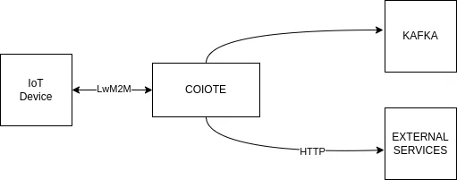
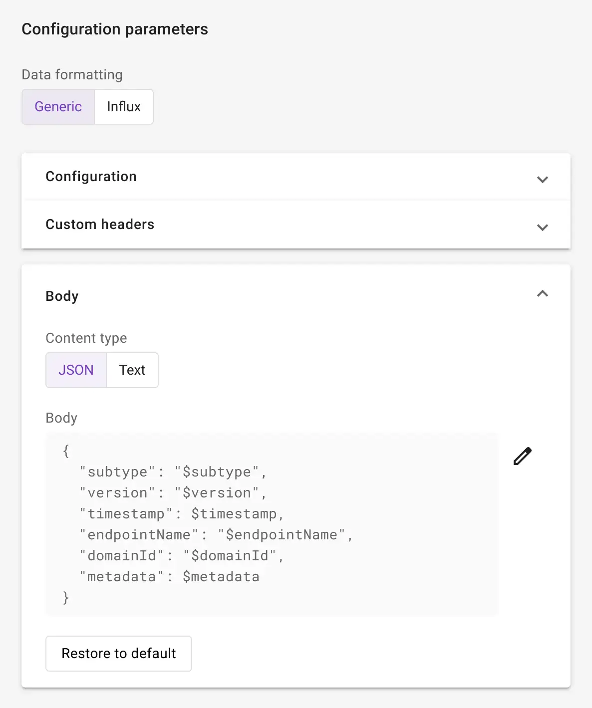
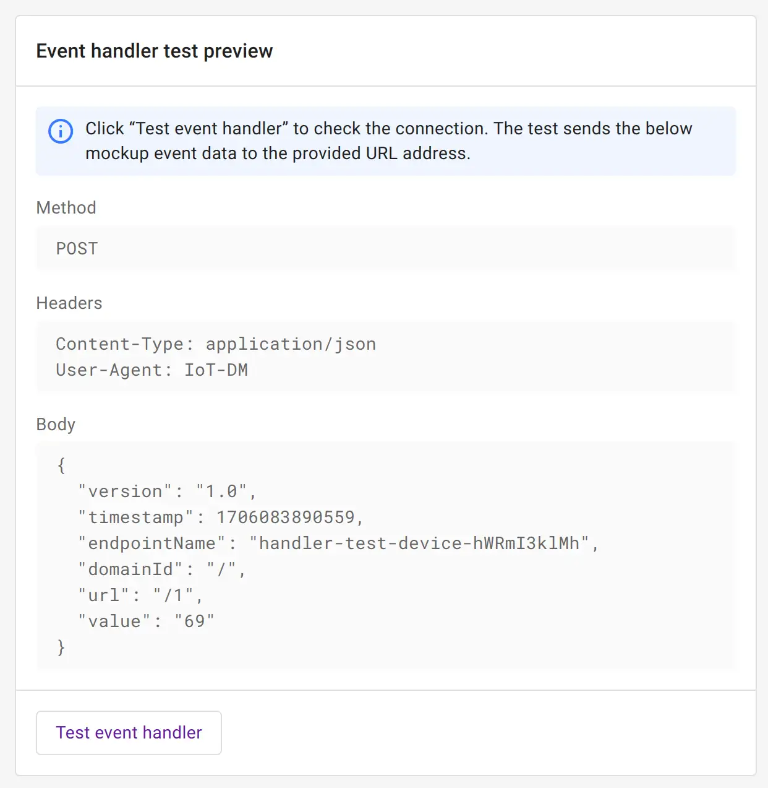
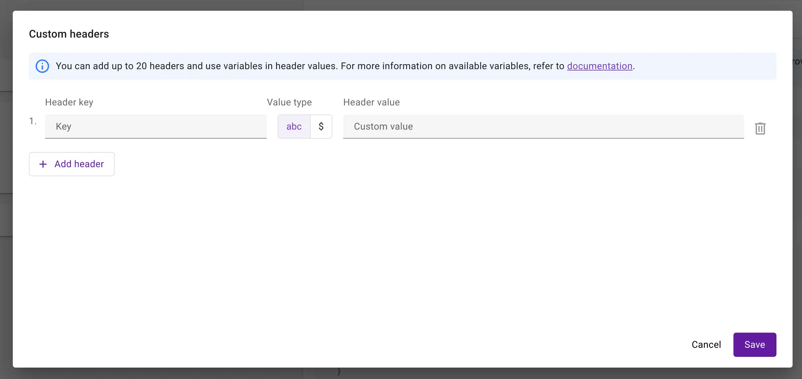
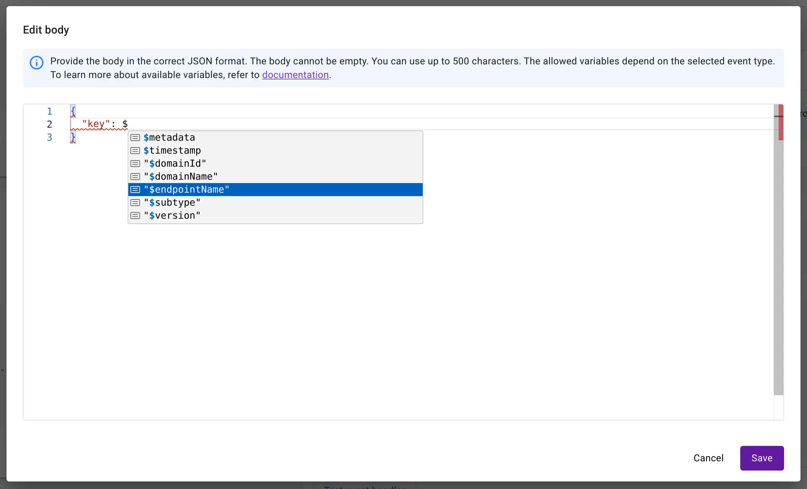

# Data Integration Center

Data Integration Center is a feature that allows you to forward device related data to your systems, databases, message
brokers etc. There are two kind of events:

* Lifecycle - these are related to device life cycle events like creation, update, deletion.
* Telemetry - these are related to telemetry gathered by device like temperature measurement.

<figure markdown>
  { align=center }
  <figcaption>High-level overview of the Data Integration Center integration</figcaption>
</figure>

## Templating

Templating feature allows for defining how your payload (or headers) looks like. This enables you to integrate with
almost all available services, gathering your data according to your preferences.

{ width=49% } { width=49% }

You can modify a body template as long as it is proper `JSON`. If you want a different content type, you can use the `Text`
option that has no validation at all.

=== "JSON"

    ```json
    {
      "version": "$version",
      "timestamp": $timestamp,
      "endpointName": "$endpointName",
      "domainId": "$domainId",
      "url": "$url",
      "value": "$value"
    }
    ```

=== "TEXT"

    ```text
    version: $version
    timestamp: $timestamp
    endpointName: $endpointName
    domainId: $domainId
    url: $url
    value: $value
    ```

Note that there are values starting with `$` e.g. `$endpointName`. These are called variables.

## Variables

Variables allow for using some device context in a payload. When sending events, variables are replaced 
with actual values e.g. `$endpointName` with `test-device-47193512895`. There are several variables that can be used,
they are predefined. If a variable does not exist e.g. `$notExisting`, then it is sent as a normal text.

=== "Device Lifecycle Variables"

      * `version` *(type: string)* - the version of changes (such as new variables) to the mechanism.
      * `timestamp` *(type: long)* - the time of occurrence of the event in milliseconds.
      * `endpointName` *(type: string)* - the device endpoint name.
      * `domainId` *(type: string)* - the entire ID of the domain with the device.
      * `domainName` *(type: string)* - the name of the last subdomain without slashes.
      * `subtype` *(type: string)* - enumeration type of the event.
      * `metadata` *(type: json|string)* - additional details about the event in relation to its subtype.

        !!! Note "Metadata format"
            For the `JSON` content type, it is an object with possibly nested fields. Whereas for `TEXT` it is a simple string with fields separated by commas.

=== "Device Telemetry Variables"

      * `version` *(type: string)* - the version of changes (such as new variables) to the mechanism.
      * `timestamp` *(type: long)* - the time of occurrence of the event in milliseconds.
      * `endpointName` *(type: string)* - the device endpoint name.
      * `domainId` *(type: string)* - the entire ID of the domain with the device.
      * `domainName` *(type: string)* - the name of the last subdomain without slashes.
      * `url` *(type: string)* - the lwm2m path (resource id) with changes.
      * `value` *(type: string|number)* - the value of the changed LwM2M resource. 

        !!! Note "Value format"
            Although it can be a number, in the case of the `JSON` content type, it must be enclosed in quotation marks.

Available variables differs from context where they are used. For detailed information, see [headers](#headers) and [body](#body).

### Headers

Variables can be used in the `Header value` field. You can enter any header value e.g. some token. 
If you change the type to `$` you will be allowed to easily select available variables.
However, in the `abc` mode, variables can also be used with the help of the `$` sign.

!!! Note

    Variables cannot be used in the header key. Thus, any `$` references defined in the `Header key` will not be considered.

{ width=80% }

=== "Available lifecycle variables"

      For device lifecycle events, there are the following variables:
    
      * `version`
      * `timestamp`
      * `endpointName`
      * `domainId`
      * `domainName`
      * `subtype`

=== "Available telemetry variables"

      For device telemetry events, there are the following variables:
    
      * `version`
      * `timestamp`
      * `endpointName`
      * `domainId`
      * `domainName`

### Forbidden headers

Note that not all headers can be overwritten for a webhook. Below is a list of forbidden headers:

* `Authorization`
* `Content-Type`
* `Content-Length`
* `User-Agent`
* `Accept`
* `Accept-Encoding`
* `Host`
* `Connection`
* `Origin`
* `Cache-Control`

### Body

As mentioned in the [Templating](#templating) section, you can adjust the look of your payload.
If you want to return to the default template, click **Return to default**.

=== "Webhook body"

    In the webhook integration, you can choose between two [content types](https://developer.mozilla.org/en-US/docs/Web/HTTP/Headers/Content-Type):
    
    * `JSON` - It enforces [the JSON format](https://developer.mozilla.org/en-US/docs/Learn/JavaScript/Objects/JSON).
               The editor tries to catch any mistakes and point them out.
    * `TEXT` - In this case there is no format validation.

=== "Kafka body"

    For integration with Kafka, only the `JSON` content type is allowed.

{ width=80% }

=== "Available lifecycle variables"

      For device lifecycle events, there are the following variables:
    
      * `version`
      * `timestamp`
      * `endpointName`
      * `domainId`
      * `domainName`
      * `subtype`
      * `metadata`

=== "Available telemetry variables"

      For device telemetry events, there are the following variables:
    
      * `version`
      * `timestamp`
      * `endpointName`
      * `domainId`
      * `domainName`
      * `url`
      * `value`
