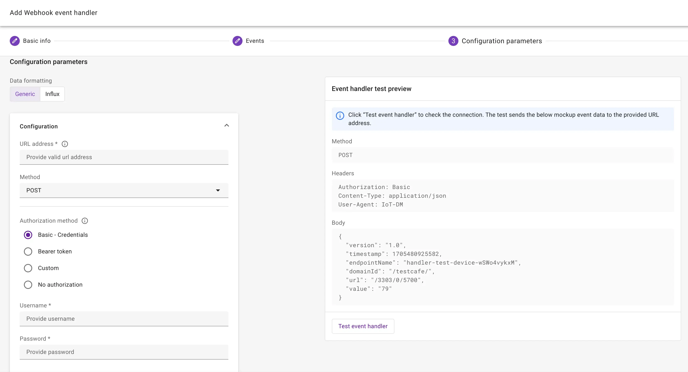
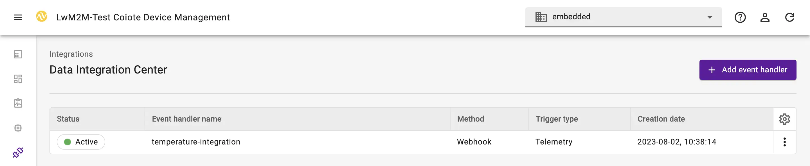

# Webhooks

The **webhook event handler** delivers HTTP(S) requests to public endpoints. Webhooks contain lifecycle events and/or telemetry data which can be delivered to web applications, IoT platforms, API gateways or hyperscaler lambda functions.

## Prerequisites

* A user with access to the {{ coiote_long_name }} and appropriate permissions
* A LwM2M device

!!! info
    You can create up to 10 *event handlers* in your domain. 

## Create a webhook

To create a new webhook event handler, select: **Integrations** > **Data Integration Center**.

Click **Add event handler** and select **Webhook**.

{ width=25% }

Provide **basic information** such as the name and description 

!!! Info

    You can activate the event handler after creation.

Select the events which trigger the HTTP(S) requests.

!!! Info "Event types"
    **Device events** include:

    - Device created
    - First registration
    - {{ coiote_short_name }} writes a value to a device
    - Device successfully executes a firmware update
    - Device deleted

    **Telemetry events** include data which is generated by the device. Events can originate from objects, object instance, resources or resource instances.

## Configure webhook parameters

Webhook parameters include:

* **URL address**
* **Method**: `POST`, `PATCH` or `PUT`
* **Authorization method**, optionally adding a Username and Password or Bearer token
* *Optional custom headers*

To validate the webhook parameters, you can test the event handler before creating the event handler.

!!! Tip "Influx and Datacake"
    For instructions on integrating data with **Influx**, visit the [InfluxDB guide](integrations/influx.md). To see how to integrate with **Datacake**, see the [Datacake guide](integrations/datacake.md).
 

To create the event handler, click **Next step** and **Add event handler**.

!!! Warning

    An event handler is automatically deactivated after several consecutive failed attempts. 
    You have to manually reactivate the event handler to continue using the data integration.