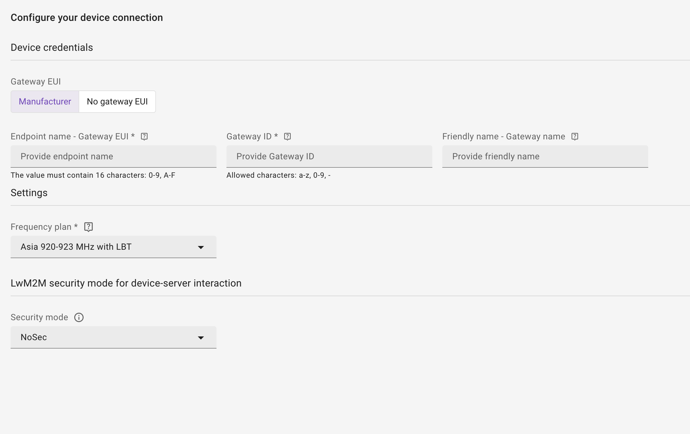
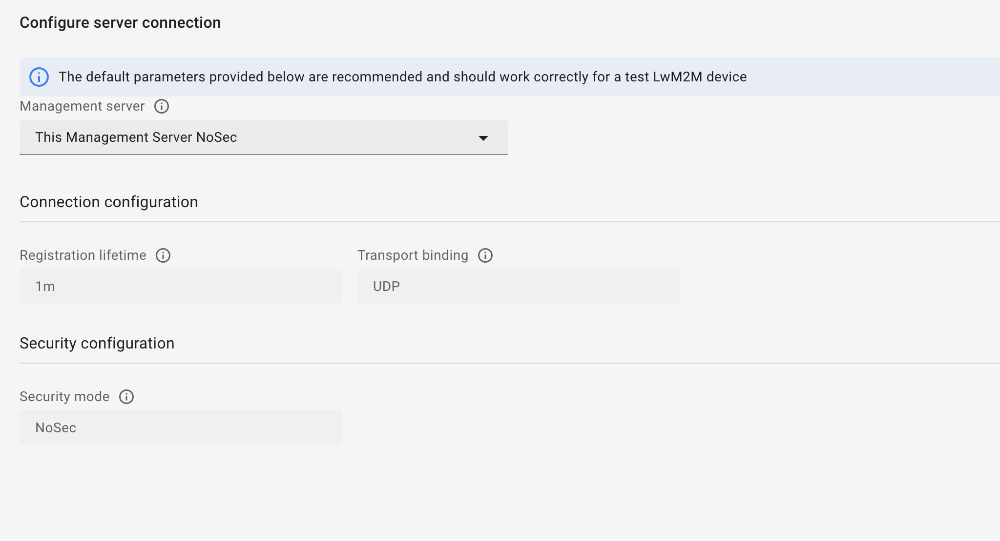
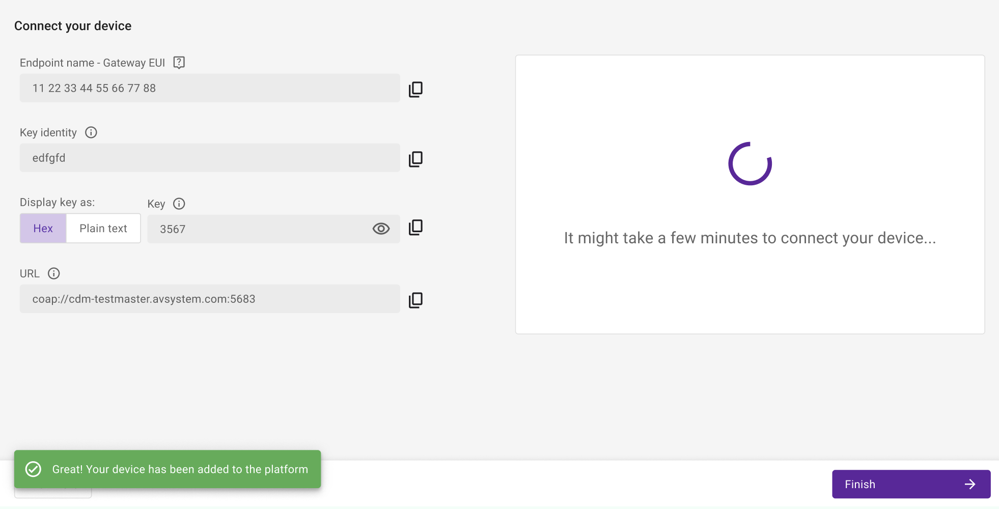

# LoRaWAN Gateway

## Overview

A LoRaWAN gateway is a radio module that functions as a communication device between end devices and a LoRaWAN network server (LNS) within a LoRa network.

A LoRa network is a low-power, wide-area network (LPWAN) designed for connecting devices over long distances with low power consumption. This network is perfect for IoT sensor networks and asset-tracking applications.

Once a gateway receives data from an end-device, it forwards it to the LNS which processes and delivers the data to the appropriate application server.

## Prerequisites

You need an active [The Things Stack Cloud](https://www.thethingsindustries.com/stack/plans/) account. For more information, read The Things Stack Cloud [documentation](https://www.thethingsindustries.com/docs/the-things-stack/cloud/).

## Integration with LoRaWAN Network Server

To connect LoRa gateway devices with Coiote, you need to set up integration with a LoRaWAN Network Server - The Things Stack. To set up the integration:

1. Go to *Integration > LoRaWAN gateways*.
2. Click **Connect** in The Things Stack card.
3. Provide the required data and click **Save**.

!!! Important
    The integration data is not validated when setting the configuration. It will be validated once you add the first LoRaWAN device. If the validation results in an error when adding the first LoRaWAN device, return to the integration panel and correct the configuration.

## Adding LoRaWAN gateway devices

To add a LoRaWAN gateway:

1. Go to *Device Inventory*.
2. Click **Add device** and then **Add device manually** under LORAWAN GATEWAY DEVICES.
3. Select connection via the Bootstrap Server or via the Management Server.

    !!! Info
        Connecting a device via the Bootstrap Server is unavailable in the Developer plan.

4. Follow the steps in the device creator.

Adding a LoRaWAN gateway via the Management Server consists of two steps: 

- **Step 1: Configure your device connection**
- **Step 2: Connect your device** 

Adding a gateway via the Bootstrap Server consists of three steps: 

- **Step 1: Configure your device connection** 
- **Step 2: Configure server connection**
- **Step 3: Connect your device**

Below you can find the description of each step:

### Configure your device connection
		

In this step provide the information about the LoRaWAN gateway device and choose device connection settings.
		
In the section *Device credentials*, fill in the following information:

- *Gateway EUI* - choose one of two options:
    - *Manufacturer* - select this option, if you have a gateway from a manufacturer with a Gateway EUI. Provide the information in two fields:
        - *Endpoint name - Gateway EUI*: A 64-bit extended unique identifier for your gateway. It should be provided by the manufacturer or printed on the gateway packaging. It will become the endpoint name by which the platform server will identify the device.
        - *Gateway ID*:  A unique identifier for your gateway.
    - *No gateway EUI* - select this option if your gateway doesn't have a Gateway EUI. Provide the information in one field:
        - *Endpoint name - gateway ID*: A unique identifier for your gateway. It will become the endpoint name by which the platform server will identify the device.
- *Friendly name* - Gateway name: An optional human-readable name to help you identify your gateway. The Things Stack will use this name instead of the gateway ID to refer to your gateway.

In the section *Settings*, select your Frequency plan. The frequency plan defines data rates that your end device or gateway is set up to use. The gateway and end devices within reach must use the same frequency plan to communicate. 

In the section *LwM2M security mode for device-server interaction* select the security mode:

- Pre-shared key - authorize your device using a pre-shared key. To use this option, provide the following:
    - Key identity - define the name that the device will use during the DTLS handshake. Can be equal to the LwM2M device endpoint name.
    - Key format 
    - Key - provide the shared secret used in the device-server authentication.
- NoSec - use the device with no security established for the device-server communication. Use this mode only for testing purposes.
- Certificate - secure your device-server communication with a certificate:
    - Select *Use a previously uploaded certificate* if you have already uploaded a certificate to the platform using the DTLS/TLS Certificates panel.
    - Select *Upload a new certificate* to load your certificate by clicking **Browse**.

### Configure server connection

In this step, provide new bootstrap connection settings. You can choose from the options in the drop-down list:

- *Use the bootstrap configuration set as default for your domain* - use this setting if you want to employ the inherited bootstrap settings for your domain.
- *This Coiote IoT DM Management Server (Cert with EST)* - use this setting if you have chosen the Certificate mode in the Device credentials step.
- *This Coiote IoT DM Management Server NoSec* - use this setting to establish the device-server communication with no security. Using this mode is not recommended except for testing purposes.
- *This Coiote IoT DM Management Server PSK* - use this setting to authorize the device-server communication using a pre-shared key.
- *Your custom bootstrap setting* - this option is available if you configured a bootstrap server setting using the Bootstrap configuration panel.

### Connect your device (optional)

You can connect your device in this step by inserting the displayed parameters into your device. If you choose to skip this step, you can finish the configuration and connect the device later.

