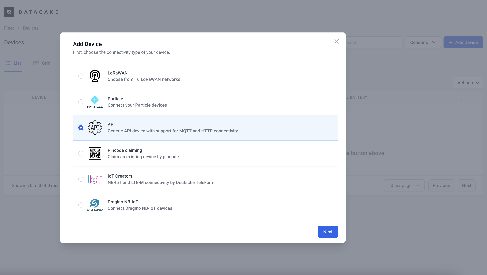
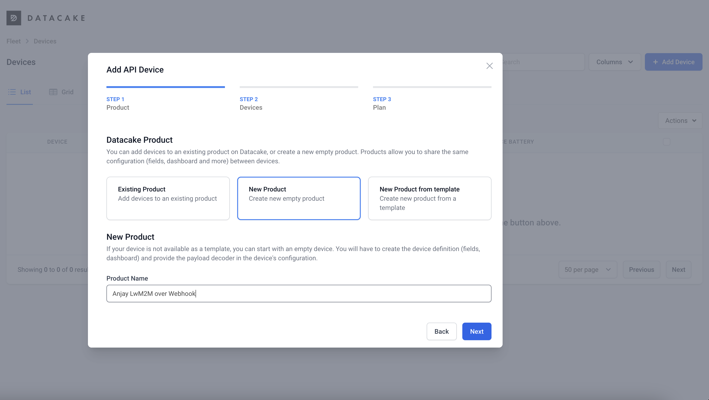
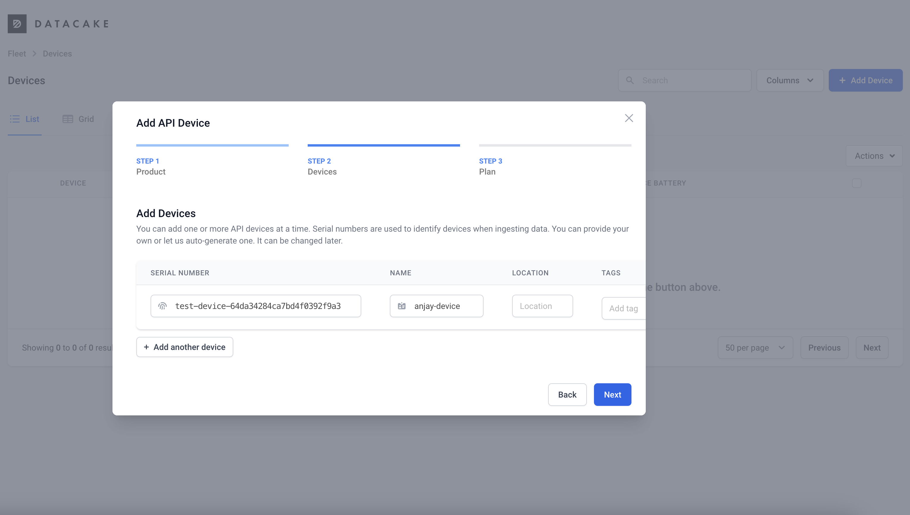
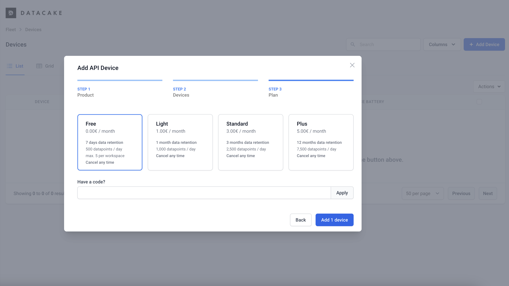
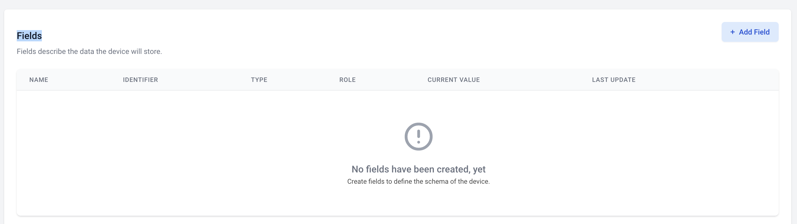
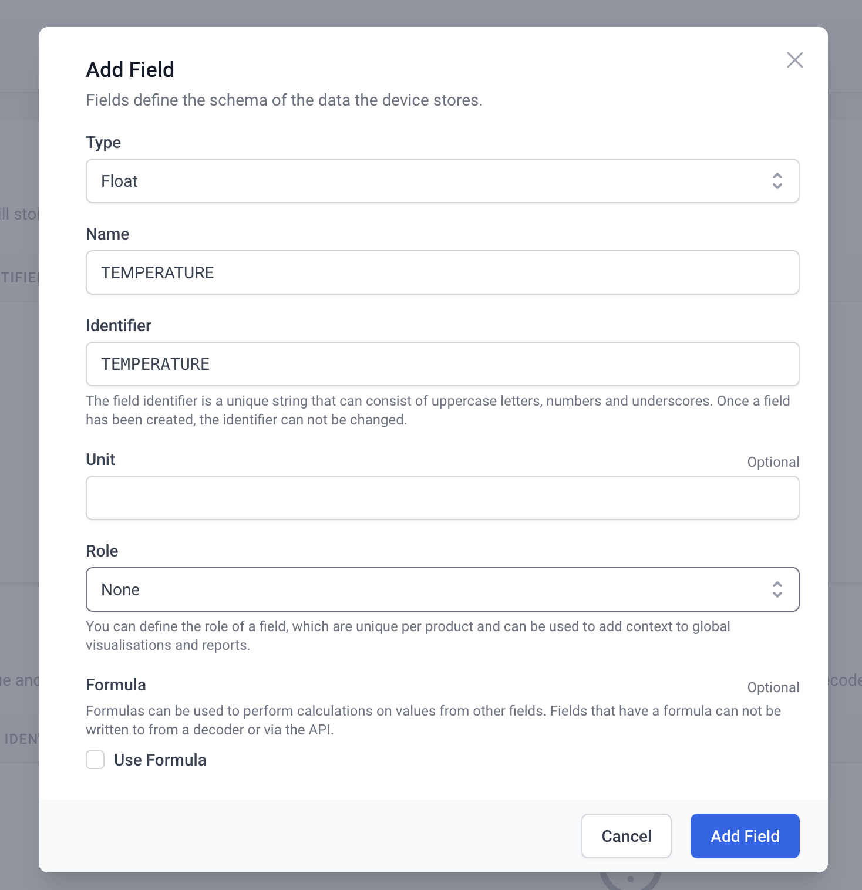
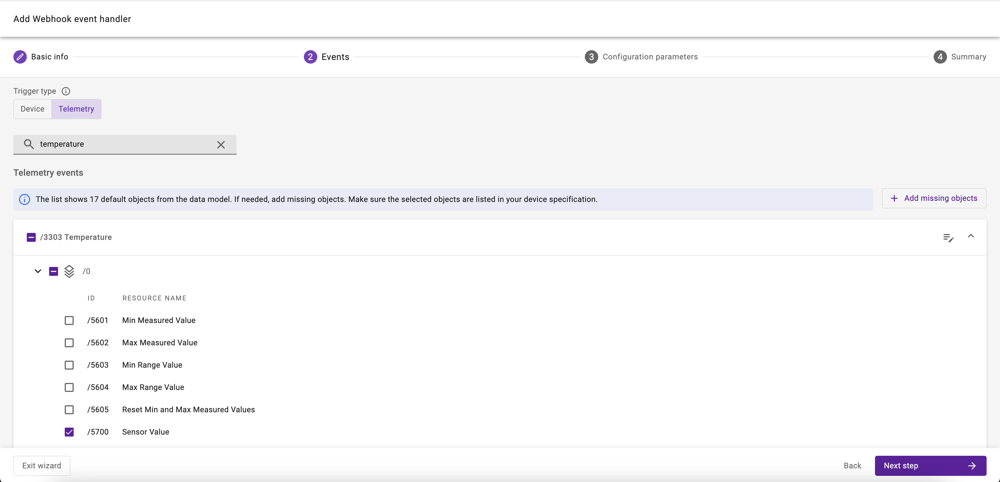

# Datacake

You can easily integrate with [Datacake](https://datacake.co/) using webhooks and a custom payload decoder. See the [Datacake docs](https://docs.datacake.de/integrations/webhook) covering this type of integrations.

## Prerequisites

* A user with access to the {{ coiote_long_name }} and appropriate permissions
* A LwM2M device
* A Datacake account *(you can create a free [Datacake account](https://app.datacake.de/signup))*


## Setup Datacake

Open your Datacake account. Create a new workspace or select an existing one.

**Create a new API Device** representing your device by going to: **Devices** > **Add device**.



Select or create a [Product](https://docs.datacake.de/device/product) that will be used as a template for your device. Since Products aggregate devices sharing similar configuration, you will later use an endpoint dedicated for your Product to ingest data for your device. Let's create a dedicated product for the demo device we will be using in this tutorial. 



**Name your device** and enter its endpoint name as the device serial number.



**Pick a plan** for billing of your integration and complete the process. You can add up to 5 devices in the Free plan of your workspace.



### Configure fields for your device

Select the device from the devices list and open its details by clicking on the device name. Open the **Configuration** tab to configure the data model of your device. Scroll down to find the fields of the device.



**Add new field representing the temperature** measured by your device. You can add fields of different types as Datacake field types cover all LwM2M resource types. For the temperature measurements we are going to pick **Float** type and we are going to name it `TEMPERATURE`.



Follow to the **HTTP Payload Decoder** section to configure the decoder for JSON values that will arrive from {{ coiote_short_name }}. To parse the incoming Webhook data from {{ coiote_short_name }}, you will need a decoder similar to the following one:

```javascript
function Decoder(request) {

    // Parse JSON into Object
    var payload = JSON.parse(request.body);
    
    var endpointName = payload.endpointName;
    var temperatureUrl = "/3303/0/5700";
    if (payload.url == temperatureUrl) {
   		var temperature = parseFloat(payload.value);
   		var time = payload.timestamp;
   		return [{
   			device: endpointName,
   			field: "TEMPERATURE",
   			value: temperature,
   			timestamp: time / 1000
   		}];
    } else {
    	return [];
    }
}
```

This decoder does several things required to ingest device data into Datacake database:

- it selects the `endpointName` field used for identification of the device in the platform,
- it accepts only changes from LwM2M URL `/3303/0/5700` which represents the Temperature/Sensor value resource,
- it parses the value and timestamp from the payload of the event.

**Save the configuration** and copy the `HTTP Endpoint URL`, which will be used as webhook target for {{ coiote_short_name }} event handler. Go back to your domain in {{ coiote_long_name }}. Go to **Integrations > Data Integration Center** and create a Webhook event handler that will forward device telemetry.



Apply the filter and go to the connection configuration step to configure the fields as follows:

- set the formatting to `Generic`,
- set the URL to the `HTTP Endpoint URL` you copied before from the Datacake configuration view. It should look like this: `https://api.datacake.co/integrations/api/aaaaaaaa-bbbb-cccc-dddd-eeeeffffggg/`,
- set the Authorization to `No authorization`, as Datacake treats the endpoint URL as a token itself.

**Test the event handler** to confirm that you entered your data correctly. Then, click **Next step** and **Add event handler** to create the event handler.

## Monitor events in Datacake

After activating the event handler, go to your Datacake account and open the Dashboard of your device. TODO @mikegpl