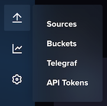
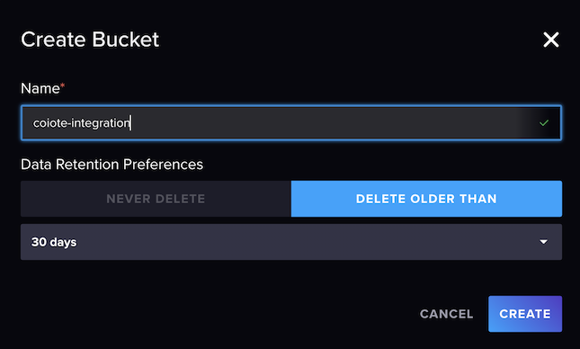
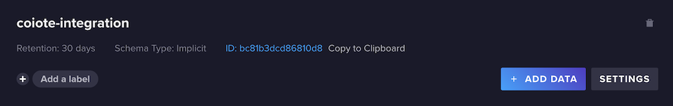
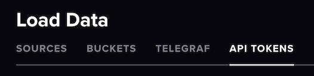
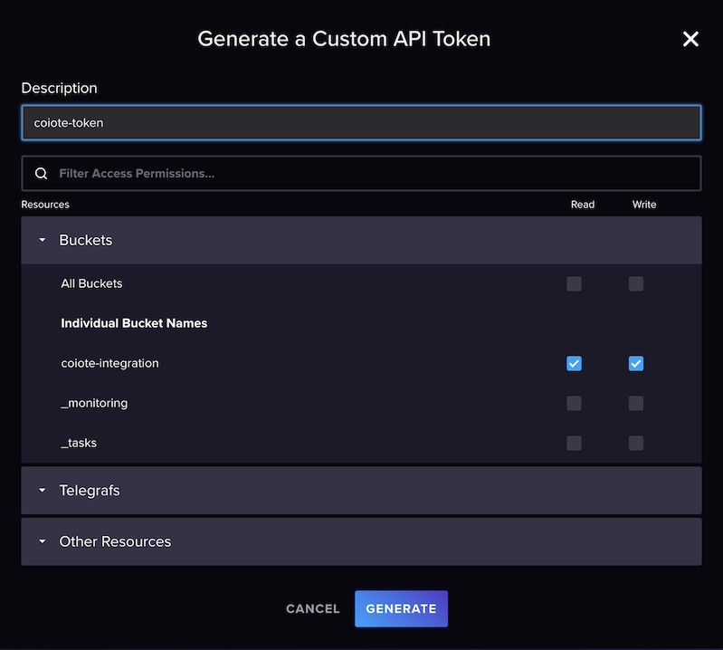
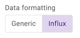
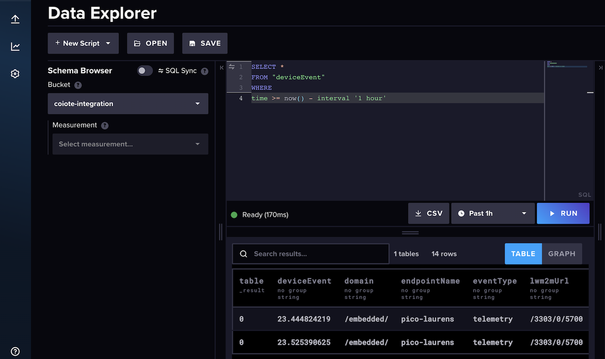

# InfluxDB

To simplify the integration with [InfluxDB](https://www.influxdata.com/), webhooks can be formatted to align with Influx’s data API requirements. 

## Prerequisites

* A user with access to the {{ coiote_long_name }} and appropriate permissions
* A LwM2M device
* An InfluxDB account *(you can create a free [InfluxDB Cloud account](https://www.influxdata.com/get-influxdb/))*


## Setup InfluxDB

Open your InfluxDB account.

**Create a new Bucket** for storing the time series data by going to: **↑** > **Buckets**.



Give the Bucket a name.



**Copy the Bucket ID** and save it to use later.



### Create API Token

Go to the API Tokens tab.



**Create a new API token**

!!! info "Create a **custom API Token**"
    Preferably, create a **custom API Token** which has only access to the specific Bucket you just created. Make sure to select *Read* and *Write* rights.



**Copy the API Token** and save it for later.

## Create webhook in {{ coiote_short_name }}

In your {{ coiote_short_name }}, select: **Integrations** > **Data Integration Center**.


Select **Add event handler**.


Select **webhook**.


Provide **basic information** such as the name and description, optionally enabling the option to activate the event handler after creation.  


**Select the events** which will trigger the HTTP(S) requests.


### Configure InfluxDB parameters

Select the **Influx data formatting** option.



**The URL address** is composed of 4 parts:

1. The **Influx URL** e.g.: `https://eu-central-1-1.aws.cloud2.influxdata.com` 

    *You can find the URL in the address bar of your browser when using InfluxDB Cloud.*

2. The **InfluxDB API**: `/api/v2/write`
3. The **precision** parameter indicading our data is ingested with millisecond precision: `?precision=ms`
4. The **Bucket ID**, starting with `&bucket=`

When combined, the URL address looks something like: 

```
https://eu-central-1-1.aws.cloud2.influxdata.com/api/v2/write?precision=ms&bucket=bc123456789ABCDE
```

!!! info
    For more information about the Influx API, visit Influx's [API documentation](https://docs.influxdata.com/influxdb/v2.7/api/). 

**Add the API token** which you previously created in your InfluxDB account.


!!! Tip
    Use the **Test event handler**-option to validate the configuration of the HTTP request before creating the event handler. When performing such test, an event should arrive in your Influx bucket.

    
    

Click **Next step** and **Add event handler** to create the event handler.


## Monitor events in InfluxDB

After activating the event handler, go to your InfluxDB account and open your Bucket.

Add the following script:

```
SELECT *
FROM "deviceEvent"
WHERE
time >= now() - interval '1 hour'
```

Press: "**► RUN**" to run the script.

If the integration is setup correct, the device events are shown in the table.


