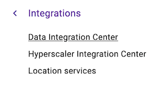
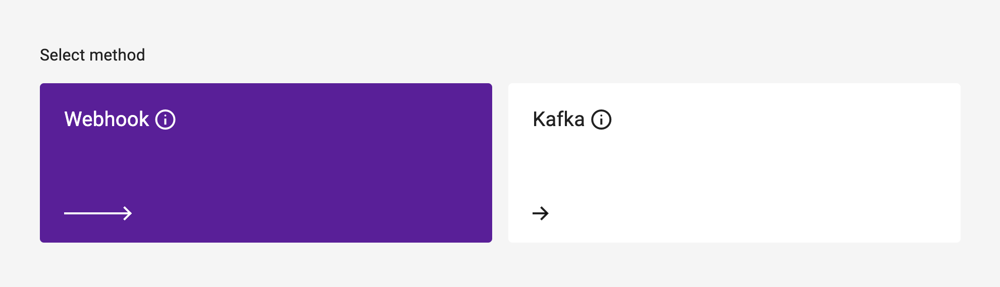
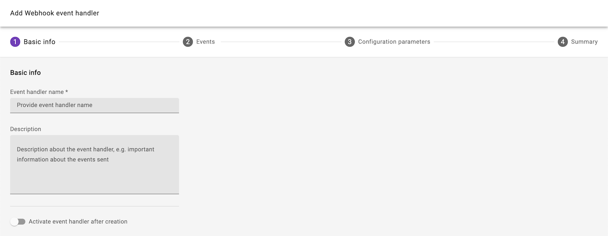
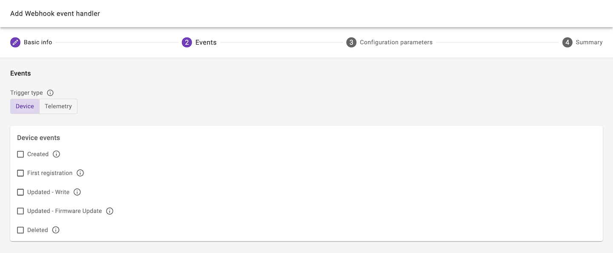
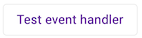
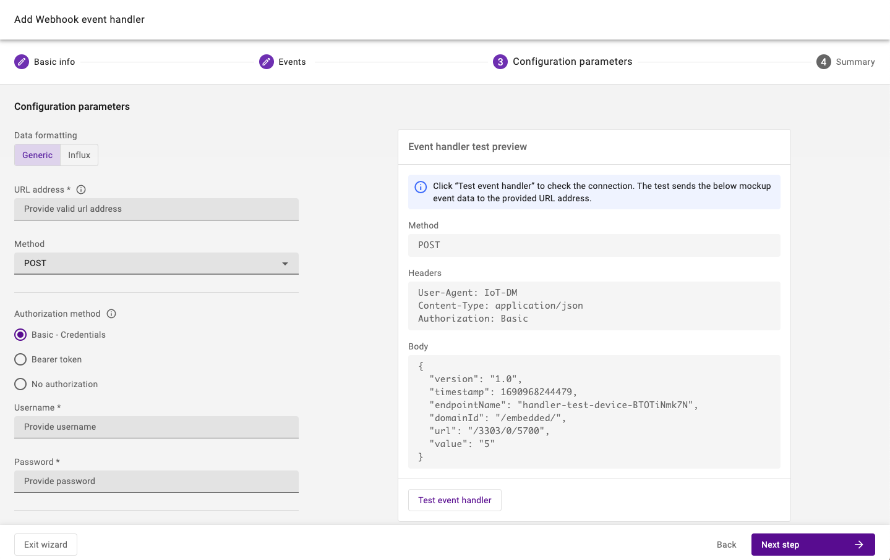
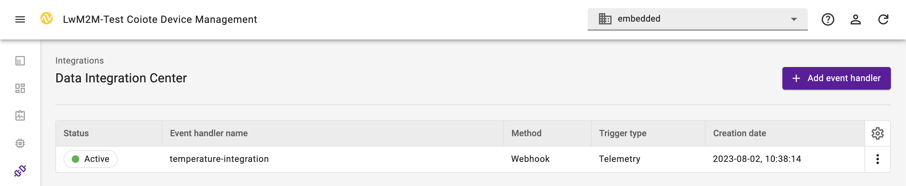

# Webhooks

The webhook event handler delivers HTTP(S) requests to public endpoints. Webhooks contain lifecycle events and/or telemetry data which can be delivered to web applications, IoT platforms, API gateways or hyperscaler lambda functions.

## Prerequisites

* A user with access to the {{ coiote_long_name }} and appropriate permissions
* A LwM2M device

## Create a webhook

To create a new webhook event handler, select: **Integrations** > **Data Integration Center**.

Select **Add event handler**.

Select **Webhook**.

Provide **basic information** such as the name and description, optionally enabling the option to activate the event handler after creation.  

**Select the events** which will trigger the HTTP(S) requests.

!!! Info "Event types"
    **Device events** include:

    - Device created
    - First registration
    - {{ coiote_short_name }} writes a value to a device
    - Device executes a firmware update
    - Device deleted

    **Telemetry events** include data which is generated by the device. Events can originate from Objects, Object Instance or specific Resources.

## Configure webhook parameters

Webhook parameters include:

* **URL address**
* **Method**: `POST`, `PATCH` or `PUT`
* **Authorization method**, optionally adding a Username and Password or Bearer token
* *Optional custom headers*

To validate the webhook parameters, it is possible to **test the event handler** before creating the event handler.

!!! Tip "Influx"
    For instructions on integrating data with **Influx**, visit the [InfluxDB guide](influx.md).

Click **Next step** and **Add event handler** to create the event handler.

