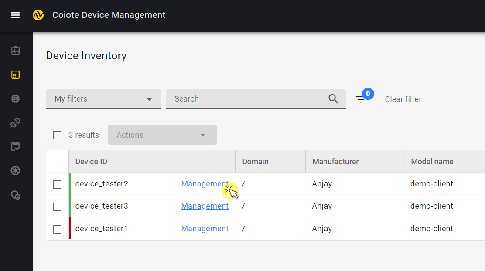
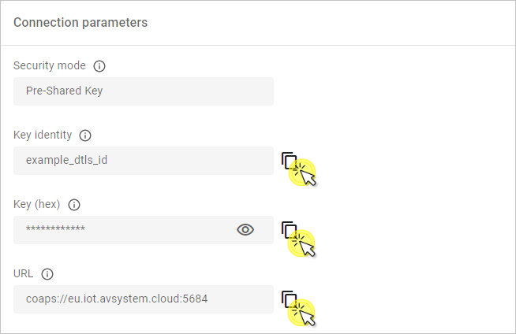

# Device Center

!!! important
     This chapter refers to the beta version of the new Device Center. It replaces the previous Device Management Center view (DMC) which is still supported - use the **Go to previous version** button and the **Go to new Device Center** link to switch between them. For documentation of the previous version, check the in-platform Coiote DM User Guide.  

The Device Center is designed for effective management of single devices. It enables IoT developers to build LwM2M applications quickly and intuitively and features actionable sections for quick access to the most important device info and data.

To enter the Device Center, go to **Device inventory** and click on the **Management** (or **Bootstrap**, if applicable) link next to the device name in the table.

## Summary sidebar

Use it to have the essential device info, status and actions always at hand.

Device actions include:

- Reboot - make the device reboot by executing the **Reboot** resource from device data model.
- Data model refresh -  make the device refresh its data model to check for new objects, object instances or resources. This is done by executing the LwM2M **Discover** operation on the device.
    {:style="float: left;margin-right: 817px;margin-top: 17px;"}
- Clear DTLS context - erase the context established between the device and the server during the DTLS handshake. A DTLS handshake to create a new DTLS context for communication will be performed.  
- Delete device - permanently deletes the device entity and its data.

Device summary lets you quickly check connection status and essential info about the device:

{:style="float: left;margin-right: 817px;margin-top: 17px;margin-bottom: 27px;"}

## Overview tab

Use this tab to see widgets related to device status and connectivity, and view Device location on the map and check location details:

{:style="float: left;margin-right: 817px;margin-top: 17px;;margin-bottom: 27px;"}

!!! note
    The information displayed in this tab is taken from the device data model in most cases. See more about the device data model in the [Data model tab](#data-model-tab) section.

## Configuration tab

Quickly view, copy and edit device connection parameters and edit device details such as **Friendly name** and image.

- To upload device image, click **Upload device image**, browse an image from your local drive and click **Save**.
- To change device **Friendly name**, click on the **pen** icon next to the device name in the widget.
- To copy each connection parameter, use the copy icon next to a given field.
    {:style="float: left;margin-right: 817px;margin-top: 17px;"}
- To change connection parameters, e.g. **Security mode**, click on the **pen** icon in the top right corner, change the required data and click **Save**.
    {:style="float: left;margin-right: 817px;margin-top: 17px;"}

## Data model tab

Perform or schedule operations on device objects, object instances, and resources:

To search the data model for device objects, object instances, and resources, start typing in the **Search** field to see results:

### Read

To perform a LwM2M READ operation on an object, object instance, or resource, click the circular icon in the **Operations** column (or via the 3 vertical dots menu in case of objects and object instances).

### Write

To perform a LwM2M WRITE operation on an object, object instance, or resource, click the **pen** icon in the **Operations** column. In the pop-up, type the desired value and click **Set value**.

### Execute

To perform a LwM2M EXECUTE operation on a resource, click the **cogwheel** icon in the **Operations** column.

