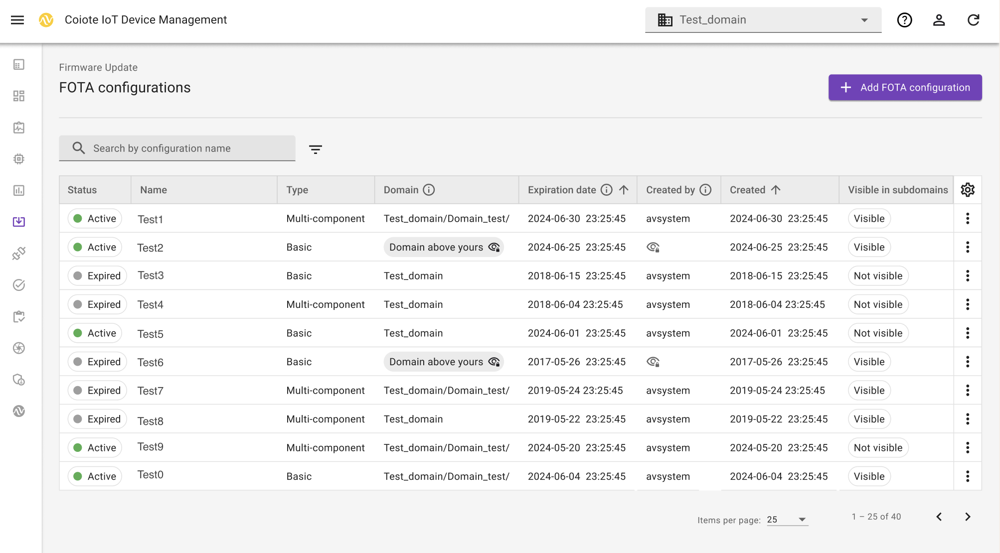
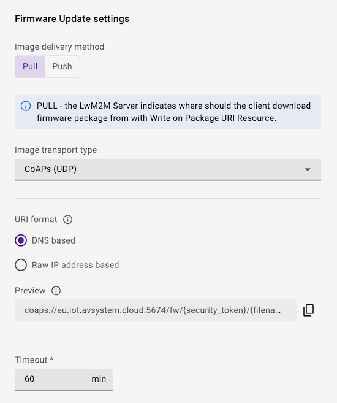

# Configurations
FOTA Configuration is an entity that determines the technical settings for Firmware updates. The settings cover:

  - image delivery method
  - image transport type
  - URI format
  - timeout

You can create and manage Fleet FOTA configuration for your devices. 

## FOTA configurations dashboard

The FOTA configuration dashboard contains a list of configurations with the possibility to filter information per: 

 * **Status** (active or expired)
 * **Name**
 * **Type** (multi-component or basic)
 * **Domain**
 * **Expiration date**
 * **Created**
 * **Created by**
 * **Visible in subdomains** (visible or not visible)

The **Settings** icon allows for adjusting the table by adding or hiding columns. If you want to search for specific configurations, you can type the configuration name in the search bar or filter entities per status and domain. 

The **More actions** icon lets you execute the following:

  - **Show settings** allows for previewing details on the chosen configuration.
  - **Copy** takes you to the view of creating a new configuration.
  - **Delete** simply deletes the chosen configuration. This action affects firmware updates that use a given configuration, as those updates won't be completed. It also affects the FOTA campaigns that use this configuration underneath. If deleted, the FOTA campaign changes status to **Canceled** and the Firmware updates can't be finished successfully therefore they are canceled as well.

## Add FOTA configurations

1. From the navigation menu, go to **Firmware Update** > **FOTA configurations**.
2. To start creating a new configuration, click **Add FOTA configuration** > **Basic**.
3. In the **Basic data** section, type in the configuration name.
4. Upload a firmware image from the repository or from your computer. For a newly uploaded image, provide a file name and confirm your choice by clicking **Save**.
5. To see the configuration in the domains under yours, enable the **Visible in subdomains** option. This option essentially allows your subcustomers to use the FOTA Firmware update. The underlying files expiration date is set to 6 months by default.
6. Optionally, in the **Description** field, provide information on your firmware.
7. To go to **Settings**, click **Next**.
8. Choose the image delivery method:

    

    * **Pull method** (recommended): The LwM2M Client receives the URI of the file that is to be downloaded and pulls the file from it.
      **Pull** supports the following **transport types**:
        - `CoAP` or `CoAPs` over `UDP`
        - `CoAP` or `CoAPs` over `TCP`
        - `HTTP` or `HTTPs`
    * **Push method**: The LwM2M Server pushes the firmware file to the device.
      **Push** transmits the firmware over the same transport type as is used for device management, which is `CoAPs` over `UDP` by default.

    !!! Tip "Which transport protocol to choose?"
        Downloads using `CoAP(s)` over `UDP` tend to be slow due to the limitation of the maximum CoAP Block size of 1024 bytes and the required acknowledgements for each Block transfer.
        Choosing `CoAP(s)` over `TCP` or `HTTP(s)` usually results in faster download speeds. However, not every device supports these transport protocols.

9. Choose the URI format in which the URL is sent to the firmware package. 

    !!! Info
        You can verify the location of the security token in the **Preview** field.

10. Once you check the details in the **Firmware Update Flow Preview** section, click **Next**.
11. In the **Summary** section, preview the Firmware update information and click **Add FOTA configuration**. 
    
If you fill in the details correctly, you see the confirmation that the FOTA configuration has been added successfully. 
