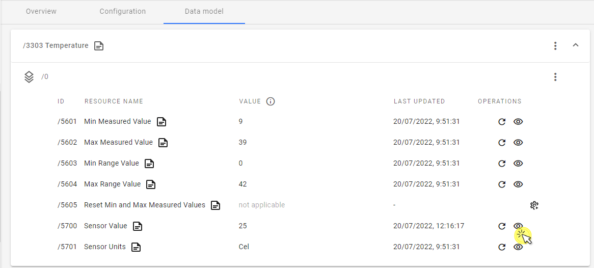
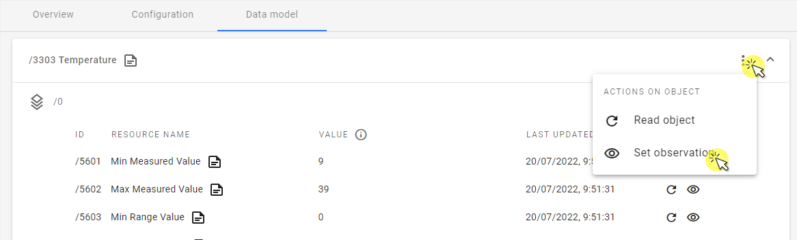

# Device Center

The Device Center is designed for effective management of single devices. It enables IoT developers to build LwM2M applications quickly and intuitively and features actionable sections for quick access to the most important device info and data.

!!! important
     This chapter refers to the beta version of the new Device Center. It replaces the previous Device Management Center view which is still supported - use the **Go to previous version** button and the **Go to new Device Center** link to switch between them.

To enter the Device Center, go to the **Device inventory** and click on one of your devices.

## Summary sidebar

Use it to have the essential device info, status and actions always at hand.

Device actions include:

- **Reboot** - make the device reboot by executing the **Reboot** resource from device data model.
- **Data model refresh** -  make the device refresh its data model to check for new objects, object instances or resources. This is done by executing the LwM2M **Discover** operation on the device.
    {:style="float: left;margin-right: 817px;margin-top: 17px;margin-bottom: 17px;border: 1px solid lightgray"}
- **Clear DTLS context** - erase the context established between the device and the server during the DTLS handshake. A DTLS handshake will be performed to create a new DTLS context for communication.  
- **Delete device** - permanently deletes the device entity and its data.

The device summary lets you quickly check connection status and essential info about the device:

{:style="float: left;margin-right: 817px;margin-top: 17px;margin-bottom: 27px;border: 1px solid lightgray"}

## Overview tab

Use this tab to see widgets related to device **status** and **connectivity**:

{:style="float: left;margin-right: 817px;margin-top: 17px;;margin-bottom: 27px;"}

## Configuration tab

Quickly view, copy and edit device connection parameters and edit device details such as **Friendly name** and image.

- To upload device image, click **Upload device image**, browse an image from your local drive and click **Save**.
- To change device **Friendly name**, click on the **pen** icon next to the device name in the widget.
- To copy each connection parameter, use the **copy** icon next to a given field.
    {:style="float: left;margin-right: 817px;margin-top: 17px;margin-bottom: 17px;"}
- To change connection parameters, e.g. **Security mode**, click on the **pen** icon in the top right corner, change the required data and click **Save**.
    {:style="float: left;margin-right: 817px;margin-top: 17px;margin-bottom: 27px;border: 1px solid lightgray"}

## Data model tab

Perform or schedule operations on device objects, object instances, and resources:

To search the data model for device objects, object instances, and resources, start typing in the **Search** field to see results:

{:style="float: left;margin-right: 817px;margin-top: 17px;margin-bottom: 17px;"}

### Read

To perform a LwM2M READ operation on an object, object instance, or resource, click the circular icon in the **Operations** column (or via the 3 vertical dots menu in case of objects and object instances).
{:style="float: left;margin-right: 817px;margin-top: 17px;margin-bottom: 17px;"}

### Write

To perform a LwM2M WRITE operation on an object, object instance, or resource, click the **pen** icon in the **Operations** column. In the side navigation menu, type the desired value and click **Set value**.
{:style="float: left;margin-right: 817px;margin-top: 17px;margin-bottom: 17px;"}

### Execute

To perform a LwM2M EXECUTE operation on a resource, click the **cogwheel** icon in the **Operations** column and select **Execute**, or **Execute with parameters** to set additional EXECUTE conditions.
{:style="float: left;margin-right: 817px;margin-top: 17px;margin-bottom: 17px;"}

### Set observation

To set an observation on a resource (and, effectively, start performing LwM2M OBSERVE operations on the device):

0. Click the **eye** icon in the **Operations** column.
{:style="float: left;margin-right: 817px;margin-top: 17px;margin-bottom: 17px;"}
0. In the side navigation menu, enable the desired attributes, fill in the values, and click **Set observation**.
{:style="float: left;margin-right: 817px;margin-top: 17px;margin-bottom: 17px;"}

!!! info
    * **Not more often than once every** - the minimum time in seconds between two notifications.
    * **At least once every** - the maximum time in seconds between two notifications. The notification is sent even if the value hasn't changed.

    Read more about other attributes in our [Brief description of OMA LwM2M](https://avsystem.github.io/Anjay-doc/LwM2M.html#attributes).

To set an observation on an object or object instance, click on the 3 vertical dots menu and select **Set observation**, then follow the steps described above.

{:style="float: left;margin-right: 817px;margin-top: 17px;margin-bottom: 17px;"}
