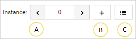
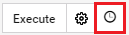
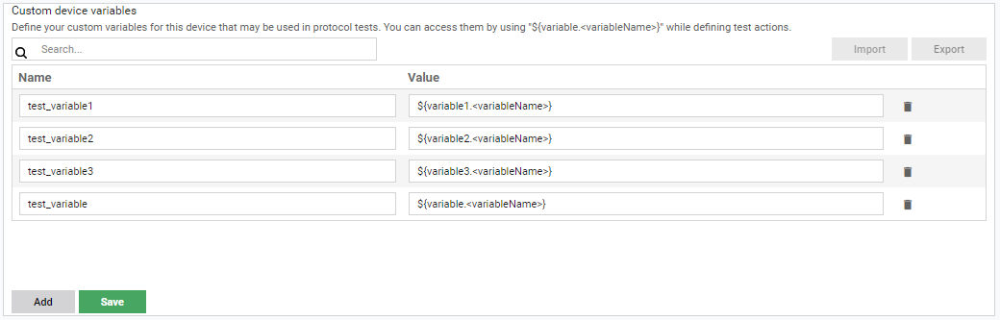
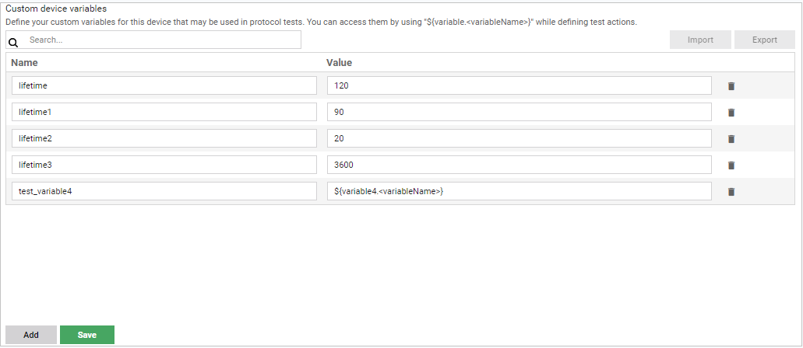
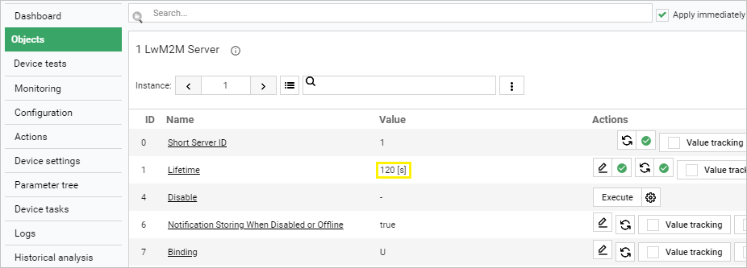

# Device data model and variables

##	Displaying device data model and running simple actions

Coiote DM gives you the possibility to view and perform actions on the data model of individual devices defined by the LwM2M protocol. This view is available under the **Objects** panel of your device. Read this chapter to learn how to use the panel.

0. **Search** - use it to find a particular object. To find the object, type its name.
0. If checked, the changes you make to device objects will be applied immediately. Otherwise, you will have to wait for the device to trigger action execution or use the **Execute tasks** button (for devices in non-queue mode).

    !!! note
        The **Apply immediately** option is only available for devices in non-queue mode.

0. Use this button to add a new LwM2M object definition.
0. Division into objects.
0. The **info** icon - click it to see the object description.
0. Managing instances:
    - [A] - Use it to select another instance of an object if the object has instances.
    - [B] - Use it to add a new instance if an object allows it.
    - [C] - Use it to select another instance or remove it.
     {:style="float: left;margin-right: 817px;margin-top: 17px;"}
0. Search - use it to find a particular resource. To find the resource, type its name.
0. Use it to refresh data, track values (send an Observe task) and add additional attributes to a selected instance.
0. Use it to refresh data, track values (send an Observe task) and add additional attributes to a selected object.
0. The table with resources of an object instance.

    !!! note
        The icon displaying the status of execution is available after clicking on one of the action buttons located in the **Actions** column. If you click it, you will see additional information about execution.
        {:style="float: left;margin-right: 1077px;margin-top: 17px;margin-bottom: 17px"}

0.	Use it to refresh the resource.
0.	Value tracking - use it to send an Observe task to the device and configure monitoring to collect data.
0.	Attributes - use it to edit resource attributes or add new ones.
0.	Use it to edit a value of a resource.
0.	Execute - use it to send an Execute task to the device. Click the icon next to the button to add additional parameters.

##	Managing device variables

Use the **Variables** panel to add custom variables onto your device for the purpose of protocol tests and view the existing variables that the device has inherited.
To enter the **Variables** panel, go to **Device Management Center** by clicking on a selected device name and choose the **Variables** tab.

!!! important
    If the **Variables** tab is not visible in your **Device Management Center**, click the **Configure visible tabs** icon, drag and drop the **Variables** tab into the **Selected tabs** column, and click **Confirm**.
    {:style="float: left;margin-right: 177px;margin-top: 17px;margin-bottom: 17px"}

1.	The **Custom device variables** list shows the variables that belong to this particular device.
    - To add a variable, click on **Add**, provide its name and value, and click **Save**. Note that every custom variable that you add will have the `VARIABLE_` prefix.
    - To delete a previously added variable, click the **Trash bin** icon and click **Save**.

2.	The **Inherited variables** list shows only the variables that the device inherits from the groups of devices that it belongs to. The list is view-only. To add a variable to this list, go to Device Groups and, in the Profiles panel, add an entry with the name beginning with `VARIABLE_`.
3. To search for variables in the table, use the search field above it.
4. To export existing variables, click the **Export** button. A `.variables` file will be downloaded onto your local drive.
5. To import variables, click the **Import** button. From your local drive, select a `.variables` file with variables. Any new variables contained in the file will be imported into the **Custom device variables** table

### Using variables in test actions

To use device variables, enter the expression context by typing ``${variable.<variableName>}`` while defining a test action. Remember that each variable is treated as a string, therefore, to use it as a different data type, you will have to cast it to the appropriate type. 

#### Using variables - example

Learn how to use device variables in **Device tests** in a few steps:

Use case: Testing the **WRITE** action on the `LwM2M Server.1.Lifetime` resource.  

1. Add the variable:
     - In **Device inventory**, click on a selected device name to enter its **Device Management Center**.
     - Select the **Variables** tab.

        !!! tip
            If the **Variables** tab is not visible in the menu, use the settings button under the menu to add it: drag it from **Available tabs** and drop it in **Selected tabs** and click **Confirm**.

      

     - Click on **Add** and provide the following:
         - Name: `lifetime120`.
         - Value: `120`.
     - Click **Save**.

2. Create a test and include the new variable in the appropriate format:
     - To add a new test, follow the steps in [Creating your first test](Getting_started.md#create-your-first-test-case) section, but including the adjustments below:
         - For example purposes, pick only the **Write** action.
         - In the **Parameter name** field, type `LwM2M Server.1.Lifetime` (note that the path may vary slightly depending on your device data model).

         - In the **Value** field, type `${variable.lifetime120.toInt}`.

            !!! tip
                By default, the variable value is rendered as a `string` data type. To cast it to the `integer` data type, `.toInt` suffix is added to the created expression, as seen above.

3. Run the created test and check if the variable works correctly:
     -  To run the test, follow the steps in [Running the test on device](Getting_started.md#run-the-test-case-on-device) using the test created in the previous step.
     -  After the test is finished, check if the *Lifetime* resource value has changed on the device:
        - Go to the **Objects** panel of your device and under the **LwM2M Server** object, look for the **Lifetime** resource value:

        - If the value has changed accordingly, the variable can be now reused and populated to any other tests.    
