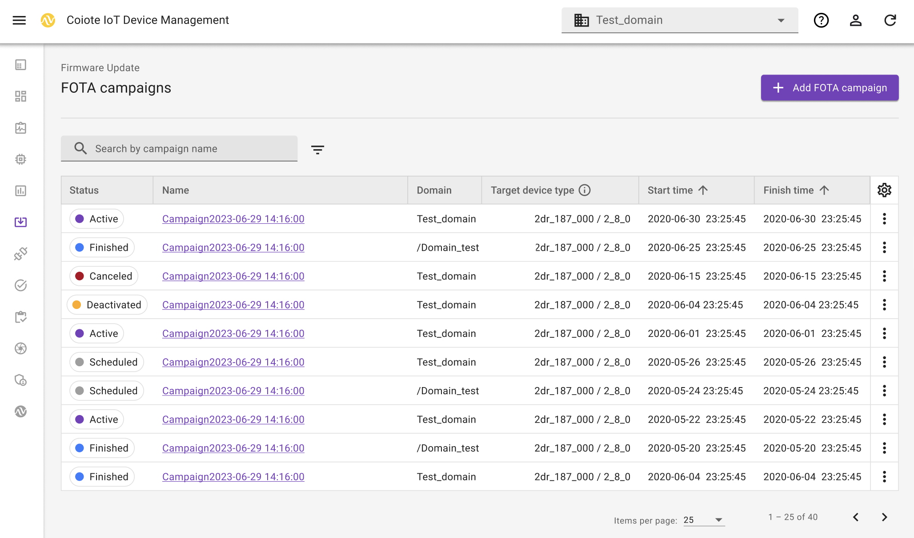
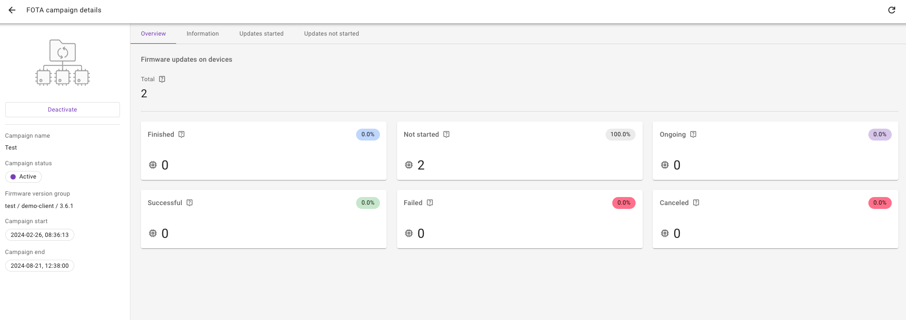

# Firmware campaigns

Firmware campaigns allows for updating a group of devices simultaneously. This feature enables configuration, activation, and tracking the Fleet FOTA campaign process. 

## FOTA campaigns dashboard

The FOTA campaigns dashboard consists of a list of campaigns with the possibility to add or hide columns with: **Status**, **Name**, **Domain**, **Target device type**, **Start time**, **Finish time**, **Created**, and **Created by**. The **cogwheel** icon allows for adjusting the table according to your preferences. If you want to search for specific campaigns, you can type the campaign name in the search bar or filter entities per status and domain. 

In the dashboard view, by clicking the **Actions** icon > **Go to campaign details**, you can preview details on the chosen campaign.

The cards show Firmware update statuses and number of affected devices. The following statuses are possible:

 - Finished - completed updates with the **Error** and **Success** status
 - Not started - created updates with the **Not started** status
 - Ongoing - updates that are in progress
 - Successful - successfully completed updates
 - Failed - updates with the **Error** status
 - Canceled - updates canceled manually or automatically while being in progress

By clicking on a chosen status card, you will be taken to the **Updates started** or **Updates not started** tab, depending whether the update is finished or in progress. This view shows a list of devices concerned with assigned statuses, campaign start time, campaign finish time, and the last time when the device was active. The **Updates started** tab allows for filtering devices per status.

The **Information** tab consists of information on a chosen FOTA campaign and the used FOTA configuration.

The left-side panel summarizes FOTA campaign information and allows for deactivating the campaign with no possibility to reactivate it. This action also cancels ongoing firmware updates used in this campaign. However, deactivation doesn't remove the historical data.

## Manage groups

You can manage groups of devices according to your preferences. 

 1. In the left-side panel, go to **Device inventory**.
 2. Select devices that you want to carry out actions on. 
 3. Click **Actions** and choose the action that you want to execute.
     * To add selected devices to a group, click **Add to group** and specify your preferences in the pop-up window.
     * To remove devices from a group, click **Remove from group** and follow the instruction in the pop-up window.
     * To change a domain, click **Change domain** and follow the instruction in the pop-up window.
     * To permanently delete devices, click **Delete**. You won't be able to recover deleted devices.

## Add FOTA campaigns

1. To add FOTA campaign, go to **Firmware Update** > **FOTA campaigns**.
2. In the upper-right corner, click **Add FOTA campaign** > **Basic**.
3. In the **Basic data** view, provide a campaign name, (optionally) description of the firmware and select FOTA configuration. 
   You can choose between subordinate or superior domains as well as your own domain. 
4. In the preview section, verify the details before moving next.
5. To schedule campaign time, click **Next**. 
6. Specify campaign start and finish time by choosing the date and time. The campaign can last for up to 6 months.
7. To proceed, click **Next**.
8. In the **Devices** section, select target device type and device group. The table shows a list of affected devices with a corresponding status, endpoint name and the last time they were active. 

    !!! info
        For more information on adding devices to a group, see [Manage groups](#manage-groups).

9. To go to the **Summary** section, click **Next**. 
10. Once you review the details of your campaign, click **Add FOTA campaign**. 
    
    If you fill in the details correctly, you will see the confirmation that your campaign has been added successfully.    

