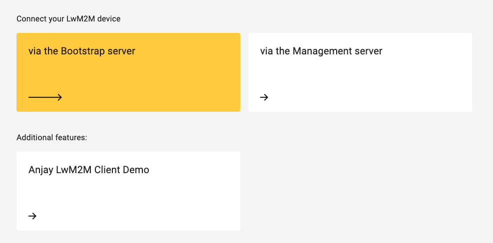
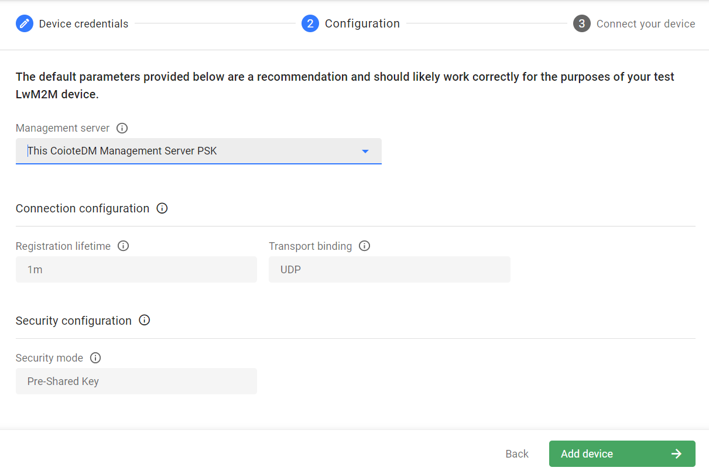

# Add a device via the Bootstrap Server

To add a device using the Bootstrap server:

1. From the navigation menu, select **Device Inventory** and click the **Add device** button.  

    !!! note
        If you're a new user with no added devices, the **Add your LwM2M device** panel will be displayed upon logging in to the platform.

2. Select the **Connect your LwM2M device via the Bootstrap server** tile.
   
3. In the **Device credentials** step, provide the following:
     - Device ID - enter the endpoint name of your LwM2M device.
     - Friendly name (optional) - enter a name for your device that will help user identify it in the platform.  
     - Security mode:
         - PSK - authorize your device using a pre-shared key. To use this option, provide the following:
             - **Key identity** - define the name that the device will use during DTLS handshake. Can be equal with the LwM2M device endpoint name.   
             - **Key** - provide the shared secret used in the device-server authentication. Select the **Key in hexadecimal** check box to enable specifying the key in hexadecimal format.
         - NoSec - use the device with no security established for the device-server communication. It is recommended to use this mode only for testing purposes.
         - Certificate - secure your device-server communication with a certificate:
             - Select **Use a previously uploaded certificate** if you have already uploaded a certificate to the platform using the **DTLS/TLS Certificates** panel.
             - Select **Upload a new certificate** to load your certificate file using the **Browse** button.
4. Click the **Configuration** button to go to the next step.
5. In the **Configuration** step, select a Management server for your device from the drop-down list:
    
    - **Use the bootstrap configuration set as default for your domain** - use this setting if you want to make use of the inherited bootstrap settings for your domain.
    - **This Coiote DM Management Server (Cert with EST)** - use this setting if you have chosen the **Certificate** mode in the **Device credentials** step.
    - **This Coiote DM Management Server NoSec** - use this setting to establish the device-server communication with no security. Using this mode is not recommended except for testing purposes.
    - **This Coiote DM Management Server PSK** - use this setting to authorize the device-server communication using a pre-shared key.
    - **Your custom bootstrap setting** - this type of setting will appear if you have configured a bootstrap server setting using the **Bootstrap configuration** panel.
6.  Click the **Add device** button and **Confirm** in the confirmation pop-up.

    !!! important
        At this stage, your device will be already visible in the platform. However, to get your device connected, you need to configure it using the credentials from the next step.

7. In the **Connect your device** step, insert the given connection parameters into your device to start connection.
8. Click **Go to device** to see your added device dashboard.