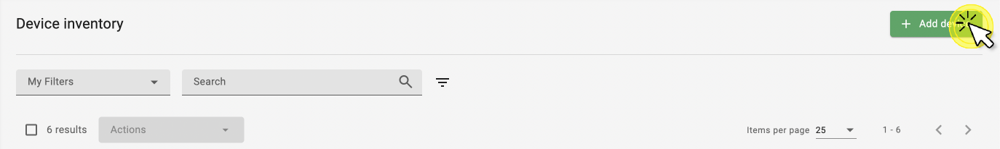
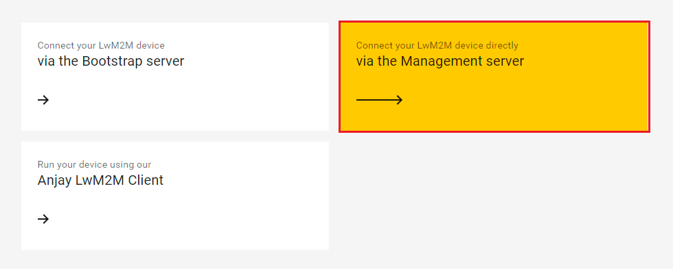
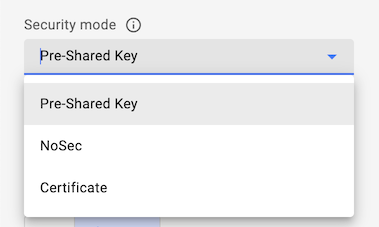
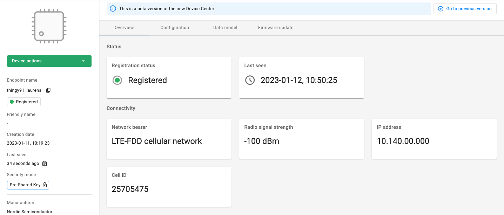

# Add a device via the Management Server

This guide walks you through the process of adding new devices to {{ short_name }} using the **Management server**.

!!! info
    The LwM2M standard defines two methods for device registration:

    1. **Management server** (default) - The LwM2M Client negotiates security credentials directly with the LwM2M server.
    2. **Bootstrap server** (enhanced security) - The Bootstrap server is a dedicated server that acts as an intermediate to securely provision LwM2M Clients with the necessary information to register with a LwM2M server. For more information, visit the [**Bootstrap guide**](bootstrap.md).

## Prerequisites

- An active [{{ short_name }}]({{ site_link }}) user account
- A LwM2M device

!!! tip "Sign up free of charge"
    You can create a **free developer account** allowing you connect up to 10 devices, to register visit: [eu.iot.avsystem.cloud]({{ site_link }})

## Add a device via the Management server

1. Log in to {{ short_name }} and from the left side menu, select **Device inventory**.

1. In **Device inventory** click **Add device**.

    

    !!! note
        If you're a new user with no added devices, the **Add your LwM2M device** panel will be displayed upon logging in to the platform.

1. Select the **Connect your LwM2M device via the Management server** tile.
   

1. In the **Device credentials** step:
     - **Endpoint name** - enter your LwM2M device endpoint name
     - **Friendly name** (optional) - enter a name that will help you identify your device

         

     - Choose one of the **Security modes**:

        

        !!! note
            For more information about the Security modes, see the [**Security modes**](#security-modes) section.

1. Click **Add device** and **Confirm** in the confirmation dialog window.

1. Once the device is activated using the right connection parameters, the device is added to the {{ short_name }} platform.
    

## Security modes

!!! info
    LwM2M supports three security modes: **Pre-Shared Key**, **Certificate**, and **NoSec**.

    * **PSK mode** uses a pre-shared key to establish secure communication between the LwM2M Client and Server.
    * **Certificate mode** uses certificates for authentication and secure communication.
    * **NoSec mode** provides no security and is intended for testing and development purposes only.

=== "**Pre-Shared Key** (PSK)"

    Authorize your device using a pre-shared key. To use this option, provide the following:

    - **Key identity** - Define the name that the device will use during the DTLS handshake. The Key identity can be equal to the LwM2M device endpoint name.
    - **Key** - Provide the shared secret used in the device-server authentication in *hex* or *plain text*.
    ---

=== "**Certificate**"

    Secure the device-server communication with a certificate:

    - Select **Use a previously uploaded certificate** if you have already uploaded a certificate to the platform using the **DTLS/TLS Certificates** panel.
    - Click **Upload a new certificate** to load your certificate file using the **Browse** button.

    !!! note
        For more information about connecting devices using a certificate, visit the [**Certificate mode**](certificate.md) guide.

    ---

=== "**NoSec**"

    Use the device with no security established for the device-server communication. Using this mode is not recommended except for testing purposes.

    ---

## Useful resources

* For more information about connecting devices using certificates, see the [**Certificate mode**](certificate.md) chapter.
* For more information about connecting devices using the Bootstrap server, see the [**Bootstrap server**](bootstrap.md) chapter.
