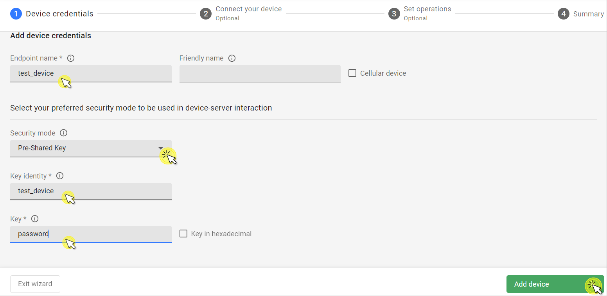

# Connect Devices

This guide walks you through the process of adding new devices to Coiote IoT DM using the **Management Server**.

!!! info
    The LwM2M standard defines two methods for device registration:
    
    1. **Management Server** (default) - The LwM2M Client negotiate security credentials directly with the LwM2M Server.
    2. **Bootstrap Server** (enhanced security) - The Bootstrap Server is a dedicated server that acts as an intermediate to securely provisions LwM2M Clients with the necessary information to register with a LwM2M Server. For more information, visit [this guide](bootstrap.md).

### Prerequisites

- An active [Coiote DM](https://eu.iot.avsystem.cloud) user account
- A LwM2M device

!!! note
    You can create a free developer account allowing you connect up to 10 devices, to register visit: [eu.iot.avsystem.cloud](https://eu.iot.avsystem.cloud)

## Add a device via the Management Server

1. Log in to Coiote DM and from the left side menu, select **Device Inventory**.

1. In **Device Inventory** click **Add device**.

    

    !!! note
        If you're a new user with no added devices, the **Add your LwM2M device** panel will be displayed upon logging in to the platform.

1. Select the **Connect your LwM2M device directly via the Management server** tile.
   

1. In the **Device credentials** step:
     - **Endpoint name** - Enter your LwM2M device endpoint name.
     - **Friendly name** (optional) - Enter a name that will help you identify your device.

         

     - Choose one of the **Security modes**:

        

        !!! info
            LwM2M supports three security modes: **Pre-Shared Key**, **Certificate**, and **NoSec**. 
            
            * **PSK mode** uses a pre-shared key is used to establish secure communication between the LwM2M Client and Server. 
            * **Certificate mode** uses certificates for authentication and secure communication. 
            * **NoSec mode** provides no security and is intended for testing and development purposes only.

        
        === "**Pre-Shared Key** (PSK)"

            Authorize your device using a pre-shared key. To use this option, provide the following:

            - **Key identity** - Define the name that the device will use during the DTLS handshake. The Key identity can be equal with the LwM2M device endpoint name.
            - **Key** - Provide the shared secret used in the device-server authentication in *hex* or *plain text*.
            - **NoSec** - Use the device with no security established for the device-server communication. Using this mode is not recommended except for testing 
            ---
    
        === "**Certificate**"

            Secure the device-server communication with a certificate:

            - Select **Use a previously uploaded certificate** if you have already uploaded a certificate to the platform using the **DTLS/TLS Certificates** panel.
            - Click **Upload a new certificate** to load your certificate file using the **Browse** button.

            !!! info
                For more information about connecting devices using a certificate, visit [**this guide**](certificate.md).

            ---

        === "**NoSec**"

            Use the device with no security established for the device-server communication. Using this mode is not recommended except for testing purposes.

            ---

1. Click the **Add device** button and **Confirm** in the confirmation pop-up.

1. Once the device is activated using the right connection parameters, the device will be added to the Coiote IoT DM platform.
    

## Useful Resources

* For more information about connecting devices using the **Certificate mode**, visit [**this guide**](certificate.md).
* For more information about connecting devices using a the **Bootstrap Server**, visit [**this guide**](bootstrap.md).