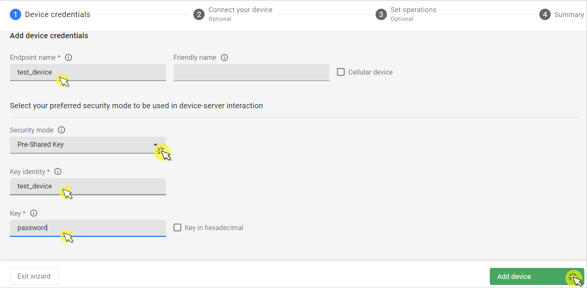
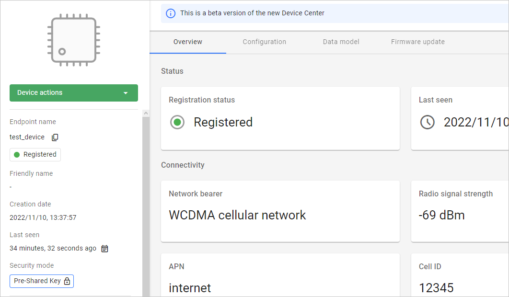
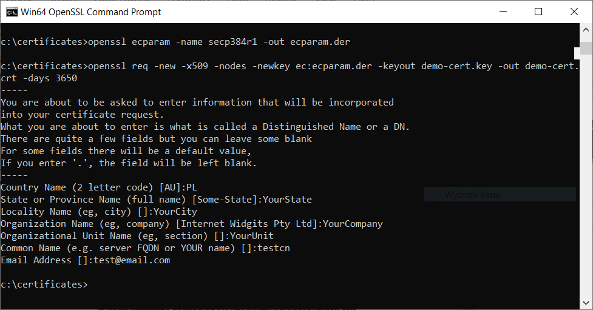
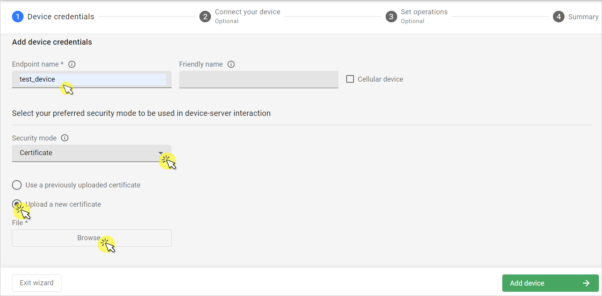
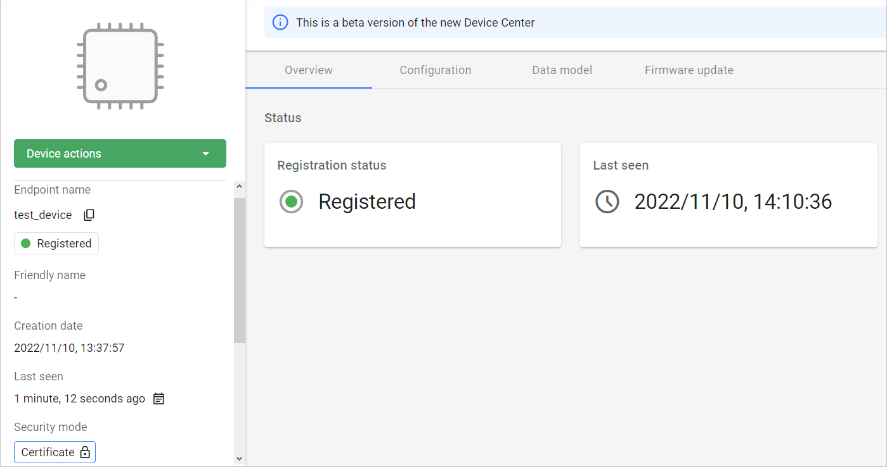

# Connect device

Learn how to onboard a LwM2M device in just a few clicks using the Management server and different security modes.   

## Connect a device with PSK security mode

### Prerequisites

- An active [Coiote DM](https://eu.iot.avsystem.cloud) user account with appropriate role assigned.
- A LwM2M device (except for the simulated test device scenario).

1. Upon logging in to Coiote DM, you will see the **Add your LwM2M device** panel.

    !!! note
        If you had previously added a device, the panel will not show. In this case, from the navigation menu, select **Device inventory** and click the **Add device** button.

2. Select the **Connect your LwM2M device directly via the Management server** tile.
   
3. In the **Device credentials** step:
     - In the **Endpoint name** enter your LwM2M device endpoint name, e.g. `test_device`.
         
     - In the **Security mode** section, select the **PSK** mode:
          - In the **Key identity** field, type `test_device`
          - In the **Key** field, type the shared secret used in the device-server authentication.  
4. Click the **Add device** button and **Confirm** in the confirmation pop-up.
5. In the **Connect your device** step, insert the given connection parameters into your device to start connection.
    
6. Click **Go to device** to see your added device dashboard.
    

## Connect a demo device with a certificate

### Prerequisites

- An active [Coiote DM](https://eu.iot.avsystem.cloud) user account with appropriate roles assigned.
- Compiled [Anjay SDK demo library](https://github.com/AVSystem/Anjay) for simulating a device.
- Installed [OpenSSL](https://www.openssl.org) (or similar) for generating the certificate.

### Generate certificate and key in OpenSSL

0. Open the OpenSSL command line terminal and run the following command(s):

    === "Windows"
        ```
        openssl ecparam -name secp384r1 -out ecparam.der
        openssl req -new -x509 -nodes -newkey ec:ecparam.der -keyout demo-cert.key -out demo-cert.crt -days 3650
        ```

    === "Linux"
        ```
        openssl req -new -x509 -nodes -newkey ec:<(openssl ecparam -name secp384r1) -keyout demo-cert.key -out demo-cert.crt -days 3650`
        ```

2. You will be asked to provide certificate information inside the terminal. You may leave the fields blank by pressing `Enter` for each or fill them in with your data.

    

3. Convert the generated certificates into the `.der` format by running the following command:

    ```
    openssl x509 -in demo-cert.crt -outform der -out demo-cert.der
    openssl ec -in demo-cert.key -outform der -out demo_key.der
    ```

### Add device to Coiote DM and connect

0. Upon logging in to Coiote DM for the first time, you will see the **Add your LwM2M device** panel.

    !!! note
        If you had previously added a device, in **Device inventory**, click the **Add device** button.

0. Select the **Connect your LwM2M device directly via the Management server** tile.
   
0. In the **Device credentials** step:
     - In the **Endpoint name** enter your LwM2M device endpoint name, e.g. `test_device`.
     - In the **Security mode** section, select the **Certificate** mode.
        
     - Click **Upload a new certificate** and **Browse**.
     - In the pop-up, go to the directory where your certificate has been generated, select the `demo-cert.crt` file and click **Open**. 
     - Click **Add device**.
0. In the **Connect your device** step, insert the given connection parameters and the path to your certificate and key into the command used for starting the Anjay demo device. The following is an example command:

    ```
    ./output/bin/demo --endpoint-name test_device --security-mode cert -C c:/certificates/demo-cert.der -K c:/certificates/demo_key.der --server-uri coaps://eu.iot.avsystem.cloud:5684
    ```
 
    !!! note
        You need to change the `c:/certificates/` path for the path where your generated certificate and key are stored.   
0. In the command line terminal, open the **Anjay** directory, paste the appropriately modified command and run it.
0. In Coiote DM, click **Next**, **Go to Summary** to skip the third step, and **Finish** to see your Device Center.
    
