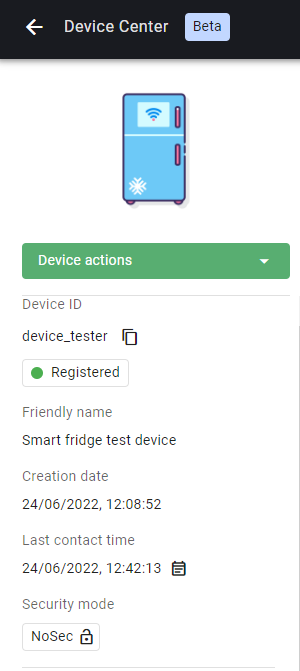
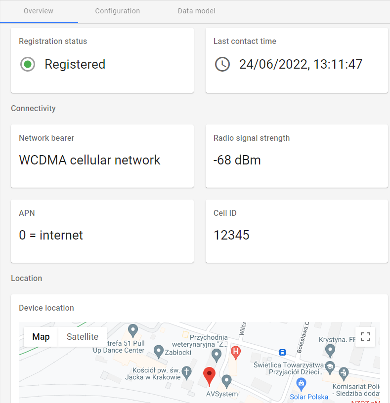
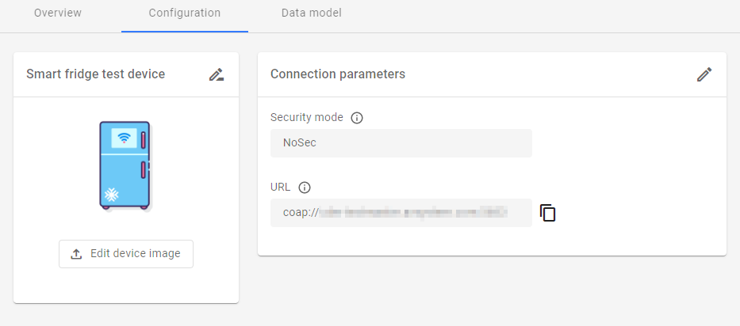
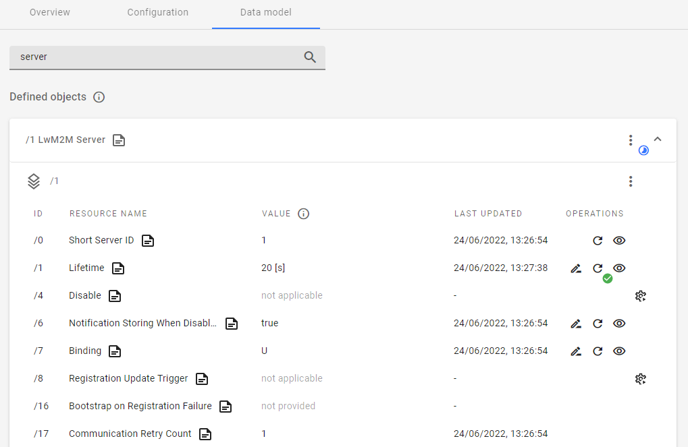

# v2022.13.5

Previous version: v2022.12.4

## Features

### New Device Center
We have introduced the new Device Center for effective management of single devices. Designed to enable IoT developers build LwM2M applications quickly and intuitively, it features the following actionable views:

- Summary sidebar
       - Use device actions (reboot, data model refresh, clear DTLS context, delete device)
       - Quickly check connection status and parameters
       - See basic device info

      {:style="float: left;margin-right: 1077px;margin-top: 17px;margin-bottom: 17px"}

- Overview tab
       - Display widgets related to device status and connectivity
       - View Device location on the map and check location details

      

- Configuration tab
       - Upload device image and change its **Friendly name**
       - View and copy device connection parameters

      

- Data model tab
       - Perform or schedule operations on device objects, object instances, and resources:
           - Read
           - Write
           - Execute
           - Set observations
       - View the details of individual objects and resources
       - Search the data model for device objects, object instances, and resources

      
The Device Center replaces the old Device Management Center view (DMC) which is still supported - use the **Go to previous version** button and the **Go to new Device Center** link to switch between them.
