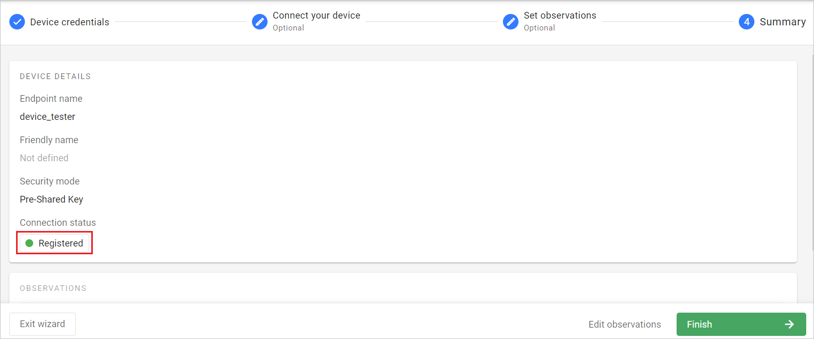
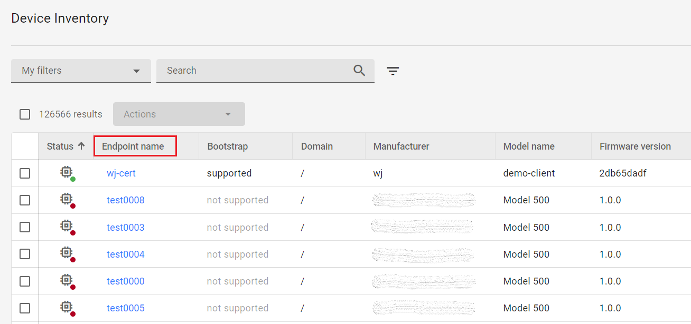

# v2022.19.2

Previous version: [v2022.18.3](v2022.18.3.md)

## Enhancements

### Connection status indicator in **Device creator** summary
We have introduced the connection status indicator to the summary step of the **Device creator**. It is now consistent with the Device Center summary

### ‘Impersonated by’ column in task edition history of **Historical analysis**
 We have added the ‘Impersonated by’ column to theTask edition history table that shows the UserID of the actual user (impersonator) who executed the recorded action from the account of the user being impersonated.

## Architectural Changes

### **Device ID** changes to **Endpoint name**
We have changed the **Device ID** label to **Endpoint name** in Device inventory, Device Center and other relevant views. This has been triggered by major changes in how the device endpoint name is now encrypted in the database.

## Bug Fixes

### Fixed *Devices registration status action* causing domain change
Deleting *Devices registration status action* no longer causes devices to change domains.

### Fixed behavior of snackbars persisting between steps of the Device creator
Snackbars appearing In the "Connect your device” step of Device creator will now disappear when navigating to the next step.

### Fixed searching for task templates
We have fixed the search option available when selecting a task template. It now works correctly, also for old Expressions and for characters such as square brackets.
