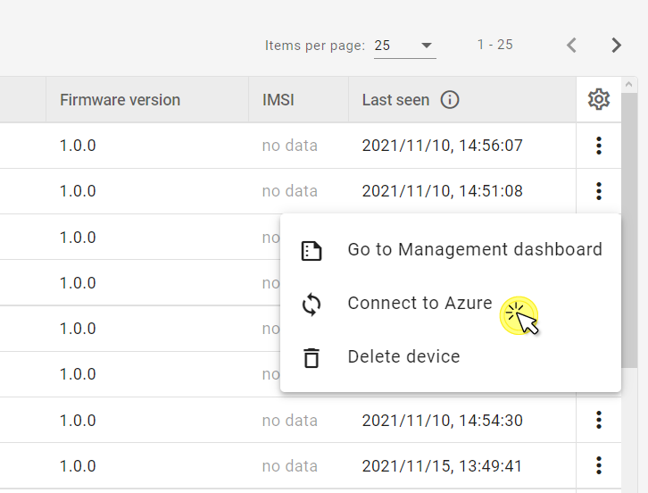

# v2022.20.4

Previous version: [v2022.19.2](v2022.19.2.md)

## Features

### Connect single device to **Azure**
We have added an option to connect single devices in **Device inventory** to the currently integrated **Azure** service. It is available in the context menu for each created device displayed in the **Device inventory** table. The operation can only be performed for a device with a configured LwM2M Management server and in the domain that the device belongs to.

### Saving filter state of the Device inventory in URL fragment
In **Device inventory**, we have introduced saving filter data as state in a URL fragment. This allows saving any filter data e.g. groups, domain, lifecycle status, and search text. When the user saves a filter or types in the search field, the URL fragment is updated. When copying and pasting the URL, the relevant data context will be applied in the filter.

## Architectural Changes

### New monitoring endpoints in restAPI
We have implemented two device monitoring restAPI endpoints:

- ``/deviceMonitoring/data/{deviceId}/resourceUrl/{lwm2mUrl}`` - returns a series of monitoring data from the device's resource identified by its LwM2M URL that were reported between the `timeRangeStart` and `timeRangeEnd`.
- ``/deviceMonitoring/data/{deviceId}/alias/{alias}`` - returns a series of monitoring data from the device's resource identified by its alias that were reported between the `timeRangeStart` and `timeRangeEnd`.

## Enhancements

### New methods added to lwM2M context in XML tasks
Added two methods to lwm2m context in XML tasks:

- `dmPathToLwM2MPath` - transforms a `dmPath` to a `lwm2mPath` (eg. `Device.0.Manufacturer` -> `/3/0/0`)
- `getDataType` gets the data type for a given path (eg. `Device.0.Manufacturer` -> string)

If the specified `dmPath` is not known, because either: the model is invalid or the path itself is invalid, then the method will return `null`.

## Bug Fixes

### Fixed adding devices to inaccessible group using ``<join>`` tag
We have changed the behavior of the XML task ``<join>`` tag so that it is no longer possible to create a group in the wrong domain using the tag.

### Fixed values of Connectivity widgets in Device Center Overview tab
We have fixed the **Cell ID**, **APN**, **Radio signal strength** and **Network bearer** **Connectivity** widgets in **Device Center** so that each displays the relevant values.
