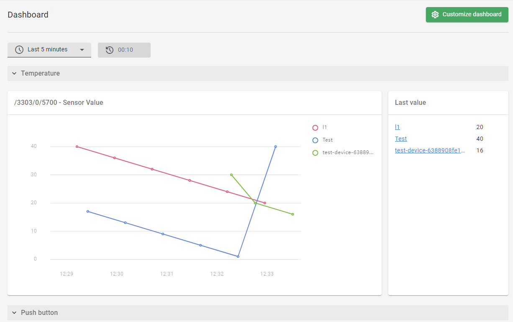

# v2022.23.11

Previous version: [v2022.22.0](v2022.22.0.md)

## Features

**Visualizing data with widgets in the new Dashboard view**      

We have introduced a brand new **Dashboard** view for displaying widgets used for data visualization. Widgets are set and configured in the **Data model** tab of the **Device Center**      , along with their corresponding Observations to enable data collection. The Dashboard data is displayed per domain and features the following kinds of charts based on the type of data collected:

  - Line chart
  - Boolean chart
  - Gantt chart
  - Punch card chart

## Architectural Changes

**Renamed `cdm.conf` configuration file to `devman.conf`**    

We have renamed the `cdm.conf` configuration filename to `devman.conf` according to the established naming convention.

**Device ID compatibility translation in REST API v3 endpoints**     

We have completed the bidirectional compatibility translation between the old and new **Device ID** format for all the REST API v3 endpoints. In the new **Device ID** format, the **Endpoint name**       is now hashed for better security. 

## Enhancements

**Improvements in displaying tooltips**      

We have fixed the behavior of the tooltips so that the displayed tooltip of one button doesn’t prevent clicking on the neighboring element. We have also introduced small delays when showing and hiding tooltips upon hovering on an UI element.

**Consistent spacings between text fields**      

We have introduced consistent spacings between text fields in **Operations Center** and **Device inventory**.

## Bug Fixes

**Fixed Azure IoT devices cannot be deleted**    

We have fixed a bug which prevented the user from deleting devices connected to an Azure IoT integration. Now, device deletion is instantaneous.

**Fixed hex key validation when adding a device with PSK mode**     

We have fixed the validation of keys typed in the hexadecimal format so that the warning message shows immediately after unclicking the key input. 

**Domain verification when updating Management device entity in Bootstrap**   
   
We have added domain verification when updating the **Management** device entity inside the **Bootstrap** entity. Now, if the **Management** entity already exists it must be visible from the level of **Bootstrap**       task domain, otherwise the task fails.
