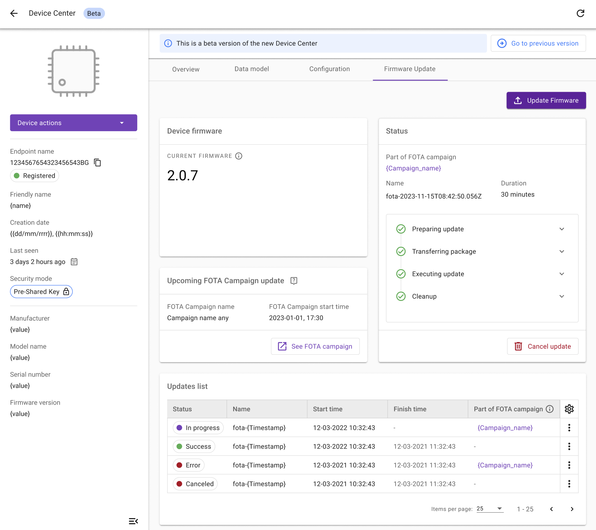

# Single update

There are two types of Firmware update:

 - **Basic Firmware Update** for a remote update of the LwM2M device firmware by using the **Firmware Update Object** `/5`.
 - **Multi-component Firmware Update** for a remote update of the LwM2M device's firmware component by using the **Advanced Firmware Update Object** `/33629`. Object `/33629` is designed as an extension of the Firmware Update object `/5`. It supports multiple instances, each representing a "component" of the device's firmware that can be upgraded separately. The specific meaning and purpose of these components are not standardized and can vary depending on the implementation. However, they typically encompass elements such as bootloaders, application code, cellular modem firmwares, security processor firmwares, and other related firmware entities.

!!! info
    **Multi-component Firmware Update** is the internal implementation, while **Advanced Firmware Update Object** `/33629` is supported by CoioteDM and Anjay only.

## Prerequisites

- An active [{{ coiote_short_name }}]({{ coiote_site_link }}/) user account
- A device which supports Firmware Update Object `/5`

!!! Note
    The **Anjay LwM2M Client** supports the Firmware Update Object. Learn more about Anjay by visiting the official <a href="https://avsystem.github.io/Anjay-doc/FirmwareUpdateTutorial.html" target="_blank">**Anjay Documentation site**</a> or <a href="https://github.com/AVSystem/Anjay" target="_blank">**Anjay SDK on GitHub**</a>.

## Firmware Update Object `/5`

The Firmware Update process is defined in the **Firmware Update Object `/5`**. This Object contains Resources which define the update process using **4 Update States** (representing the phase of the update process) and **11 Update Results** (representing the most common outcomes of the firmware update process).

* **Resource** `/5/*/3` represents the **State**
* **Resource** `/5/*/5` represents the **Update Result**

=== "**Update States**"

    | ID          | State       | Description |
    | ----------- | ----------- | ----------- |
    | `state 0`   | **Idle**    | Before downloading and after successfully updating |
    | `state 1`   | **Downloading** | The new firmware is on the way |
    | `state 2`   | **Downloaded** | The firmware download is completed |
    | `state 3`   | **Updating** | The Client starts updating its firmware, after which it changes its state back to *Idle* |

=== "**Update Results**"

    | Result          | Description |
    | ----------- | ----------- |
    | `update result 0`   | **Initial value** |
    | `update result 1`   | **Firmware updated successfully** |
    | `update result 2`   | **Insufficient flash memory for the new firmware package** |
    | `update result 3`   | **Out of RAM during downloading proces** |
    | `update result 4`   | **Connection lost during downloading process** |
    | `update result 5`   | **Integrity check failure for new downloaded package** |
    | `update result 6`   | **Unsupported package type** |
    | `update result 7`   | **Invalid URI** |
    | `update result 8`   | **Firmware update failed** |
    | `update result 9`   | **Unsupported protocol** |
    | `update result 10`  | **Firmware update cancelled** |
    | `update result 11`  | **Firmware update deferred** |

!!! info
    Learn more about the Firmware Update Object in the <a href="https://devtoolkit.openmobilealliance.org/OEditor/LWMOView?url=https%3A%2F%2Fraw.githubusercontent.com%2FOpenMobileAlliance%2Flwm2m-registry%2Fprod%2F5.xml" target="_blank">**OMA LwM2M Object and Resource Registry**</a>.

## Firmware Update Object `/33629`

Object `/33629` defines the update process using **4 Update States** representing the phase of the update process. Additionally, a total of **13 Update Results** may be reported, representing the most common outcomes of the firmware update process.

* **Resource** `/33629/*/3` represents the **State**
* **Resource** `/33629/*/5` represents the **Update Result**

=== "**Update States**"

    | ID          | State       | Description |
    | ----------- | ----------- | ----------- |
    | `state 0`   | **Idle**    | Before downloading and after successfully updating |
    | `state 1`   | **Downloading** | The new firmware is on the way |
    | `state 2`   | **Downloaded** | The firmware download is completed |
    | `state 3`   | **Updating** | The Client starts updating its firmware, after which it changes its state back to *Idle* |

=== "**Update Results**"

    | Result          | Description |
    | ----------- | ----------- |
    | `update result 0`   | **Initial value** |
    | `update result 1`   | **Firmware updated successfully** |
    | `update result 2`   | **Insufficient flash memory for the new firmware package** |
    | `update result 3`   | **Out of RAM during downloading proces** |
    | `update result 4`   | **Connection lost during downloading process** |
    | `update result 5`   | **Integrity check failure for new downloaded package** |
    | `update result 6`   | **Unsupported package type** |
    | `update result 7`   | **Invalid URI** |
    | `update result 8`   | **Firmware update failed** |
    | `update result 9`   | **Unsupported protocol** |
    | `update result 10`  | **Firmware update cancelled** |
    | `update result 11`  | **Firmware update deferred** |
    | `update result 12`  | **Conflicting state** |
    | `update result 13`  | **Dependency error** |

## Firmware Update Dashboard
In the **Device Center**, in the **Firmware update** tab, you can find cards with information on the selected Firmware Update.

 - **Device Firmware** shows the last recorded information on the current firmware version.
 - **Status** contains the information on the firmware concerned and shows if this firmware is a part of the FOTA campaign. It also indicates the status of the following stages of the Firmware update: **Preparing update**, **Transferring package**, **Executing update** and **Cleanup**. The **Cancel update** button allows you to end already started updating process which means that the Firmware update progress won't be saved. This action is only applicable for the devices supporting this feature.
 - **Upcoming FOTA Campaign update** shows the campaign which is identified as the first to perform the next Firmware update on a given device as per the time of creation and its schedule. Once the update starts, the campaign will be moved to the **Updates list**.
 - **Updates list** points at the Firmware updates history with the possibility to filter information by: **Status**, **Name**, **Start time**, **Finish time**, **Type**, **Created**, **Created by**, and **Part of FOTA campaign**. A reference link to a campaign name enables you to access the FOTA campaign details providing you have the appropriate permissions.

    - No information in this field, marked by a hyphen **-**, means that it's a Single FOTA Firmware update which is not a part of a campaign.
    - Whereas inactive information means that you are not eligible to view the details.

The **Settings** icon allows for enabling and disabling the filters according to your preferences. The **More action** icon allows for previewing configuration details of a chosen firmware, copying the configuration or canceling the existing one.

 


## Prepare the Firmware Update

1. In the {{ coiote_long_name }}, go to [**Device Inventory**]({{ coiote_site_link }}/ui/device/inventory).

2. Select the device you want to update by clicking on its endpoint name.

3. Go to the **Data model** tab to validate if:

    * the Firmware Update Object `/5` is present for Basic Firmware Update
    * the Firmware Update Object `/33629` is present for Multi-component Firmware Update

    If so, the Object is supported by the LwM2M Client.

    

4. Go to the **Firmware update** tab and click **Update Firmware**.

6. From the drop-down menu, choose the type of Firmware Update that you want to create:
    - Basic Firmware Update from an existing configuration
    - New Basic Firmware Update
    - New Multi-component Firmware Update

### Create Basic Firmware update from an existing configuration

To create basic Firmware update from an existing configuration, perform the following steps:

1. Provide a name of the Firmware update.
2. Select a FOTA configuration for your Firmware update.
3. In the FOTA configuration settings section, preview configuration details before scheduling update.
4. To create Firmware update, click **Schedule Update**.

    If you fill in details correctly, you will see the confirmation that your update has been scheduled successfully.

### Create new Basic Firmware update

To create new, basic Firmware update, perform the following steps:

1. Provide a name of the Firmware update.
2. Upload a new firmware image or choose one from the resources.
3. Optionally, in the **Description** field, provide information about the Firmware version.

    !!! Info
        You can save FOTA configuration after its creation by enabling the appropriate toggle switch. Once it's activated, you can also make the configuration visible in subdomains by enabling **Visible in domains**. In case the configuration is saved for later purposes, the underlying files expiration date is extend to 6 months.
        <br>
        

4. To go to **Settings**, click **Next**.
5. Choose the image delivery method:

    

    * **Pull method** (recommended): The LwM2M Client receives the URI of the file that is to be downloaded and pulls the file from it.
      **Pull** supports the following **transport types**:
        - `CoAP` or `CoAPs` over `UDP`
        - `CoAP` or `CoAPs` over `TCP`
        - `HTTP` or `HTTPs`
    * **Push method**: The LwM2M Server pushes the firmware file to the device.
        **Push** transmits the firmware over the same transport type as is used for device management, which is `CoAPs` over `UDP` by default.

    !!! Tip "Which transport protocol to choose?"
        Downloads using `CoAP(s)` over `UDP` tend to be slow due to the limitation of the maximum CoAP Block size of 1024 bytes and the required acknowledgements for each Block transfer.
        Choosing `CoAP(s)` over `TCP` or `HTTP(s)` usually results in faster download speeds. However, not every device supports these transport protocols.

6. Choose the URI format in which the URL will be send to the firmware package.

    !!! Info
        In the **Preview** field, you can verify the location of the security token.

7. Once you check the details in **Firmware Update Flow Preview**, click **Next**.
8. In the **Summary** section, preview the Firmware update information and click **Schedule Update**.

    If you filled in the details correctly, you will see the confirmation that the Firmware update has been scheduled successfully.

### Create new, multi-component Firmware update
To create new, multi-component Firmware update, perform the following steps:

1. Provide a name of the Firmware update.
2. Optionally, in the **Description** field, provide information about your Firmware version.

    !!! Info
        You can save FOTA configuration after its creation by enabling the appropriate toggle switch. Once it's activated, you can also make the configuration visible in subdomains by enabling **Visible in domains**. In case the configuration is saved for later purposes, the underlying files expiration date is extended to 6 months.
        

3. To go to the component selection, click **Next**.
4. To select more than one component, click **Add new component** and upload a new firmware or choose one from resources.
    
5. To go to **Settings**, click **Next**.
6. Choose the image delivery method:

    

    * **Pull method** (recommended): The LwM2M Client receives the URI of the file that is to be downloaded and pulls the file from it.
      **Pull** supports the following **transport types**:
        - `CoAP` or `CoAPs` over `UDP`
        - `CoAP` or `CoAPs` over `TCP`
        - `HTTP` or `HTTPs`

    * **Push method**: The LwM2M Server pushes the firmware file to the device.
      **Push** transmits the firmware over the same transport type as is used for device management, which is `CoAPs` over `UDP` by default.

    !!! Tip "Which transport protocol to choose?"
        Downloads using `CoAP(s)` over `UDP` tend to be slow due to the limitation of the maximum CoAP Block size of 1024 bytes and the required acknowledgements for each Block transfer.
        Choosing `CoAP(s)` over `TCP` or `HTTP(s)` usually results in faster download speeds. However, not every device supports these transport protocols.

6. Choose the URI format in which the URL will be send to the firmware package.

    !!! Info
        In the **Preview** field, you can verify the location of the security token.

7. Once you check the details in the **Firmware Update Flow Preview** section, click **Next**.

8. In the **Summary** section, preview the Firmware update information and click **Schedule Update**.

    If you filled in the details correctly, the Firmware update will be scheduled successfully.


## Download & Upgrade Process

If the Firmware Update is scheduled successfully, the device starts downloading the firmware at the next practical opportunity. The actual firmware **update** starts once the integrity and authenticity of the firmware image has been validated by the LwM2M Client.


Once executed successfully, the status in the **Update list** panel changes to `Success`.


!!! note
    While the device is updating its firmware, it will deregister and reboot by using the new firmware. This process may time several minutes.

    

### Monitoring the update process

You can monitor the status of the Firmware update by reviewing the following resources:

 - **State** `/5/*/3` and **Update Results** `/5/*/5` for **Basic Firmware Update**
 - **State** `/33629/*/3` and **Update Results** `/33629/*/5` for **Multi-component Firmware Update**

To find the Resources, select the **Data model** tab and open:

 - **Firmware Update Object** `/5` for **Basic Firmware Update**
 - **Advanced Firmware Update Object** `/33629` for **Multi-component Firmware Update**


If no errors occur, the update process follows this pattern:

1. **Downloading** `state 1` & `update result 0`
2. **Downloaded** `state 2` & `update result 0`
3. **Updating** `state 3` & `update result 0`
4. **Updated** `state 0` & `update result 1`

!!! important "Update successful?"
    - If the **State** `/5/*/3` reports `0` and the **Update Results** `/5/*/5` reports `1` for **Basic Firmware Update**, the firmware device has been completed successfully. Congratulations!
    - If the **State** `/33629/*/3` reports `0` and the **Update Results** `/33629/*/5` reports `1`for **Multi-component Firmware Update**, the firmware device has been completed successfully. Congratulations!

## REST API
 [REST API Documentation](http://cdm-tc-main-fleetfota.kube.si:8086/apidoc/coiotedm/v3) supports **Basic Firmware Update** and **Multi-component Firmware Update** for the the updates which use an existing configuration. For more information, see the [Firmware Configurations](Configurations.md), [Firmware Campaigns](Campaigns.md) or [Single Update](Single_update.md) sections.

## Troubleshooting

### Firmware Update only works over CoAP, not over CoAPs - sample issue

For the firmware update over CoAPs transfer to work, the LwM2M Client must use the same security credentials (i.e. PSK or certificates) as those used for the management interface. This is the default behavior of the Anjay client, but you might need to configure it explicitly when using other LwM2M Client implementations.

!!! info "Zephyr LwM2M Client configuration instruction"

    The **security tags** needs to the same in the "**Security tag for FOTA download library**" as in the "**LwM2M server TLS tag**" (e.g. using Nordic's default tag: `35724861`).

    To update the security tags, edit the **Kconfig** in the directory:

    ```
    Zephyr Kernel
    > Modules
        > nrf
        > Nordic nRF Connect
            > Networking
            > Application protocols
                > LwM2M client utilities library
                > Security object support
                > Firmware Update object support
    ```

    
    *Kconfig editor in nRF Connect for VS Code*

## Useful Links
- [Anjay firmware update documentation](https://avsystem.github.io/Anjay-doc/FirmwareUpdateTutorial/FU-Introduction.html)
- [Anjay SDK](https://github.com/AVSystem/Anjay)
- [Anjay Zephyr SDK](https://github.com/AVSystem/Anjay-zephyr-client)
- [Anjay ESP32 SDK](https://github.com/AVSystem/Anjay-esp32-client)
- [OMA LwM2M Object and Resource Registry](https://technical.openmobilealliance.org/OMNA/LwM2M/LwM2MRegistry.html)

