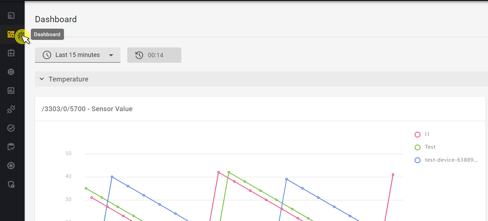
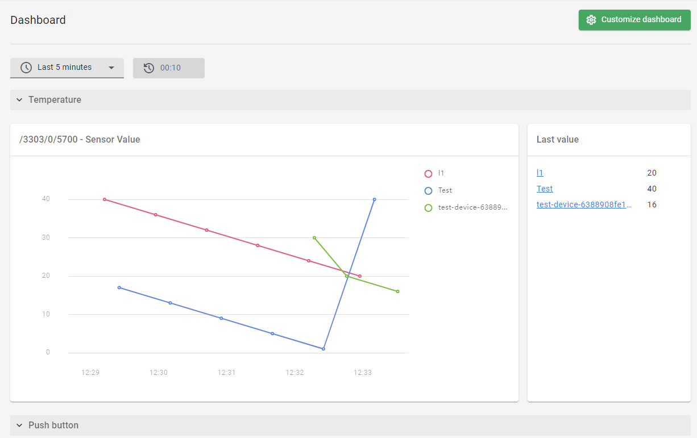
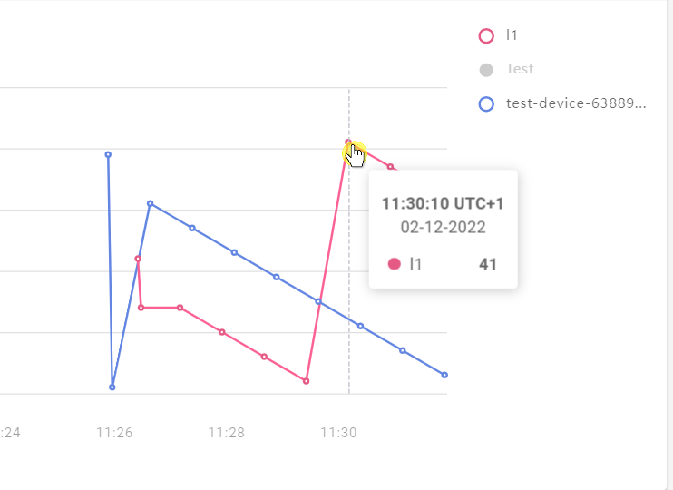
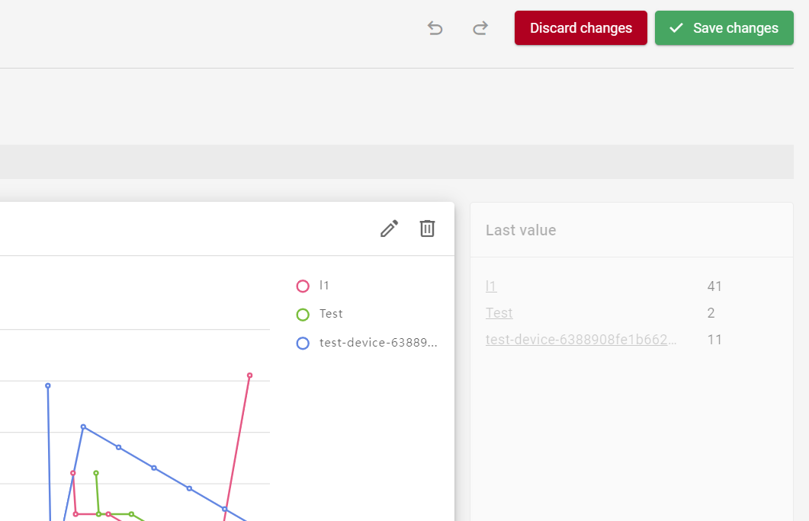

# Dashboard

The **Dashboard** displays widgets with visualized device data for your domain. Widgets are set and configured in the **Data model** tab of the **Device Center**, along with their corresponding **Observations** to enable collection of the reported device data. The **Dashboard** widgets are displayed per domain and feature different kinds of charts depending on the type of data collected.

!!! important
    The **Dashboard** and widgets are domain-wide, so they only apply to devices belonging to your domain. You can add up to 10 devices to a single widget, and they are added chronologically based on their **Creation time**. So if there are, for example, 15 devices in your domain, the 10 oldest of them will only be presented on a widget.

{:style="float: left;margin-right: 817px;margin-top: 17px;margin-bottom: 17px;border: 1px solid lightgray"}

## Dashboard overview

The **Dashboard** consists of widgets which are based on observations set on a device's data model. If you can't see any widgets in your domain dashboard, follow the [Visualize device data](../Quick_Start/Visualize_device_data.md) quick start to set them up smoothly.

  {:style="float: left;margin-right: 817px;margin-top: 17px;margin-bottom: 17px;border: 1px solid lightgray;"}

### Widgets

!!! note
    A total of 15 widgets can be configured for a domain. A counter showing the number of widgets left to use is displayed in the **Add widget** dialog window.

A widget consists of its main component, which is a chart representing the collected device data, and the **Last value** component, which lists the last value that each device in the widget reported to Coiote DM. 

- To adjust the displayed timespan for the widget data, select the desired period in the **timespan** expandable list. Choose among the predefined timespans ranging from 5 minutes up to 12 hours. 

    !!! tip
        If the widget chart displays no data, the cause might be that the 10 oldest devices in your domain were not active within the chosen timespan and no data was reported. Try chosing a wider timespan or check device connection status.

- To view individual data readings in a chart, hover over a data point to see the reading value and its exact date.  
  {:style="float: left;margin-right: 817px;margin-top: 17px;margin-bottom: 17px;border: 1px solid lightgray;width: 60%"}  
- To exclude a device from the chart, simply click on its name located next to the chart. 

!!! note
    The widget data is refreshed automatically and periodically every 15 seconds.

### Customize dashboard

A dashboard can be customized. Click **Customize dashboard** to switch to edition mode.

- To change widget name, expand a widget and click the **pencil** icon. Type the new name and click **Save**. 
- To delete a widget, expand a widget and click the **thrash bin** icon.
{:style="float: left;margin-right: 817px;margin-top: 17px;margin-bottom: 17px;border: 1px solid lightgray;width: 80%"}  
- To undo or redo your edits, click the **undo** or **redo** arrows.
- To exit edition mode without saving changes, click **Discard changes** and **Discard** in the dialog window.
- To exit edition mode and save changes, click **Save changes**.