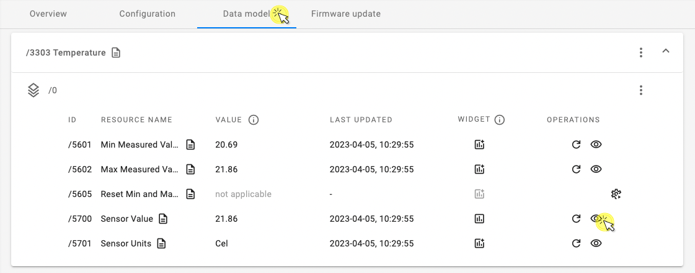
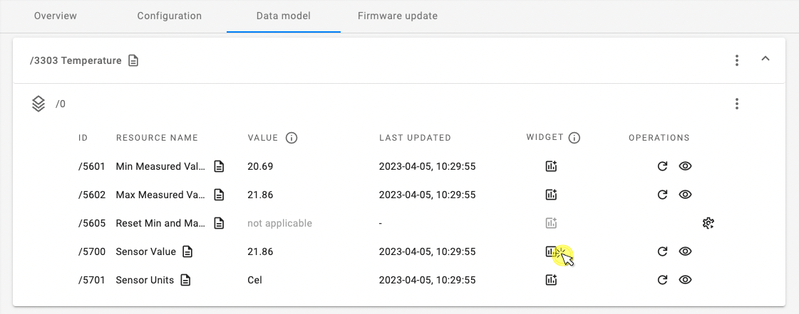

# Visualize device data

The **Dashboard** consists of **widgets** which display telemetry data. In order to collect data to display, **observations** needs to be set on specific **resources**. 

{:style="float: left;margin-right: 817px;margin-top: 17px;margin-bottom: 17px;border: 1px solid lightgray"}

## Set observation

To start collecting data to be displayed on your Dashboard, start observering one or multiple resources.

!!! note
    By default, the data is stored for 30 days. The storage retention period can be changed in the **Domain configuration** view.    

0. Go to the **Device Center** of a connected device and click the **Data model** tab.
0. In the list of objects, expand an object (e.g. Temperature `/3303/`) and click the **eye** icon in the **Operations** column.
    {:style="float: left;margin-right: 817px;margin-top: 17px;margin-bottom: 17px;border: 1px solid lightgray"}
0. In the side navigation menu, enable the **Not more often than once every** and **At least once every** attributes and click **Save**.
  
    {:style="float: left;margin-right: 817px;margin-top: 17px;margin-bottom: 17px;border: 1px solid lightgray"}

    !!! info
        * **Not more often than once every** - the minimum time in seconds between two notifications.
        * **At least once every** - the maximum time in seconds between two notifications. The notification is sent even if the value hasn't changed.

## Create Widget

- In the expanded object card, click the **Add widget** icon in the **Widget** column.
    
     

    !!! important
        The action of adding a widget applies to all the devices in your domain, but the widget will only display data from the **10 oldest devices** (based on their **Creation time**).

## View widget in your **Dashboard**

To see the device data visualized on the widget, enter your **Dashboard**.

0. From the left-side menu, select **Dashboard**.
0. Expand the widget you just created, you should see a view similar to this:
    {:style="float: left;margin-right: 817px;margin-top: 17px;margin-bottom: 17px;border: 1px solid lightgray"}
0. Adjust the timespan for the collected data by selecting the desired period in the **timespan** expandable list.

    !!! note
        The data is refreshed automatically and periodically every 15 seconds, there's no need to refresh the page manually.

    !!! tip
        If the widget chart displays no data, the cause might be that the 10 oldest devices in your domain were not active within the chosen timespan and no data was reported. Try chosing a wider timespan or check device connection status.

### Customize dashboard

Dashboards can be customized. Click **Customize dashboard** to switch to edit mode.

- To change the widget name, expand a widget and click the **pencil** icon. Type the new name and click **Save**. 
- To delete a widget, expand a widget and click the **thrash bin** icon.
{:style="float: left;margin-right: 817px;margin-top: 17px;margin-bottom: 17px;border: 1px solid lightgray;width: 80%"}  
- To undo or redo your edits, click the **undo** or **redo** arrows.
- To exit edition mode without saving changes, click **Discard changes** and **Discard** in the dialog window.
- To exit edition mode and save changes, click **Save changes**.