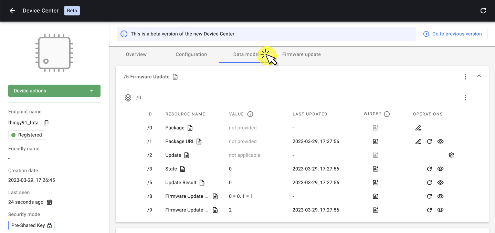
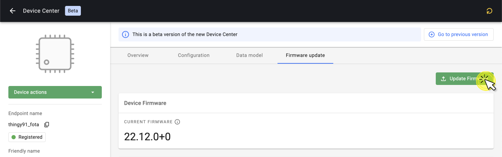
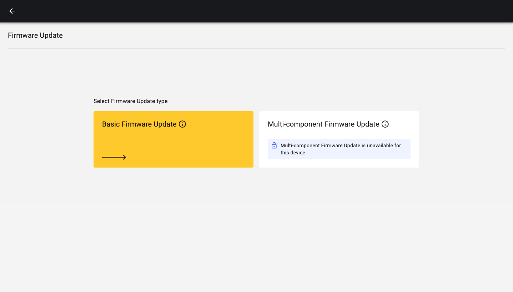
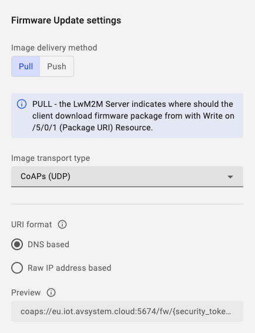
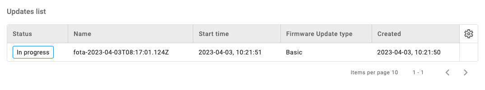
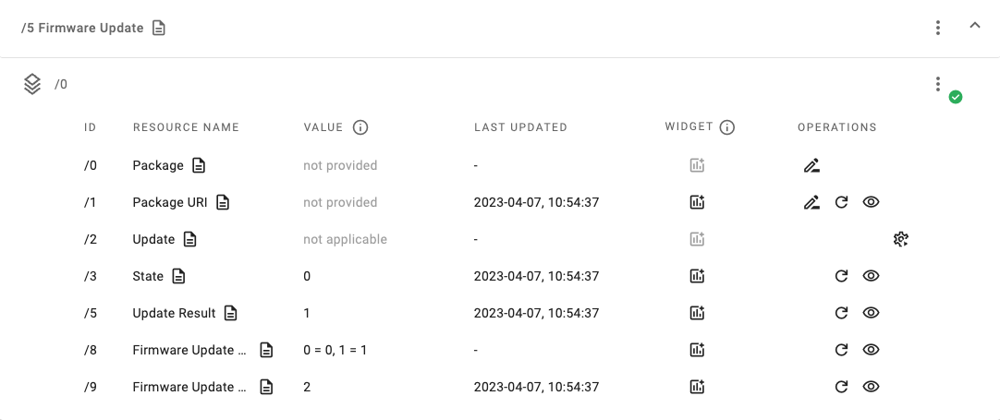

# Basic Firmware Update

Remotely update the firmware of your LwM2M device using the **Firmware Update Object** `/5`.

## Prerequisites

- An active [Coiote DM](https://eu.iot.avsystem.cloud/) user account
- A device which supports Firmware Update Object `/5`
    
!!! Note
    The **Anjay LwM2M Client** supports the Firmware Update Object. Learn more about the Anjay by visiting the official <a href="https://avsystem.github.io/Anjay-doc/FirmwareUpdateTutorial.html" target="_blank">**Anjay Documentation**</a> or <a href="https://github.com/AVSystem/Anjay" target="_blank">**Anjay SDK on GitHub**</a>.

## Firmware Update Object `/5`

The Firmware Update process is defined in the **Firmware Update Object `/5`**. This Object contains Resources which define the update process using **4 Update States** (representing the phase of the update process) and **11 Update Results** (representing the most common outcomes of the firmware update process).

* **Resource** `/5/*/3` represents the **State**
* **Resource** `/5/*/5` represents the **Update Result**

=== "**Update States**"

    `state 0` **Idle** - Before downloading and after successfully updating
    
    `state 1` **Downloading** - The new firmware is on the way
    
    `state 2` **Downloaded** - The firmware download is completed
    
    `state 3` **Updating** - The Client starts updating its firmware, after which it changes its state back to *Idle*

=== "**Update Results**"

    `update result 1` **Firmware updated successfully**

    `update result 2` **Insufficient flash memory for the new firmware package**

    `update result 3` **Out of RAM during downloading proces**

    `update result 4` **Connection lost during downloading process**

    `update result 5` **Integrity check failure for new downloaded package**

    `update result 6` **Unsupported package type**

    `update result 7` **Invalid URI**

    `update result 8` **Firmware update failed**

    `update result 9` **Unsupported protocol**

    `update result 10` **Firmware update cancelled**

    `update result 11` **Firmware update deferred**

!!! info
    Learn more about the Firmware Update Object in the <a href="https://devtoolkit.openmobilealliance.org/OEditor/LWMOView?url=https%3A%2F%2Fraw.githubusercontent.com%2FOpenMobileAlliance%2Flwm2m-registry%2Fprod%2F5.xml" target="_blank">**OMA LwM2M Object and Resource Registry**</a>.

## Prepare the Firmware Update

1. Select the device you want to update from the [**Coiote Device Inventory**](https://eu.iot.avsystem.cloud/ui/device/inventory).
    
1. Select **Data model** from the top menu and validate if the Firmware Update object `/5` is visible, indicating that the Object is supported by the LwM2M Client.

    

1. Select **Firmware update** from the top menu and click **Update Firmware** from the top-right corner.

    

1. Select **Basic Firmware Update**

    

1. Choose between **Pull** and **Push**

    **Pull method**: The LwM2M Client receives the URI of the file that is to be downloaded and pulls the file from it. 
    
    **Push method**: The LwM2M Server pushes the firmware file to the device.

    !!! Info
        **Pull** supports any of the following **transport types**:

        - `CoAP` or `CoAPs` over `UDP`
        - `CoAP` or `CoAPs` over `TCP`
        - `HTTP` or `HTTPs`

        **Push** uses `CoAPs` by default.

    

1. Click **Schedule Update** from the bottom-right corner to trigger the Firmware Update process.

    

## Download & Upgrade Process

If the Firmware Update is scheduled successfully, the device starts **downloading** the firmware at the next practical opportunity. The actual firmware **update** starts once the integrity and authenticity of the firmware image has been validated by the LwM2M Client.

The status of the firmware update is shown in the Resources: **State** `/5/*/3` & **Update Result** `/5/*/5`. If no errors arise, the update process follows the following pattern:

1. **Downloading** `state 1` & `update result 0` 
2. **Downloaded** `state 2` & `update result 0` 
3. **Updating** `state 3` & `update result 0` 
4. **Updated** `state 0` & `update result 1` 

!!! info
    When the device is updating its firmware, it will deregister and reboot using the new firmware. This process may time multiple minutes.

    

If the update was successfully performed, the **State** `/5/*/3` returns to `0` and the **Update Results** `/5/*/5` reports `1`.

## Troubleshooting

### Insufficient flash
A common update error is due to insufficient flash memory, indicated by **Update Result** `2`.

The Anjay build file can be quite large in size, particularly when using the `.hex` file (`app_signed.hex`). For updating the firmware, it’s better to use the `app_update.bin` file which is about half the size of the `.hex` file.

!!! Warning
    The **Nordic Thingy:91** is very restricted in its flash size due to the Nordic Bootloader. The maximum firmware size is `421kB`.

## Useful Links
- [Anjay firmware update documentation](https://avsystem.github.io/Anjay-doc/FirmwareUpdateTutorial/FU-Introduction.html)
- [Anjay SDK](https://github.com/AVSystem/Anjay)
- [Anjay Zephyr SDK](https://github.com/AVSystem/Anjay-zephyr-client)
- [Anjay ESP32 SDK](https://github.com/AVSystem/Anjay-esp32-client)
- [OMA LwM2M Object and Resource Registry](https://technical.openmobilealliance.org/OMNA/LwM2M/LwM2MRegistry.html)