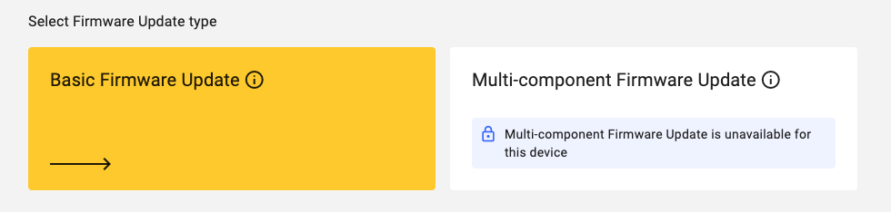

# Basic Firmware Update

Remotely update the firmware of your LwM2M device using the Firmware Update Object `/5`.

## Prerequisites

- An active [Coiote DM](https://eu.iot.avsystem.cloud/) user account
- A device which supports Firmware Update Object `/5`
    
!!! Note
    The **Anjay LwM2M Client** supports the Firmware Update Object. Learn more about the Anjay by visiting the official [**Anjay Documentation](https://avsystem.github.io/Anjay-doc/FirmwareUpdateTutorial.html) or [Anjay SDK on GitHub](https://github.com/AVSystem/Anjay).

## Firmware Update Object `/5`

The Firmware Update process is defined in the **Firmware Update Object `/5`**. This Object contains Resources which defines the update process using **4 Update States** (representing the phase of the update process) and **11 Update Results** (representing the most common outcomes of the firmware update process).

* Resource `/5/*/3` represents the **State**
* Resource `/5/*/5` represents the **Update Result**

=== "**Update States**"

    `state 0` **Idle** - before downloading and after successfully updating
    
    `state 1` **Downloading** - the new firmware is on the way
    
    `state 2` **Downloaded** - the firmware download is completed
    
    `state 3` **Updating** - tthe Client starts updating its firmware, after which it changes its state back to *Idle*

=== "**Update Results**"

    `result 1` **Firmware updated successfully**

    `result 2` **Insufficient flash memory for the new firmware package**

    `result 3` **Out of RAM during downloading proces**

    `result 4` **Connection lost during downloading process**

    `result 5` **Integrity check failure for new downloaded package**

    `result 6` **Unsupported package type**

    `result 7` **Invalid URI**

    `result 8` **Firmware update failed**

    `result 9` **Unsupported protocol**

    `result 10` **Firmware update cancelled**

    `result 11` **Firmware update deferred**

!!! info
    Learn more about the Firmware Update Object in the <a href="https://devtoolkit.openmobilealliance.org/OEditor/LWMOView?url=https%3A%2F%2Fraw.githubusercontent.com%2FOpenMobileAlliance%2Flwm2m-registry%2Fprod%2F5.xml" target="_blank">**OMA LwM2M Object and Resource Registry**</a>.

## Prepare the Firmware Update

1. Select the device you want to update from the **Coiote Device Inventory**.
    
1. Select **Data model** from the top menu and validate if the Firmware Update object `/5` is implemented.

    

1. Select **Firmware update** from the top menu and click **Update Firmware** from the top-right corner.

    

1. Select **Basic Firmware Update**

    

1. Choose between **Pull** and **Push**

    **PULL method**: The LwM2M Client receives the URI of the file that is to be downloaded and pulls the file from it.
    
    **PUSH method**: The LwM2M Server pushes the firmware file to the device.

    
    
1. Choose the **transport type**

    **Pull** supports any of the following options:

    - `CoAP` or `CoAPs` over `UDP`
    - `CoAP` or `CoAPs` over `TCP`
    - `HTTP` or `HTTPs`

    **Push** uses `CoAPs` by default.

1. Click **Schedule Update** from the bottom-right corner to trigger the Firmware Update process.

    

## Download & Upgrade Process

If the Firmware Update is scheduled successfully, the device starts **downloading** the firmware at the next practical opportunity and starts **updating** the firmware once the integrity and authenticity of the firmware image has been validated.

The status of the firmware update is shown in the Resources **State `/5/*/3`** & **Update Result `/5/*/5`**. If no errors arise, the update process follows the following pattern: 

1. **Downloading** `state 1` & `update result 0` 
2. **Downloaded** `state 2` & `update result 0` 
3. **Updating** `state 3` & `update result 0` 
4. **Updated** `state 0` & `update result 1` 

!!! info
    When the device is updating its firmware, it will deregister and reboots using the new firmware. This process may time multiple minutes.

    

If the update was successfully performed, the **State `/5/*/3`** returns to `0` and the **Update Results `/5/*/5`** reports `1`.

## Troublelshooting

### Insufficient flash
A common update error is due to insufficient flash memory, indicated by Update Result 2.

The Anjay build file in `.hex` format (`app_signed.hex`) can be quite large in size. For updating the firmware, it’s better to use the `app_update.bin` file which is about half the size compared to the `.hex` file.

## Useful Links
- [Anjay documentation](https://avsystem.github.io/Anjay-doc/FirmwareUpdateTutorial/FU-Introduction.html)
- [Anjay SDK](https://github.com/AVSystem/Anjay)
- [Anjay Zephyr SDK](https://github.com/AVSystem/Anjay-zephyr-client)
- [Anjay ESP32 SDK](https://github.com/AVSystem/Anjay-esp32-client)
- [OMA LwM2M Object and Resource Registry](https://technical.openmobilealliance.org/OMNA/LwM2M/LwM2MRegistry.html)