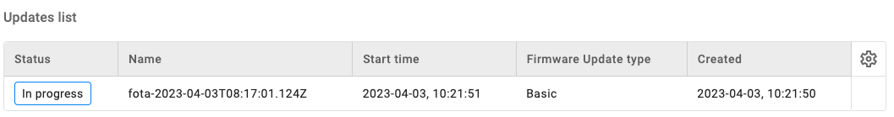

# Basic Firmware Update

Remotely update the firmware of your LwM2M device using the **Firmware Update Object** `/5`.

## Prerequisites

- An active [Coiote DM](https://eu.iot.avsystem.cloud/) user account
- A device which supports Firmware Update Object `/5`
    
!!! Note
    The **Anjay LwM2M Client** supports the Firmware Update Object. Learn more about Anjay by visiting the official <a href="https://avsystem.github.io/Anjay-doc/FirmwareUpdateTutorial.html" target="_blank">**Anjay Documentation site**</a> or <a href="https://github.com/AVSystem/Anjay" target="_blank">**Anjay SDK on GitHub**</a>.

## Firmware Update Object `/5`

The Firmware Update process is defined in the **Firmware Update Object `/5`**. This Object contains Resources which define the update process using **4 Update States** (representing the phase of the update process) and **11 Update Results** (representing the most common outcomes of the firmware update process).

* **Resource** `/5/*/3` represents the **State**
* **Resource** `/5/*/5` represents the **Update Result**

=== "**Update States**"

    | ID          | State       | Description |
    | ----------- | ----------- | ----------- |
    | `state 0`   | **Idle**    | Before downloading and after successfully updating |
    | `state 1`   | **Downloading** | The new firmware is on the way |
    | `state 2`   | **Downloaded** | The firmware download is completed |
    | `state 3`   | **Updating** | The Client starts updating its firmware, after which it changes its state back to *Idle* |

=== "**Update Results**"

    | Result          | Description |
    | ----------- | ----------- |
    | `update result 1`   | **Firmware updated successfully** |
    | `update result 2`   | **Insufficient flash memory for the new firmware package** |
    | `update result 3`   | **Out of RAM during downloading proces** |
    | `update result 4`   | **Connection lost during downloading process** |
    | `update result 5`   | **Integrity check failure for new downloaded package** |
    | `update result 6`   | **Unsupported package type** |
    | `update result 7`   | **Invalid URI** |
    | `update result 8`   | **Firmware update failed** |
    | `update result 9`   | **Unsupported protocol** |
    | `update result 10`  | **Firmware update cancelled** |
    | `update result 11`  | **Firmware update deferred** |

!!! info
    Learn more about the Firmware Update Object in the <a href="https://devtoolkit.openmobilealliance.org/OEditor/LWMOView?url=https%3A%2F%2Fraw.githubusercontent.com%2FOpenMobileAlliance%2Flwm2m-registry%2Fprod%2F5.xml" target="_blank">**OMA LwM2M Object and Resource Registry**</a>.


## Prepare the Firmware Update

1. In the Coiote IoT Device Management platform, go to [**Device Inventory**](https://eu.iot.avsystem.cloud/ui/device/inventory).

1. Select the device you want to update by clicking on its endpoint name.

1. Go to the **Data model** tab to validate if the Firmware Update Object `/5` is present. If so, the Object is supported by the LwM2M Client.

    

1. Go to the **Firmware update** tab.

1. Click the **Update Firmware** button.

    

1. Select **Basic Firmware Update**.

    

1. Upload the **firmware image**.

    

1. Choose between **Pull** and **Push**:

    * **Pull method** (recommended): The LwM2M Client receives the URI of the file that is to be downloaded and pulls the file from it. 
    
    * **Push method**: The LwM2M Server pushes the firmware file to the device.

    !!! Info
        **Pull** supports the following **transport types**:

        - `CoAP` or `CoAPs` over `UDP`
        - `CoAP` or `CoAPs` over `TCP`
        - `HTTP` or `HTTPs`

        **Push** transmits the firmware over the same transport type as is used for device management, which is `CoAPs` over `UDP` by default.

    !!! Tip "Which transport protocol to choose?"
        
        Downloads using `CoAP(s)` over `UDP` tend to be slow due to the limitation of the maximum CoAP Block size of 1024 bytes and the required acknowledgements for each Block transfer.

        Choosing `CoAP(s)` over `TCP` or `HTTP(s)` usually results in faster download speeds. However, not every device supports these transport protocols.


    


1. Click **Schedule Update** to trigger the Firmware Update process.


## Download & Upgrade Process

If the Firmware Update is scheduled successfully, the device starts **downloading** the firmware at the next practical opportunity. The actual firmware **update** starts once the integrity and authenticity of the firmware image has been validated by the LwM2M Client.



Once executed successfully, the status in the **Update list** panel changes to `Success`.


!!! note
    While the device is updating its firmware, it will deregister and reboot using the new firmware. This process may time several minutes.

    

### Monitoring the update process

During the update process, the status of the firmware update can be monitored by reviewing the Resources **State** `/5/*/3` and **Update Results** `/5/*/5`.

To find the Resources, select the **Data model** tab and open the **Firmware Update Object** `/5`. 


If no errors occur, the update process follows this pattern:

1. **Downloading** `state 1` & `update result 0` 
2. **Downloaded** `state 2` & `update result 0` 
3. **Updating** `state 3` & `update result 0` 
4. **Updated** `state 0` & `update result 1` 

!!! important
    Does the **State** `/5/*/3` report `0` and the **Update Results** `/5/*/5` report `1`? Congratulations! You've successfully updated the firmware of your device. 🎉

## Troubleshooting

### Firmware Update only works over CoAP, not over CoAPs

For the firmware update over CoAPs transfer to work, the LwM2M Client shall use the same security credentials (i.e. PSK or certificates) as those used for the management interface. This is the default behavior of the Anjay client, but you might need to configure it explicitly when using other LwM2M Client implementations.

!!! info "Zephyr LwM2M Client configuration instruction"

    The **security tags** needs to the same in the "**Security tag for FOTA download library**" as in the "**LwM2M server TLS tag**" (e.g. using Nordic's default tag: `35724861`).

    To update the security tags, edit the **Kconfig** in the directory:

    ```
    Zephyr Kernel
    > Modules
        > nrf
        > Nordic nRF Connect
            > Networking
            > Application protocols
                > LwM2M client utilities library
                > Security object support
                > Firmware Update object support
    ```

    
    *Kconfig editor in nRF Connect for VS Code*


## Useful Links
- [Anjay firmware update documentation](https://avsystem.github.io/Anjay-doc/FirmwareUpdateTutorial/FU-Introduction.html)
- [Anjay SDK](https://github.com/AVSystem/Anjay)
- [Anjay Zephyr SDK](https://github.com/AVSystem/Anjay-zephyr-client)
- [Anjay ESP32 SDK](https://github.com/AVSystem/Anjay-esp32-client)
- [OMA LwM2M Object and Resource Registry](https://technical.openmobilealliance.org/OMNA/LwM2M/LwM2MRegistry.html)