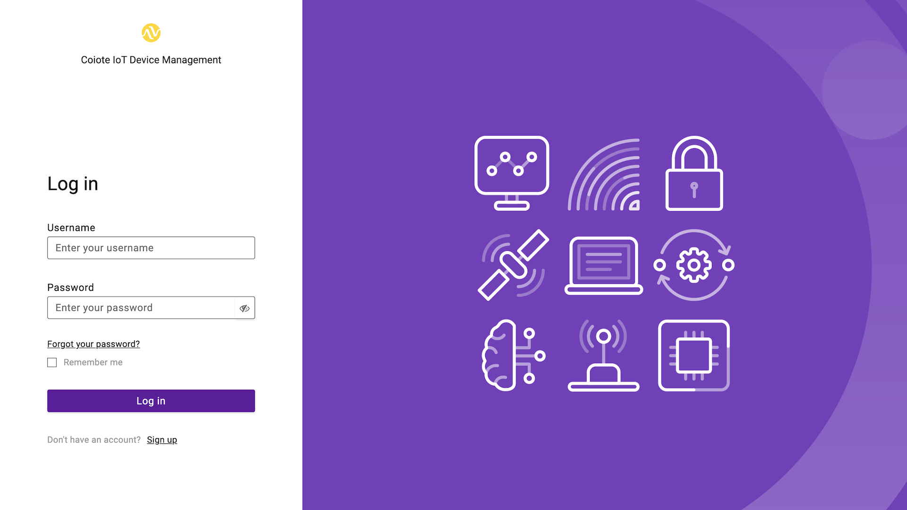
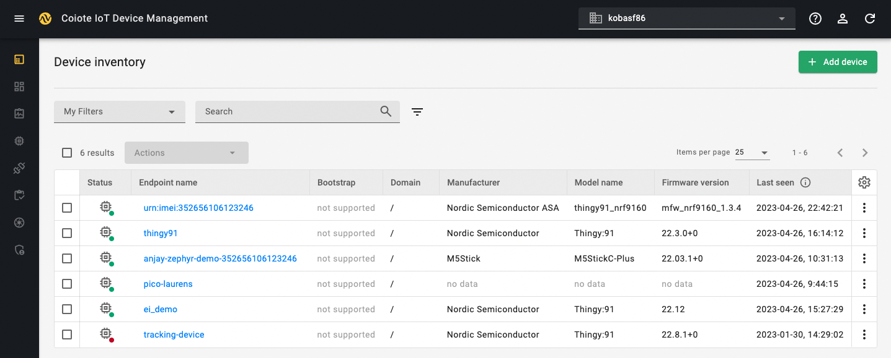
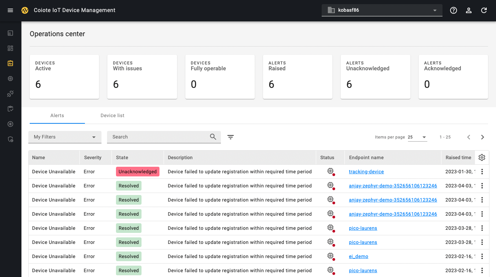
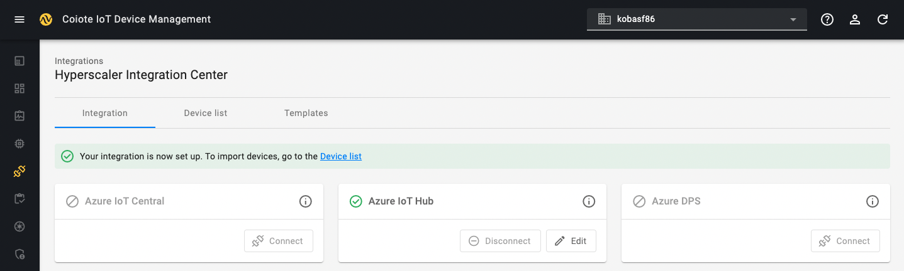
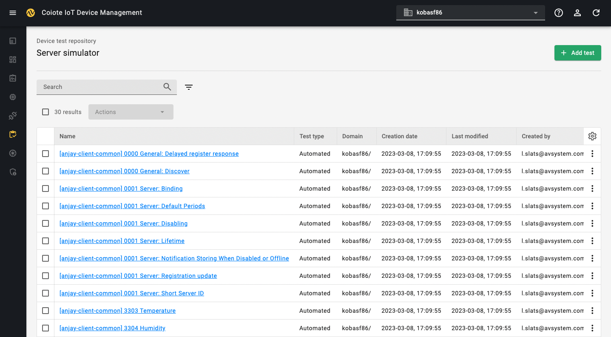

# {{ coiote_long_name }}

{{ coiote_long_name }} allows you to manage your LwM2M devices throughout their entire lifecycle. {{ coiote_short_name }} supports device onboarding, data management, data visualization, automated tests, firmware updates, monitoring & alerting and cloud integrations.

[Visit {{ coiote_short_name }}]({{ coiote_site_link }}/){: .md-button .md-button--big }

!!! Tip "Sign up free of charge"
    Get started by <a href="{{ coiote_site_link }}/" target="_blank">**signing up**</a> to {{ coiote_long_name }}. You can sign up for a developer account which allows you to connect up to 10 devices free of charge.

## Device inventory

Once logged in, you enter the **Device inventory** which provides an overview of all registered LwM2M devices. After selecting one of your devices, you enter the **Device center** which allows you to monitor and manage single devices.

In the **Device center** you can:

* Alter device configurations
* Set observations
* Schedule firmware updates

→ **Learn more about the [**Device center**](/Coiote_IoT_DM/Device_Center/).**

## Dashboard

The Dashboard is composed of widgets which display telemetry data. Widgets use different kinds of charts depending on the type of data collected. Go to the **Device center** to configure widgets.

→ **Learn more about [**Data visualization**](/Coiote_IoT_DM/Visualize_data/).**

## Operations center

Use the **Operations center** to easily monitor your devices. It provides a clear overview of alerts, which highlight the devices requiring immediate attention.

## Device groups*

!!! Note
    Features marked with an "*****" are only included in the premium version of {{ coiote_short_name }}.

Devices can be added to **Groups** allowing for easy management of your device fleet. Instead of managing devices one by one, configurations and firmware can be updated for a group of devices with a single click.

## Integrations

Initiate integrations with popular cloud platforms such as Azure IoT Hub, AWS IoT Core or nRF Cloud.

→ **Learn more about [**Cloud integrations**](/Cloud_integrations/Azure_IoT/Azure_IoT_Hub/Configure_Azure_IoT_Hub_integration/).**

## Device test repository*

Test the performance of your device firmware by mimicking real-world scenarios. Device tests allow you to validate new application firmware, to test the implementation of the LwM2M standard, and to run regression tests to ensure new firmware doesn’t break existing functionality.

→ **Learn more about [**Device tests**](/Coiote_IoT_DM/Device_tests/Overview/).**

## Monitoring & Reporting*

The **Monitoring** module is responsible for collecting historical data about device states which can be aggregated and downloaded using the **Reporting** feature.

## Administration

Manage additional settings in the administration section, such as **Billing**, **User management** and **Domain management**.
