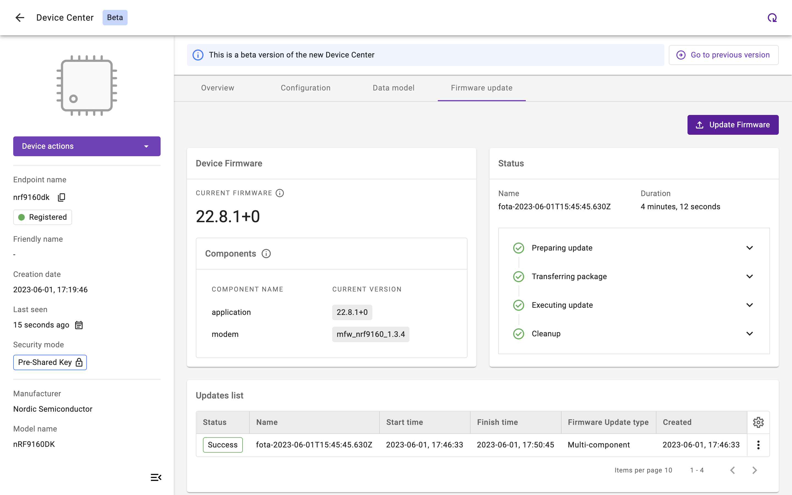

# Multi-component Firmware Update

Remotely update a component of your LwM2M device's firmware using the **Advanced Firmware Update Object** `/33629`.

Object `/33629` is designed as an extension of the Firmware Update object `/5`. It supports multiple instances, each representing a "component" of the device's firmware that can be upgraded separately. The specific meaning and purpose of these components are not standardized and can vary depending on the implementation. However, they typically encompass elements such as bootloaders, application code, cellular modem firmwares, security processor firmwares, and other related firmware entities.

## Prerequisites

- An active [{{ coiote_short_name }}]({{ coiote_site_link }}/) user account
- A device which supports the Advanced Firmware Update Object `/33629`

## Firmware Update Object `/33629`

Object `/33629` defines the update process using **4 Update States** representing the phase of the update process. Additionally, a total of **13 Update Results** may be reported, representing the most common outcomes of the firmware update process.

* **Resource** `/33629/*/3` represents the **State**
* **Resource** `/33629/*/5` represents the **Update Result**

=== "**Update States**"

    | ID          | State       | Description |
    | ----------- | ----------- | ----------- |
    | `state 0`   | **Idle**    | Before downloading and after successfully updating |
    | `state 1`   | **Downloading** | The new firmware is on the way |
    | `state 2`   | **Downloaded** | The firmware download is completed |
    | `state 3`   | **Updating** | The Client starts updating its firmware, after which it changes its state back to *Idle* |

=== "**Update Results**"

    | Result          | Description |
    | ----------- | ----------- |
    | `update result 0`   | **Initial value** |
    | `update result 1`   | **Firmware updated successfully** |
    | `update result 2`   | **Insufficient flash memory for the new firmware package** |
    | `update result 3`   | **Out of RAM during downloading proces** |
    | `update result 4`   | **Connection lost during downloading process** |
    | `update result 5`   | **Integrity check failure for new downloaded package** |
    | `update result 6`   | **Unsupported package type** |
    | `update result 7`   | **Invalid URI** |
    | `update result 8`   | **Firmware update failed** |
    | `update result 9`   | **Unsupported protocol** |
    | `update result 10`  | **Firmware update cancelled** |
    | `update result 11`  | **Firmware update deferred** |
    | `update result 12`  | **Conflicting state** |
    | `update result 13`  | **Dependency error** |

## Prepare the Firmware Update

1. In the Coiote IoT Device Management platform, go to [**Device Inventory**]({{ coiote_site_link }}/ui/device/inventory).

1. Select the device you want to update by clicking on its endpoint name.

1. Go to the **Data model** tab to validate if the Firmware Update Object `/33629` is present. If so, the Object is supported by the LwM2M Client.

    !!! info
        Each **Object Instance** represents a component of the device's firmware which can be updated. Click the Object Instances of Object `/33629` to see what components can be updated.

    

1. Go to the **Firmware update** tab.

1. Click the **Update Firmware** button.

    

1. Select **Multi-component Firmware Update**.

    

1. Select the components you would like to update, e.g. modem, application or bootloader.

    

    !!! note
        In this example, the modem firmware of the nRF9160 SiP is being updated using the delta update file: `mfw_nrf9160_update_from_1.3.3_to_1.3.4.bin` which is provided by [Nordic](https://www.nordicsemi.com/Products/Development-hardware/nRF9160-DK/Download?lang=en#infotabs).

1. Upload the **firmware image**.

    

1. Choose between **Pull** and **Push**:

    * **Pull method** (recommended): The LwM2M Client receives the URI of the file that is to be downloaded and pulls the file from it.

    * **Push method**: The LwM2M Server pushes the firmware file to the device.

    !!! Info
        **Pull** supports the following **transport types**:

        - `CoAP` or `coaps_uri` over `UDP`
        - `CoAP` or `coaps_uri` over `TCP`
        - `HTTP` or `HTTPs`

        **Push** transmits the firmware over the same transport type as is used for device management, which is `coaps_uri` over `UDP` by default.

    !!! Tip "Which transport protocol to choose?"

        Downloads using `CoAP(s)` over `UDP` tend to be slow due to the limitation of the maximum CoAP Block size of 1024 bytes and the required acknowledgements for each Block transfer.

        Choosing `CoAP(s)` over `TCP` or `HTTP(s)` usually results in faster download speeds. However, not every device supports these transport protocols.

    

1. Click **Schedule Update** to trigger the Firmware Update process.

## Download & Upgrade Process

If the Firmware Update is scheduled successfully, the device starts **downloading** the firmware at the next practical opportunity. The actual firmware **update** starts once the integrity and authenticity of the firmware image has been validated by the LwM2M Client.

Once executed successfully, the status in the **Update list** panel changes to `Success`.

!!! note
    While the device is updating its firmware, it will deregister and reboot using the new firmware. This process may time several minutes.

    

### Monitoring the update process

During the update process, the status of the firmware update can be monitored by reviewing the Resources **State** `/33629/*/3` and **Update Results** `/33629/*/5`.

To find the Resources, select the **Data model** tab and open the **Advanced Firmware Update Object** `/33629`.

If no errors occur, the update process follows this pattern:

1. **Downloading** `state 1` & `update result 0`
2. **Downloaded** `state 2` & `update result 0`
3. **Updating** `state 3` & `update result 0`
4. **Updated** `state 0` & `update result 1`

!!! important "Update successful?"
    Does the **State** `/33629/*/3` report `0` and the **Update Results** `/33629/*/5` report `1`? Congratulations! You've successfully updated the firmware of your device. 🎉

## Useful Links
- [Anjay firmware update documentation](https://avsystem.github.io/Anjay-doc/FirmwareUpdateTutorial/FU-AdvancedFirmwareUpdate.html)
