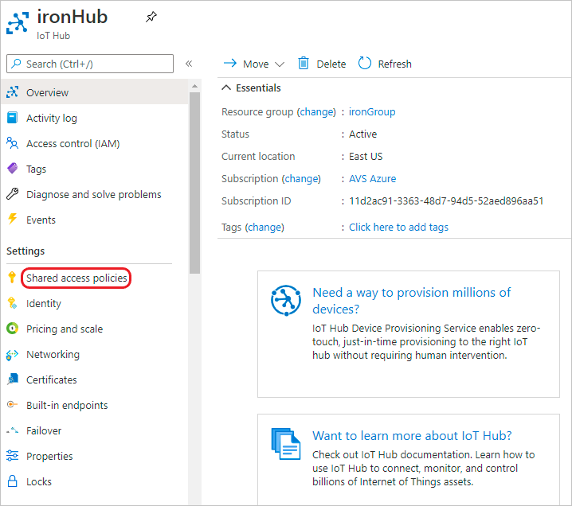
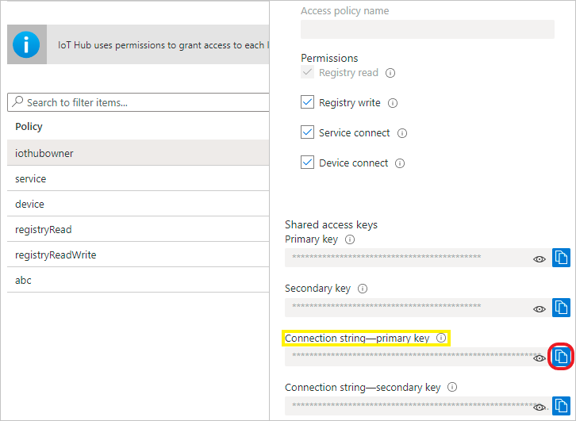
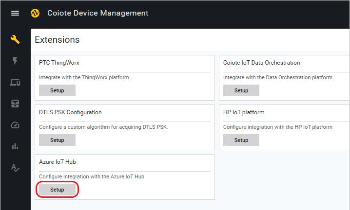
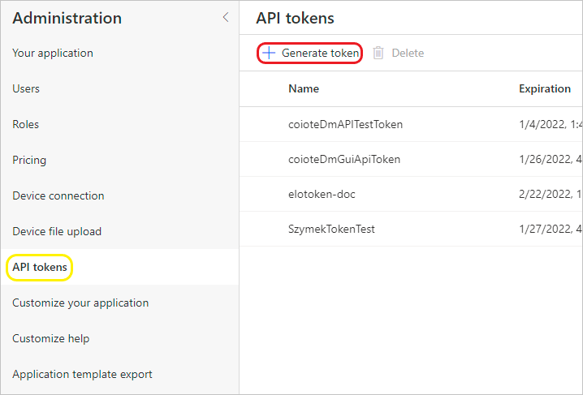
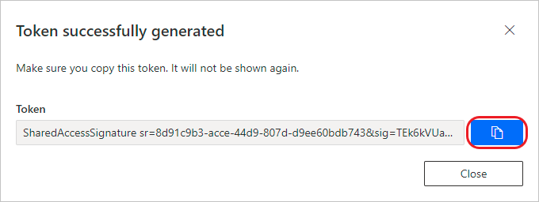
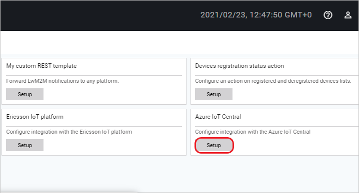

---
hide:
  - toc        # Hide table of contents
---

# Configuring the Azure IoT integration extension

=== "Azure IoT Hub"

    ## Configure the Azure IoT Hub extension

    ### Prerequisites:

      - An active IoT Hub with hub owner access permissions.
      - A Coiote DM user account with permissions to use the integration extension.
    __________________
    ### Get the IoT Hub connection string

    1. In your IoT Hub general view, go to **Shared access policies**:

        

    2. From the list of policies, select the `iothubowner` policy.
    3. Under **Shared access keys**, click the copy icon for the *Connection string -- primary key* to save the value.

        

    !!! info
        For detailed information about the IoT Hub permissions, please visit the [Control access to IoT Hub](https://docs.microsoft.com/en-us/azure/iot-hub/iot-hub-devguide-security#access-control-and-permissions) section of the Azure IoT Hub documentation.
    Now you need to use the credential in the Coiote DM platform.

    ### Set up the **Azure IoT Hub Extension** using credentials.  

    1. In your Coiote DM user account, go to **Administration --> Extensions**.
    2. Find the **Azure IoT Hub** tab and click `Setup`.

        

    3. In the tab, paste the previously copied IoT Hub connection string.

        

        - use `Test connection` to see if the connection can be established correctly.

        - click `Save` to keep the setting.

=== "Azure IoT Central"

    ##  Configure the Azure IoT Central extension

    ### Prerequisites:

     - An active IoT Central with hub owner access permissions.
     - A Coiote DM user account with permissions to use the integration extension.
    _______________
    ### Get the Azure IoT Central integration credentials

     1. In your Azure IoT Central account view, go to **Administration**:
     2. Under **Your application**, copy the full *Application URL* (along with '.azureiotcentral.com') into Notepad or other place to keep it for later.

         

     3. From the **Administration** menu, select **API tokens** and click *generate token*.

         

     4. In the pop-up window that appears, click the copy icon for the newly generated token.

         

     Now you need to use the obtained credentials in the Coiote DM platform.

    ### Set up the **Azure IoT Hub Extension** using credentials.  

     1. In your Coiote DM user account, go to **Administration --> Extensions**.
     2. Find the **Azure IoT Central** tab and click `Setup`.

        

     3. Inside the tab:
          - paste the previously copied Azure IoT Central *Application URL*,
          - provide the API token and,
          - if needed, enter your *Device Provisioning Service hostname* (however, the default address provided is  sufficient in most cases).

        

          - use `Test connection` to see if the connection can be established correctly.

          - click `Save` to keep the setting.

