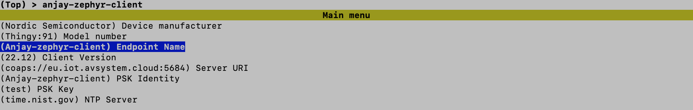

# Edge Impulse & Thingy:91

## Introduction
This example runs a motion recognition model built with <a href="https://www.edgeimpulse.com/" target="_blank">Edge Impulse</a>, and streams detection statistics to a LwM2M server.

**LwM2M Objects used**:

- Security: `/0` 
- Server: `/1`
- Device: `/3`
- Pattern Detector: `/33650` (custom object)

## Prerequisites
- Thingy:91
- [Coiote IoT DM](https://eu.iot.avsystem.cloud/) account
- Installed [Zephyr](https://docs.zephyrproject.org/latest/getting_started/index.html) dependencies
- Serial communication program e.g. minicom or RealTerm (for Linux or Mac) or PuTTy (for Windows)


## Compilation

**Clone the Anjay Zephyr repository**

Open the command line interface on your machine and clone the Anjay Zephyr repository using [Git](https://formulae.brew.sh/formula/git):

```jsx
git clone https://github.com/AVSystem/Anjay-zephyr-client
```

Open the repository: `Anjay-zephyr-client` > `ei-demo`

Set West manifest path to `Anjay-zephyr-client/ei_demo`, and manifest file to `west-nrf.yml` and do `west update`.

```jsx
west config manifest.path Anjay-zephyr-client/ei_demo
west config manifest.file west-nrf.yml
west update
```
!!! info
    **The default credentials are**:

    * Endpoint name: `Anjay-zephyr-client`
    * PSK (Pre-Shared Key): `test`
    
!!! note
    **Update the endpoint name and PSK using menuconfig** (optional)

    Run the following command:
    ```bash
    west build -b thingy91_nrf9160_ns -p -t menuconfig
    ```

    Open up folder `anjay-zephyr-client --->`
    

    Change the Endpoint Name and PSK Key:

    

    After making the changes, close the config menu by pressing `Q` and save it by pressing `Y`.

Compile the project for Thingy:91 by running the below command within the `ei_demo` directory.

```jsx
west build -b thingy91_nrf9160_ns
```


## Write the firmware to the Thingy:91

Find the build file in the directory `/build/zephyr`, named: `app_signed.hex`

Flash the file using the **Programmer** application in **nRF Cloud for Desktop** via **MCUboot**.

*For more information on flashing the Thingy:91 using MCU Boot, see [link](https://developer.nordicsemi.com/nRF_Connect_SDK/doc/latest/nrf/ug_thingy91_gsg.html#program-the-nrf9160-sip-application).*


## Connect the Thingy:91 to Coiote IoT Device Management

To connect the board:

1. [Log in](https://eu.iot.avsystem.cloud/) to Coiote DM and from the left side menu, select **Device Inventory**.
1. In **Device Inventory**, select **Add device**.
1. Select the **Connect your LwM2M device directly via the Management server** tile.
    
    

1. In the **Device credentials** step:
    - Add the **Endpoint name**, the default name is: `Anjay-zephyr-client`
    - **Key Identity** is the same as the Endpoint name.
    - Add the **Key**, the default key is: `test`
    - Click the **Add device** button and click **Confirm** in the confirmation pop-up.

    


## Add the Pattern Detection Object to Coiote

Object ID `/33650` refers to the pattern detection model.

To add this custom object, go to the device overview page in Coiote IoT DM and click the top-right button: **Go to previous version**. 


In the left-side menu, click **Objects**.

Click the button at the top right corner: **Add new LwM2M object definition**.


To add a new object definitiation, copy-paste the following `XML file` and click **Import**.

```
<?xml version="1.0" encoding="UTF-8"?>

<LWM2M xmlns:xsi="http://www.w3.org/2001/XMLSchema-instance" xsi:noNamespaceSchemaLocation="http://openmobilealliance.org/tech/profiles/LWM2M.xsd">
    <Object ObjectType="MODefinition">
        <Name>Pattern detector</Name>
        <Description1><![CDATA[This object is used to report the pattern detected by the ML-based classification algorithms and to count the number of times it has been detected.]]></Description1>
        <ObjectID>33650</ObjectID>
        <ObjectURN>urn:oma:lwm2m:ext:33650</ObjectURN>
        <LWM2MVersion>1.0</LWM2MVersion>
        <ObjectVersion>1.0</ObjectVersion>
        <MultipleInstances>Multiple</MultipleInstances>
        <Mandatory>Optional</Mandatory>
        <Resources>
            <Item ID="2000">
                <Name>Detector State</Name>
                <Operations>R</Operations>
                <MultipleInstances>Single</MultipleInstances>
                <Mandatory>Mandatory</Mandatory>
                <Type>Boolean</Type>
                <RangeEnumeration></RangeEnumeration>
                <Units></Units>
                <Description><![CDATA[The current state of a detector.]]></Description>
            </Item>
            <Item ID="2001">
                <Name>Detector Counter</Name>
                <Operations>R</Operations>
                <MultipleInstances>Single</MultipleInstances>
                <Mandatory>Mandatory</Mandatory>
                <Type>Integer</Type>
                <RangeEnumeration></RangeEnumeration>
                <Units></Units>
                <Description><![CDATA[The cumulative value of patterns detected.]]></Description>
            </Item><Item ID="2002">
                <Name>Pattern Name</Name>
                <Operations>R</Operations>
                <MultipleInstances>Single</MultipleInstances>
                <Mandatory>Mandatory</Mandatory>
                <Type>String</Type>
                <RangeEnumeration></RangeEnumeration>
                <Units></Units>
                <Description><![CDATA[Name of the pattern being detected.]]></Description>
            </Item>
			
			
            
         </Resources>
        <Description2></Description2>
    </Object>
</LWM2M>
```


After importing the object definitiation, go back to the *New Device Center* by clicking the button in the top-right corner: **Go to new Device Center**.


If the import was successful, you will find the under **Data model** the object: `/33650 Pattern detector`.


The object: `/33650` can distinguish patterns:

1. idle
1. circle
1. snake

Each pattern is defined as an *Object Instance*. The number of times the pattern has been recognized is shown as the **Dectector Counter**.

To see the detector counters for each pattern, select the corresponding Object Instance by clicking the down-arrow: ▼.


## Movement detection

Now start moving the Thingy:91 around to detect either of the three patterns. When a new motion pattern is detected, the LED color on the device will change.

Optional - set observations.

[link to more information](/Coiote_IoT_DM/User_Interface/Device_Center/#set-observation)