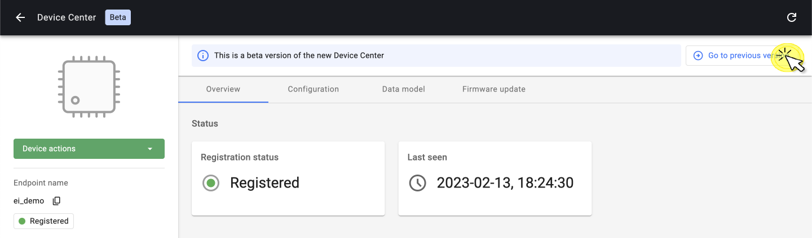
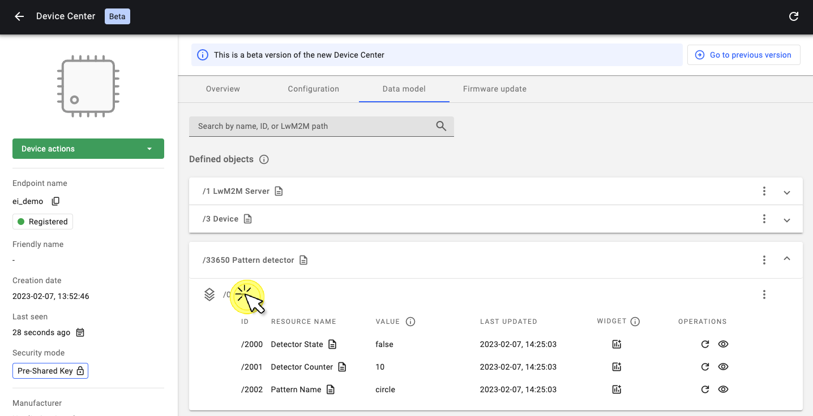

# Motion detection using Edge Impulse and Thingy:91

## Introduction
This example runs a motion detection model using the accelerometer of the Thingy:91 development kit, built with <a href="https://www.edgeimpulse.com/" target="_blank">Edge Impulse</a>. It streams the detected motion patterns to a LwM2M server.


*Detecting the motion patterns: "idle" and "snake"*

LwM2M Objects used:

- Security: `/0`
- Server: `/1`
- Device: `/3`
- Pattern Detector: `/33650` (custom object)

## Prerequisites
- Thingy:91
- [{{ coiote_short_name }}]({{ coiote_site_link }}/) account
- Installed <a href="https://docs.zephyrproject.org/latest/getting_started/index.html" target="_blank">Zephyr</a> dependencies
- Serial communication program e.g. minicom or RealTerm (for Linux or Mac) or PuTTy (for Windows)

!!! warning
    This tutorial uses the Arm Embedded Toolchain, which is not compatible with the Apple M1 chipset.

## Compilation

### Clone the Anjay Zephyr repository

Open the command line interface on your machine and clone the [Anjay Zephyr repository](https://github.com/AVSystem/Anjay-zephyr-client) using [Git](https://formulae.brew.sh/formula/git):

```jsx
git clone https://github.com/AVSystem/Anjay-zephyr-client
```

Set West manifest path to `Anjay-zephyr-client/ei_demo`, and manifest file to `west-nrf.yml` and run `west update`:

```jsx
west config manifest.path Anjay-zephyr-client/ei_demo
west config manifest.file west-nrf.yml
west update
```

### Update the endpoint name and PSK (optional)

!!! info
    **The default credentials are**:

    * Endpoint name: `Anjay-zephyr-client`
    * PSK (Pre-Shared Key): `test`

The Endpoint Name and PSK can be configured using *menuconfig*.

To open *menuconfig*, run the following command:
```bash
west build -b thingy91_nrf9160_ns -p -t menuconfig
```

Open up the folder `anjay-zephyr-client --->`


Create a new **Endpoint Name** and **PSK Key**:


After making the changes, press `Q` to close the config menu and `Y` to save.

### Compile the project

Go to the `ei_demo` directory and compile the project for the Thingy:91:

```jsx
west build -b thingy91_nrf9160_ns
```

## Write the firmware to the Thingy:91

1. Find the build file in the directory `/build/zephyr`, named: `app_signed.hex`.
1. Connect the Thingy:91 to a USB port of your machine.
1. Flash the file using the **Programmer** application in **nRF Cloud for Desktop** via **MCUboot**.

*Find more information on flashing the Thingy:91 using MCU Boot <a href="https://developer.nordicsemi.com/nRF_Connect_SDK/doc/latest/nrf/ug_thingy91_gsg.html#program-the-nrf9160-sip-application" target="_blank">here</a>.*


## Connect the Thingy:91 to {{ coiote_long_name }}

To connect to {{ coiote_long_name }}, please register at [eu.iot.avsystem.cloud]({{ coiote_site_link }}/).

To connect the board:

1. [Log in]({{ coiote_site_link }}/) to {{ coiote_short_name }} and select **Device Inventory** from the left side menu.
1. In **Device Inventory**, select **Add device**.
1. Select the **Connect your LwM2M device directly via the Management server** tile.

    

1. In the **Device credentials** step:
    - Add the **Endpoint name**, the default endpoint name is: `Anjay-zephyr-client`
    - **Key Identity** is the same as the endpoint name
    - Add the **Key**, the default key is: `test`
    - Click **Add device** and then **Confirm** in the confirmation pop-up

    


## Add the Pattern Detection Object to {{ coiote_short_name }}

Object ID `/33650` refers to the pattern detection model and indicates which pattern has been detected.

To add this custom object, go to the device overview page in {{ coiote_short_name }} and click the top-right button: **Go to previous version**.



In the left-side menu, click **Objects**.

Click the button at the top right corner: **Add new LwM2M object definition**.


To add a new object definition, copy-paste the following `XML file` and click **Import**.

```
<?xml version="1.0" encoding="UTF-8"?>

<LWM2M xmlns:xsi="http://www.w3.org/2001/XMLSchema-instance" xsi:noNamespaceSchemaLocation="http://openmobilealliance.org/tech/profiles/LWM2M.xsd">
    <Object ObjectType="MODefinition">
        <Name>Pattern detector</Name>
        <Description1><![CDATA[This object is used to report the pattern detected by the ML-based classification algorithms and to count the number of times it has been detected.]]></Description1>
        <ObjectID>33650</ObjectID>
        <ObjectURN>urn:oma:lwm2m:ext:33650</ObjectURN>
        <LWM2MVersion>1.0</LWM2MVersion>
        <ObjectVersion>1.0</ObjectVersion>
        <MultipleInstances>Multiple</MultipleInstances>
        <Mandatory>Optional</Mandatory>
        <Resources>
            <Item ID="2000">
                <Name>Detector State</Name>
                <Operations>R</Operations>
                <MultipleInstances>Single</MultipleInstances>
                <Mandatory>Mandatory</Mandatory>
                <Type>Boolean</Type>
                <RangeEnumeration></RangeEnumeration>
                <Units></Units>
                <Description><![CDATA[The current state of a detector.]]></Description>
            </Item>
            <Item ID="2001">
                <Name>Detector Counter</Name>
                <Operations>R</Operations>
                <MultipleInstances>Single</MultipleInstances>
                <Mandatory>Mandatory</Mandatory>
                <Type>Integer</Type>
                <RangeEnumeration></RangeEnumeration>
                <Units></Units>
                <Description><![CDATA[The cumulative value of patterns detected.]]></Description>
            </Item><Item ID="2002">
                <Name>Pattern Name</Name>
                <Operations>R</Operations>
                <MultipleInstances>Single</MultipleInstances>
                <Mandatory>Mandatory</Mandatory>
                <Type>String</Type>
                <RangeEnumeration></RangeEnumeration>
                <Units></Units>
                <Description><![CDATA[Name of the pattern being detected.]]></Description>
            </Item>

         </Resources>
        <Description2></Description2>
    </Object>
</LWM2M>
```


After importing the object definition, go back to the *New Device Center* by clicking the button in the top-right corner: **Go to new Device Center**.


If the import was successful, you will find the object: `/33650 Pattern detector` under **Data model**.


### Pattern detection

The object: `/33650` can distinguish three patterns:

1. Idle
1. Circle
1. Snake

Each pattern is defined as an *Object Instance*. The number of times the pattern has been recognized is shown as the **Detector Counter**.

To see the Detector Counter for each pattern, select the corresponding Object Instance by clicking the down-arrow: ▼.



Now start moving the Thingy:91 around to detect all three patterns. When a new motion pattern is detected, the Detector Counter increases and the LED color on the device will change.

### Set observations

The LwM2M standard allows you to instruct the device about the minimum and maximum allowed intervals between two updates. The intervals can be set from 1 second to multiple days. To instruct the device, an OBSERVE operation can be sent from the LwM2M Server to the LwM2M Client.

For more information, see [how to set observations](/Coiote_IoT_DM/Device_Center/#set-observation)
