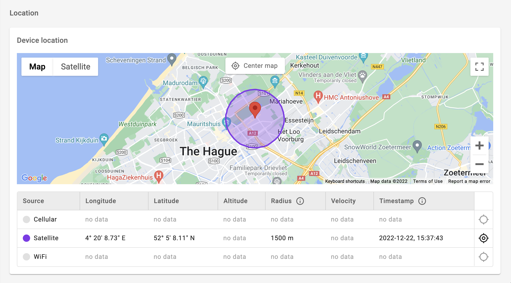
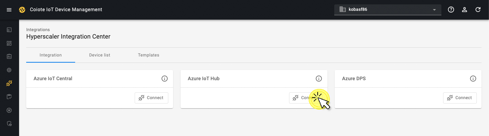
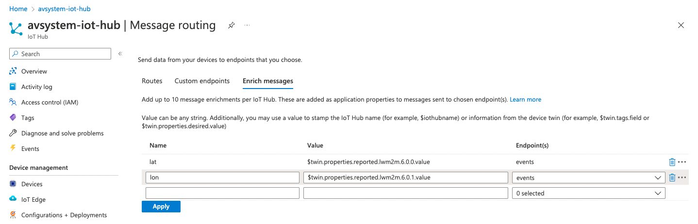

# Tracking application - Thingy:91 to Power BI

## Introduction
Build a tracking application using the **Thingy:91** devkit, while leveraging the benefits of the LwM2M protocol and visualizing its data on **Microsoft Power BI**.

## Prerequisites

- [Thingy:91](https://www.nordicsemi.com/Products/Development-hardware/Nordic-Thingy-91) with SIM with access to LTE-M or NB-IoT networks
- [Coiote IoT DM](https://eu.iot.avsystem.cloud/) account (premium)
- [nRF Cloud](https://nrfcloud.com/) account
- [nRF Connect for Desktop](https://www.nordicsemi.com/Products/Development-tools/nrf-connect-for-desktop)
- [Microsoft Azure account](https://azure.microsoft.com/en-us/free/)
- [Microsoft Power BI account](https://powerbi.microsoft.com/)

## Architecture


This tutorial uses the **Thingy:91** prototyping platform in combination with the **Coiote IoT Device Management** platform to build a cellular-connected tracking application. The integration with **nRF Cloud Locator** enables cell-based localization and optimizes the usage of the onboard GNSS. The location data, in combination with additional telemetry data is sent to **Azure IoT Hub** and visualized using **Microsoft Power BI**.

## Part 1 - Connect the Thingy:91 to Coiote using the LwM2M Anjay client

### Set up the Anjay Zephyr Client

#### Get Zephyr and Python dependencies

To get the Zephyr SDK and dependencies follow the first 4 steps of the instruction provided by [the Zephyr Project](https://docs.zephyrproject.org/latest/getting_started/index.html).

0. [Select and update OS](https://docs.zephyrproject.org/latest/develop/getting_started/index.html#select-and-update-os)
0. [Install dependencies](https://docs.zephyrproject.org/latest/develop/getting_started/index.html#install-dependencies)
0. [Get Zephyr and install Python dependencies](https://docs.zephyrproject.org/latest/develop/getting_started/index.html#get-zephyr-and-install-python-dependencies)
0. [Install Zephyr SDK](https://docs.zephyrproject.org/latest/develop/getting_started/index.html#install-zephyr-sdk)


#### Clone the Anjay Zephyr repository

Open the command line interface on your machine, then paste and run the following command:

   ```
   git clone https://github.com/AVSystem/Anjay-zephyr-client
   ```

### Compile the demo project

0. Connect the Thingy:91 board to a USB port of your machine.
0. Set West manifest path to `Anjay-zephyr-client/demo`, manifest file to `west-nrf.yml`, and run `west update`:

    ```
    west config manifest.path Anjay-zephyr-client/demo
    west config manifest.file west-nrf.yml
    west update
    ```

0. Go to the directory `Anjay-zephyr-client/demo` and configure the client using **menuconfig**.

    **Menuconfig** allows for, among others, enabling the **GPS** and **cell-based location services**. To open the configuration menu, run the command:

    ```
    west build -b thingy91_nrf9160ns -p -t menuconfig
    ``` 
    
    A config screen will open:

    - Open the folder: `anjay-zephyr-client --->`
        - Select: `Enable manual requests for cell-based location`
        - Open the folder: `Enable GPS on nRF9160-based devices --->`
            - Select `Enable A-GPS using Nordic Location Services over LwM2M`
        

    

    After making the configuration changes, close the config menu by pressing `Q` and save it by pressing the key `Y`.

    **Build the project** using the updated configuration by running:
    ```
    west build
    ```

0. Find the `app_signed.hex` file under the `build/zephyr` directory in the project folder.

### Write the firmware to the Thingy:91

- When using the Thingy:91, use the `app_signed.hex` file which you can find in the `build/zephyr` directory.
- Flash it using **Programmer** application in **nRF Cloud for Desktop** via **MCUboot**. 

    *For more information on flashing the Thingy:91 using MCU Boot, see [link](https://developer.nordicsemi.com/nRF_Connect_SDK/doc/latest/nrf/ug_thingy91_gsg.html#program-the-nrf9160-sip-application)*


- Powercycle the Thingy:91 to activate the application.


## Connect the Thingy:91 to Coiote IoT Device Management

To connect the board:

1. [Log in](https://eu.iot.avsystem.cloud/) to Coiote DM and from the left side menu, select **Device Inventory**.
1. In **Device Inventory**, click **Add device**.
1. Select the **Connect your LwM2M device directly via the Management server** tile.
    
    

1. In the **Device credentials** step:
    - Think of an unique **Endpoint name**.
    - **Key Identity** is the same as the Endpoint name
    - Create a **Key** and store this somewhere to retrieve later when configuring your device.
    - Click the **Add device** button and click **Confirm** in the confirmation pop-up.

    

## Configure the Client

0. With the Thingy:91 still connected to a serial port interface, connect to your device using a serial communication program (e.g. Minicom, RealTerm or PuTTY).

0. Use the `anjay` command to list possible options:

    ```
    uart:~$ anjay
    anjay - Anjay commands
    Subcommands:
    start   :Save config and start Anjay
    stop    :Stop Anjay
    config  :Configure Anjay params
    ```

    !!! tip
        To show available subcommands, use the **Tab** key.

0. Check your default credentials by following the instructions in the program:

    ```
    anjay config show
    ```

    

0. Update your device credentials:
    * To make any changes to the configuration, stop the client:

        ```
        anjay stop
        ```
    
    * To update the **endpoint name** run the following command. Use the endpoint name you created in Coiote. 

        ```
        anjay config set endpoint <endpoint name>
        ```

    * To update the **Pre-Shared Key**, enter the key you created in Coiote and run the following command.

         ```
         anjay config set psk <key>
         ```

0. Start the client using the new configurations:

    ```
    anjay start
    ```

0. Go to the Coiote DM. If your device is connected successfully is will be shown as **Registered**.

    


## Part 2 - Enable nRF Cloud integration

Follow [**the instructions listed here**](../../Cloud_integrations/nRF_Cloud_Location_services/Configure_nRF_Cloud_integration/) to enable the nRF Location Service integration.

If the connection to nRF Cloud Locator was successful, you will see the device location as a widget in the Coiote Device Center.




## Part 3 - Connect Coiote to Microsoft Azure

Start by logging into your Azure account. [Create a new **IoT Hub**](https://learn.microsoft.com/en-us/azure/iot-hub/iot-hub-create-through-portal) and a new **storage account**.

Get the **IoT Hub connection**-string and **Azure Blob storage**-string from your Azure account. For information on how to retrieve these details, [see link](../../Cloud_integrations/Azure_IoT/Azure_IoT_Hub/Configure_Azure_IoT_Hub_integration/#get-the-iot-hub-connection-string).

In Coiote, click **Integrations** from the left-side menu and select **Hyperscaler Integration Center**.

Go the Azure IoT Hub section and click **Connect**.



In the dialog window, paste the **IoT Hub connection string** and **Azure Blob storage** connection string into the relevant fields.

### Create a new LwM2M template

In Coiote DM, go to **Integrations**, open the tab **Templates** and create a new template by clicking the green button **+ Add new**.


Name your template and click the button **+ Add missing objects**


Select all of the following objects:

- `0` - LwM2M Security
- `1` - LwM2M Server
- `3` - Device
- `4` - Connectivity Monitoring
- `5` - Firmware Update
- `6` - Location
- `3303` - Temperature
- `3304` - Humidity
- `3313` - Accelerometer
- `3315` - Barometer
- `3347` - Push button
- `3420` - LED color light
- `10256` - ECID-Signal Measurement information
- `50001` - Location Assistance

Set the CAPABILITY TYPE to **Telemetry** for the resources:

- `3303` - Temperature
    - `/5601` - Min Measured Value
    - `/5602` - Max Measured Value
    - `/5700` - Sensor Value
- `3304` - Humidity
    - `/5601` - Min Measured Value
    - `/5602` - Max Measured Value
    - `/5700` - Sensor Value
- `3313` - Accelerometer
    - `/5702` - X Value
    - `/5703` - Y Value
    - `/5704` - Z Value
- `3315` - Barometer
    - `/5601` - Min Measured Value
    - `/5602` - Max Measured Value
    - `/5700` - Sensor Value
- `3347` - LED color light
    - `/5500` - Digital Input State
    - `/5501` - Digital Input Counter

!!! note
    Although the **Location** object `6` sends telemetry data, all location resources need to be configured as **Property**.


### Connect your device to Azure

In Coiote, visit your **Device inventory**. Find the device you want to connect to Azure, click the three dots and select **Connect to Azure**.


If the the connection was successful, your device is now added to your **Azure IoT Hub**. You can find your device under: **Device management** > **Devices**.


### Set group value tracking on resources in Coiote DM

- In Coiote DM, go to **Device Groups**.
- Open up the folder **hyperscaler** and open the subfolder which contains your device which is connected to Azure.
- Go to the **Value tracking** panel and click **Add new**. In the pop-up:
    - Provide the resource path: `Temperature.0.Sensor Value`.
    - In the **Notification frequency** section, provide the following values:
        - **At least once every** - set it to 1 hour.
        - **Not more often than once every** - set it to 10 minutes.
    - Click **Add new**.
- Go through the same process for the resources: `Humidity.0.Sensor Value`, `Barometer.0.Sensor Value`, `Location.0.Latitude` and `Location.0.Longitude`.


## Part 4 - Connect Microsoft Azure to Power BI

### Configuring message routing for sending telemetry data in Azure IoT Hub

#### Set up message routing

1. Go to your Azure IoT hub and add message routing:
    - In the left-side menu, under **Hub settings**, select **Message routing** and click **+ Add**.
    
    - Provide a name for your event, for example `EventRoute`.
    - From the **Endpoint** drop-down list, select **events**.
    - From the **Data source** drop-down list, select **Device Telemetry Messages**.
    - In the **Routing query**, paste the following:
    
    ```
    IS_DEFINED($body.lwm2m.6.0.0.value) OR IS_DEFINED($body.lwm2m.6.0.1.value) OR IS_DEFINED($body.lwm2m.3303.0.5700.value) OR IS_DEFINED($body.lwm2m.3304.0.5700.value) OR IS_DEFINED($body.lwm2m.3315.0.5700.value)
    ```
    
    - Click **Save**.

    

1. While in the **Message routing** panel, go to the **Enrich messages** tab to set up location tracking:
    - For latitude:
        - Name - type `lat`
        - Value - copy and paste `$twin.properties.reported.lwm2m.6.0.0.value`
        - Endpoint(s) - select `events`
    - For longitude:
        - Name - type `lon`
        - Value - copy and paste `$twin.properties.reported.lwm2m.6.0.1.value`
        - Endpoint(s) - select `events`
    
    

### Set up a Stream Analytics Job

1. Use search to go to **Stream analytics jobs** and create a job for transferring the gathered data to Power BI.
    - Click **+ Create** and provide the following:
        
        
        
        - **Resource group** - pick your resource group.
        - **Instance Name** - e.g. `lwm2m-to-powerbi`.
        - **Region** - select the region closest to your device’s location
        - Click **Review + Create**.
    - Once your deployment is complete, click **Go to resource**.

2. While in your Stream Analytics job panel, add a stream **input** and **output** and write a **query**:
    - Under **Job topology**, select **Inputs**.
        - From the **+ Add stream input** drop-down list, select **IoT Hub** and provide the following:
            - Input alias - e.g. `thingy91-input`.
            - Consumer group - pick the `$Default` group.
            - Click **Save**.
    - Under **Job topology**, select **Outputs**.
        - From the **+ Add** drop-down list, select **Power BI**
        - In the **Power BI** right-hand side panel, provide the following:
            - Output alias - e.g. `thingy91-output`
            - Select - Provide Power BI settings manually
            - Group workspace - The ID can be found in the powerBI URL for the workspace.
            - Authentication mode - User token
            - Dataset name - e.g. `AVSystemIoTHubDataSet`
            - Table name - e.g. `Data`
            - Click the button **Authorize** and login to your Power BI account
        - Click **Save**.
    - Under **Job topology**, select **Query**.
        - Paste the following query into the query input field (remember to adjust your naming inside the query if needed):
        
        ```
        SELECT
            CAST("lwm2m"."3303"."0"."5700".value  as float) as temperature,
            CAST("lwm2m"."3304"."0"."5700".value as float) as humidity,
            CAST("lwm2m"."3315"."0"."5700".value as float) as barometer,
            CAST("lwm2m"."3313"."0"."5702".value as float) as xValue,
            CAST("lwm2m"."3313"."0"."5703".value as float) as yValue,
            CAST("lwm2m"."3313"."0"."5704".value as float) as zValue,
            GetMetadataPropertyValue("thingy91-input", '[User].[lat]') as lat,
            GetMetadataPropertyValue("thingy91-input", '[User].[lon]') as lon,
            EventProcessedUtcTime as processedTimestamp,
            IoTHub.EnqueuedTime as iotHubTimestamp,
            IoTHub.ConnectionDeviceId as deviceId
        INTO
            "thingy91-output"
        FROM
            "thingy91-input"
        ```

        - Click **Save query**.
    - Click **Test query** to validate if the query works as expected.
    
        

    - In your Stream analytics job, go to **Overview** and click **Start**. Confirm by clicking **Start** again in the right-wide window to run the created query.

        
    
## Data visualization using Power BI

Once the query is finished, you can go to Power BI to create a visualization for the data you have gathered.

1. Go to [https://powerbi.microsoft.com/](https://powerbi.microsoft.com/) and sign in to your account.
1. Go to the workspace you connected via Stream Analytics Jobs and find your recently created dataset.
1. Click the **more options** icon and select **Create report**
    
1. Now start building some nice visualizations, such as a map for your location and line charts for your temperature, humidity and barometer values.

    Eventually, it may look something like this:
    


!!! info

    Did you manage to setup the integration and display data in Power BI? Congratulations! If not, don't worry, there are many engineers ready to support you. Join our [**AVSystem Discord**](https://discord.avsystem.com/) to get in touch with our experts. 

    [](https://discord.avsystem.com/)


