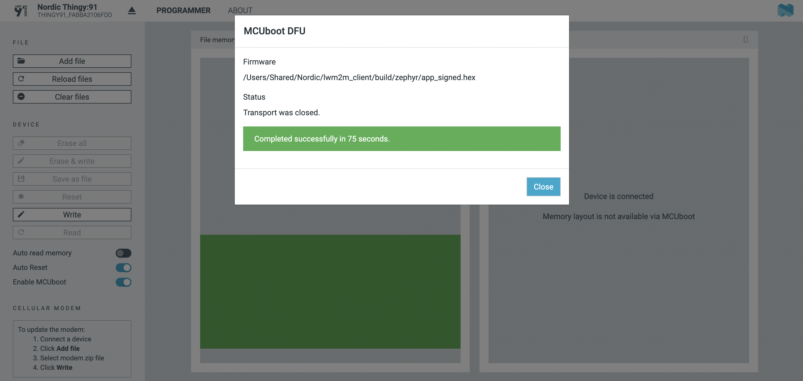

# Tracking application

## Introduction
Build a tracking application using the Thingy:91 devkit, while leveraging the benefits of the LwM2M protocol and visualizing its data on Microsoft Power BI.

## Prerequisites

- [Thingy:91](https://www.nordicsemi.com/Products/Development-hardware/Nordic-Thingy-91) with SIM with access to LTE-M or NB-IoT networks
- (Premium) account on [Coiote IoT DM](https://eu.iot.avsystem.cloud/)
- [nRF Cloud](https://nrfcloud.com/) account
- [nRF Connect for Desktop](https://www.nordicsemi.com/Products/Development-tools/nrf-connect-for-desktop)
- [nRF Connect SDK](https://www.nordicsemi.com/Products/Development-software/nrf-connect-sdk)
- [Microsoft Azure account](https://azure.microsoft.com/en-us/free/)
- [Microsoft Power BI account](https://powerbi.microsoft.com/)

## Architecture
```
Thingy:91   →   AVSystem    ←   nRF Cloud Connector
                            →   Azure IoT Hub   →   Microsoft PowerBI
```

## Part 1 - Connect the Thingy:91 to Coiote using the Zephyr LwM2M client

### **Install the nRF Connect SDK**

If not installed yet, make sure to install the nRF Connect SDK. In this example, we’re using the **nRF Connect extension for Visual Studio Code**. For information on working with the SDK, see the [Nordic documentation](https://developer.nordicsemi.com/nRF_Connect_SDK/doc/latest/nrf/getting_started.html).

### **Create a new application**

Create a new application in VS Code, use the [**lwm2m client**](https://developer.nordicsemi.com/nRF_Connect_SDK/doc/latest/nrf/samples/nrf9160/lwm2m_client/README.html) template. If you installed the nrf Connect SDK, you can the sample at: `nrf/samples/nrf9160/lwm2m_client`


!!! Info
    **Update the default key** (optional)

    The default key is: `000102030405060708090a0b0c0d0e0f`

    To update this key, open the `Kconfig` file, go to line 113 and update the key.


### Generate a Build Configuration

In VS Code, you can find the **lwm2m_client** application you just opened in the **nRF Connect extension**, under **APPLICATIONS**. Click on **No build configurations** to **Add a build configuration**.


In the **Add Build Configuration** page, select the board **thingy91_nrf9160_ns**

Select the configuration file: `prj.conf`

Add **Kconfig fragments**:

- `overlay-avystem.conf`
- `overlay-assist-cell.conf` for localization using cell towers
- `overlay-assist-agps.conf` for Assisted GPS
- `overlay-queue.conf` for integration with nRF Cloud

Uncheck the box **Build after generating configuration**

Click **Build Configuration**


Once the configuration has been generated, click **Kconfig** under **ACTIONS**.


Update the timeout time to 200 seconds, giving more time to the GPS to get a fix.

To do so, search for “**lwm2m seconds**”. Set the timeout to 200 “LWM2M Registration Update transmission time before timeout”.

Click **Build** to create a binary.


### **Write the firmware to the Thingy:91**

- When using the Thingy:91, use the `app_signed.hex` file and flash the firmware the **Programmer** in **nRF Cloud for Desktop**. 
  You can find the `app_signed` file in the folder `/build/zephyr`
- Flash it using **Programmer** in **nRF Cloud for Desktop** via **MCU** **boot**. 

    *For more information on flashing the Thingy:91 using MCU Boot, see [link](https://developer.nordicsemi.com/nRF_Connect_SDK/doc/latest/nrf/ug_thingy91_gsg.html#program-the-nrf9160-sip-application)*



- Powercycle the Thingy:91 to activate the application.


## **Register your device in AVSystem**

To connect to Coiote IoT Device Management LwM2M Server, please register at [https://eu.iot.avsystem.cloud](https://eu.iot.avsystem.cloud/).

To connect the board:

1. Log in to Coiote DM and from the left side menu, select **Device Inventory**.
1. In **Device Inventory**, click **Add device**.
1. Select the **Connect your LwM2M device directly via the Management server** tile.
    
    
    

1. In the **Device credentials** step:
    - Use as the **Endpoint name**: `urn:imei:…` followed by the IMEI of the Thingy:91 which you can find on the printed sticker on the device.
    
    
    
    - **Key Identity** is the same as the device ID
    - Create a **Key** (in hexademical). The default key is: `000102030405060708090a0b0c0d0e0f`.
1. Click the **Add device** button and **Confirm** in the confirmation pop-up.
1. If the device was booted successfully, you will see the device as shown below.

    

## Enable nRF Cloud integration

Follow [**the instructions listed here**](../../Cloud_integrations/nRF_Cloud_Location_services/Configure_nRF_Cloud_integration/) to enable the nRF Location Service integration.

If the connection to nRF Cloud Locator was successful, you will see the device location as a widget in the Coiote Device Center.


## Part 2 - Connect Coiote to Microsoft Azure

In Coiote DM, go to **Integrations**, open the tab **Templates** and create a new template by clicking the green button **+ Add new**.


Select the objects: 

- 0 - LwM2M Security
- 1 - LwM2M Server
- 3 - Device
- 4 - Connectivity Monitoring
- 5 - Firmware Update
- 6 - Location
- 3303 - Temperature
- 3304 - Humidity
- 3313 - Accelerometer
- 3315 - Barometer
- 3347 - Push button
- 3420 - LED color light
- 10256 - ECID-Signal Measurement information
- 50001 - Location Assistance

Make sure to select **Telemetry** for the sensor values of the objects: **6**, **3303**, **3304**, **3313**, **3315** and **3347**.


### Connect your device to Azure

Visit your **Device inventory** in Coiote. Find the device you want to connect to Azure, click the three dots and select **Connect to Azure**.


