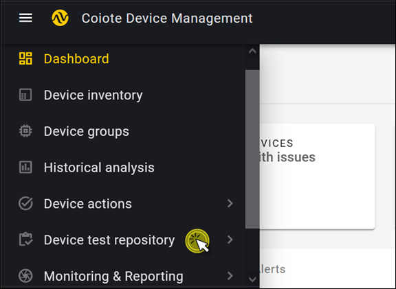
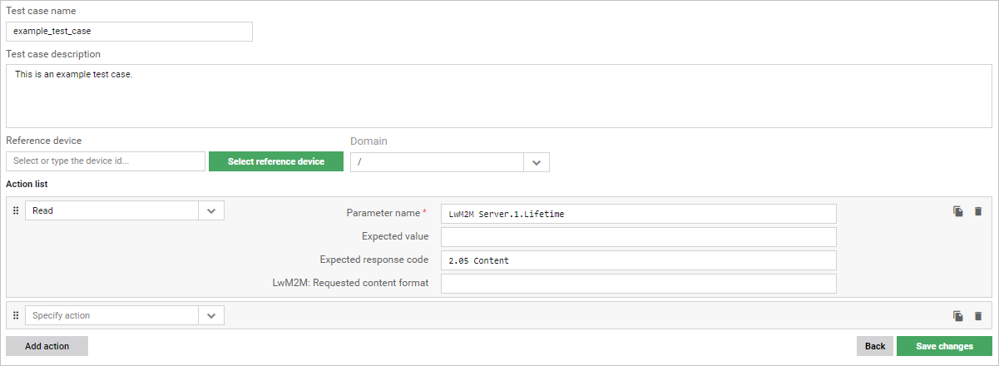

# Configure tests

## Introduction

This chapter covers the configuration aspects of the device tests. It explains how to list and view the configuration of tests, and how to add, edit, delete, import, and export them.

!!! note
    The configuration of tests is device-independent, which means that all the configured tests can be applied for all the devices that have registered to the platform.

## Device test repository panel

In this section you'll learn about the layout and main features of the Device test repository panel.

To enter the panel, select **Device test repository** and then **Server simulator** in the navigation menu.

0. **Search** – use it to search the test list.
0. **Filter** - use it to filter tests either per domain or per test type (Automated or Semi-Manual).
0.	**Add test** – use it to add a test manually or import tests from a `.conf` file.
0.	**'Select all' checkbox** – use it to select or deselect all tests visible in the list.
0.	**Actions – drop-down menu** – use it to download or delete selected tests.

    

0.  **Actions – context menu** - use it to preview, download, or delete selected tests.
0.	**Test list** – it features all the tests available for you at the moment, or all the tests meeting the search criteria (if entered).
0. **Test type** – it shows the test type: either Automated or Semi-Manual.
0.	**Domain name** – it shows the names of domains and subdomains to which your test belong.
0.	**Creation date** – it shows the date when the test was created.
0.	**Last modified** – it shows the date when the test was last modified.
0. **Description** – it shows a test description, if the test has any.

##	Listing tests

The tests appearing in the **Device test repository** panel are presented in the form of a searchable alphabetical list to ensure their convenient viewing and management. Read on this section to learn how to use the search to list your tests.

### Using the search

To search the list of configured tests, start typing your entry into the search field. The matching items will appear in the list.

!!! tip
    Note that if you select a test from the filtered list and then erase your entry from the search field, the selection is carried over to the complete list view. Similarly, if you use the **Select all** checkbox in the full list view and then filter the list using the search, the selection is carried over to the filtered list view.

##	Viewing test configuration

Read this section to learn how to view the configuration of an individual test:

1.	From the navigation menu, select **Device test repository**.
2.	In the list, find the test you want to view and click its name.
    
3.	In the action list, expand the action items by clicking the ˅ icon.
4.	To expand or collapse the complete action list, use the **Expand all** and **Collapse all** buttons.
5.	Optionally, you can use the **Edit test** button to edit your test or click the **trash bin** :material-delete: icon to delete it.

## Adding new tests

Read this section to learn how to add a new test. You can either add a test manually or import tests as a `.conf` file.

### Add a test manually

1.	From the navigation menu, select **Device test repository**.
2.	Click **Add test** and select **Add test manually**
3.	Configure your test:
    
    -	Enter your **Test name** (this field is mandatory).
    -	Enter your **Test description** (this field is optional).
    -	Select your **Reference device** (this field is optional). You can either:
         -	type the exact device ID in the **Reference device** search field and hit `Enter`,
         -	click **Select reference device** and select your device from the list. If you can't see your device in the list, start typing its name in the search field to get matching results.
4.	In the **Action list**, specify your actions:
    -	To add your first action item, choose its name from the drop-down list, or type its name in the **Specify action** field.
    -	Within the action, fill in the mandatory attributes field.
    -	To add another action item, use the **Add action** button and specify your next action.
    -	To change the order of actions within the test, drag and drop the action item you want to move by using the **drag** icon.
    -	To copy an action item, click the **copy** icon (except for the **Loop** action).
    -	To delete an action item, click the **trash bin** :material-delete: icon.
5.	If your test is ready and all the mandatory fields are filled, click **Add a new test**.

!!! note
    To learn more about individual test actions, see the **Test action** chapter.

### Import tests from .conf file

1.	From the navigation menu, select **Device test repository**.
2.	Click **Add test** and select **Import tests from .conf file**.
3.  A dialogue box prompting you to import a `.conf` file appears. Add the file and click **Import**.

!!! tip
    To download tests into a `.conf` file, check the [Downloading tests](#downloading-tests) section.

## Editing tests

Read this section to learn how to edit a test.

!!! note
    If you edit a test that was executed before, the existing historical results for this test will no longer be available.  

1.	From the navigation menu, select **Device test repository**.
2.	From the list, choose the test you want to edit and click its name.
3.	Click **Edit test** in the top-right corner.
4.	Edit your test:
     -	Modify your **Test name** (this field is mandatory).
     -	Modify your **Test description** (this field is optional).
     -	Change or add your **Reference device** (this field is optional). You can either:
          -	type the exact device ID in the **Reference device** search field and hit `Enter`,
          -	click **Select reference device** and select your device from the list. If you can't see your device in the list, start typing its name in the search field to get matching results.
5.	In the **Action list**, edit your actions:
     -	Edit an existing action item by changing its name, modifying its attributes.
     -	Add another action item using the **Add action** button.
     -	Change the order of actions within the test by dragging and dropping the action item you want to move using the **drag** icon.
     -	Copy an action item by clicking on the **copy** icon (except for the **Loop** action).
     -	Delete an action item by clicking on the **trash bin** :material-delete: icon.
6.	If you are done editing your test and all the mandatory fields remain filled, click **Save changes**.

## Deleting tests

Read this section to learn how to delete tests.

1.	From the navigation menu, select **Device test repository**.
2.	From the list, select the tests you want to delete.
3.	There are two ways to delete the selected tests:
    * Click the **Actions** drop-down menu and select **Delete**.
    
    * Click the context menu :material-dots-vertical: on the right and select **Delete**.
    

4. In the dialog that appears, click **Delete**. The test will be permanently deleted and you won't be able to recover it.

## Downloading tests

Read this section to learn how to export tests.

1.	From the navigation menu, select **Device test repository**.
2.	From the list, select the test(s) you want to export.
3.  There are two ways to download the selected tests:
    * for batch export, click the **Actions** drop-down menu and select **Download tests**.
    * for single test export, click the context menu :material-dots-vertical: on the right the test entry and select **Download test**.
  3. The tests are downloaded in the ``.conf`` format.

!!! tip
    Edit the exported tests using Windows Notepad or other standard text editor.

## Previewing test

1. Select the test you want to preview.
2. Click the context menu :material-dots-vertical: on the right and select **Preview test**.
