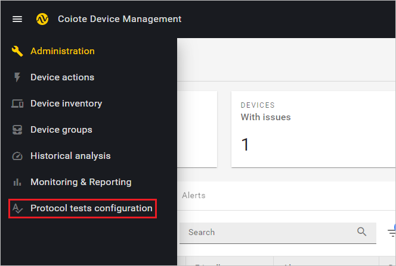
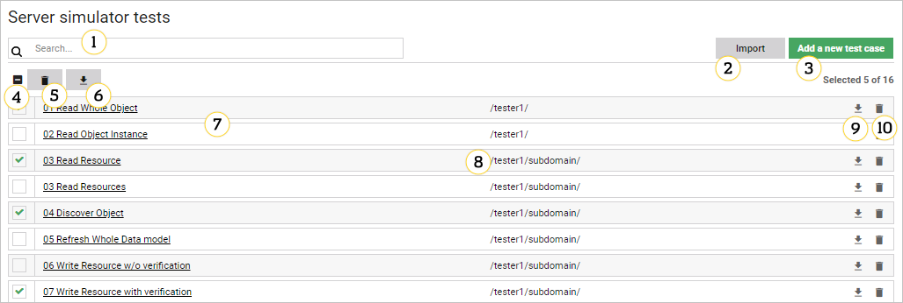
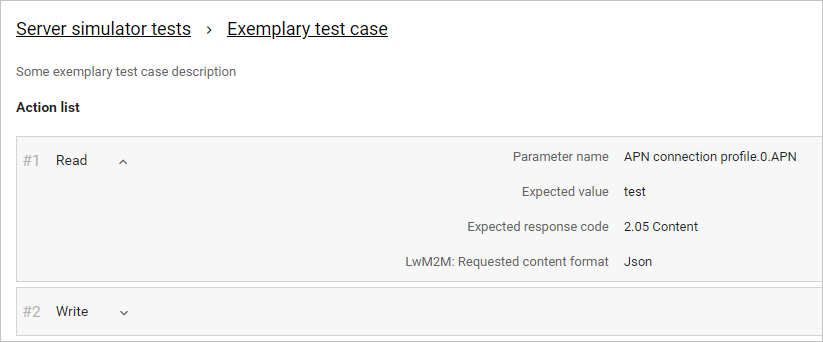
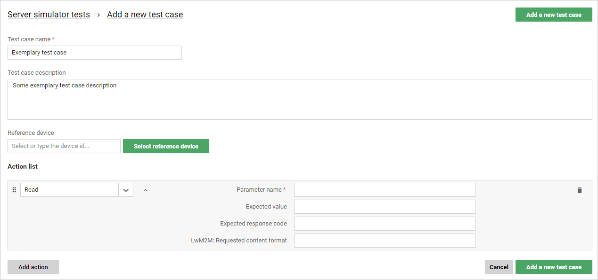
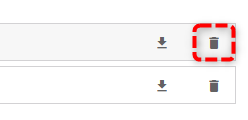
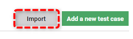
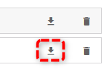
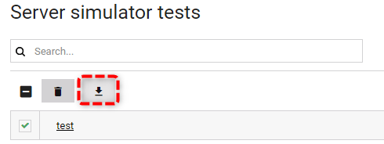

# Configuring test cases

## Introduction

This chapter covers the configuration aspects of the interoperability tests. It explains how to list and view the configuration of test cases, and how to add, edit, delete, import, and export them.

!!! note
    The configuration of test cases is device-independent, which means that all the configured test cases can be applied for all the devices that have registered to the platform.

## Interoperability tests configuration panel

In this section you will learn about the layout and main features of the Protocol tests configuration panel.

To enter the panel, in the navigation menu, select **Protocol tests configuration**.

1.	**Search** – use it to search the test case list.
2.	**Import** – use it to import test cases.
3.	**Add a new test case** – use it to add a new test case to the list.
4.	**'Select all' checkbox** – use it to select or deselect all test cases visible in the list.
5.	**'Delete selected' button** – use it to delete selected test cases.

6.  **'Export selected' button** - use it to export selected test cases.
7.	**Test case list** – it features all the test cases available for you at the moment, or all the test cases meeting the search criteria (if entered).
8.	**Domain name** – it shows the names of domains and subdomains to which your test cases belong.
9.	**Export icon** – use it to export a single test case.
10.	**Trash bin icon** – use it to delete a single test case.

##	Listing test cases

The test cases appearing in the test cases panel are presented in the form of a searchable alphabetical list to ensure their convenient viewing and management. Read this section to learn how to use the search to list your test cases.

### Using the search

To search the list of configured test cases start typing your entry into the search field. The matching items will appear in the list.

!!! tip
    Note that if you select a test case from the filtered list, and then erase your entry from the search field, the selection will be carried over to the complete list view. Similarly, if you use the select all checkbox in the full list view, and then filter the list using the search, the selection will be carried over to the filtered list view.

##	Viewing test case configuration

Read this section to learn how to view the configuration of an individual test case:

1.	From the navigation menu, select **Protocol tests configuration**.
2.	In the list, find the test case you want to view and click on its name.

3.	In the action list, expand the action items by clicking the ˅ icon.
4.	To expand or collapse the complete action list, use the **Expand all** and **Collapse all** buttons.
5.	Optionally, you can use the **Edit test case** button to edit your test case or click the **trash bin** icon to delete it.

## Adding new test cases

Read this section to learn how to add a new test case.

1.	From the navigation menu, select **Protocol tests configuration**.
2.	Click the **Add a new test case** button in the top-right corner:
3.	Configure your test case:

    -	Enter your **Test case name** (this field is mandatory).
    -	Enter your **Test case description** (this field is optional).
    -	Select your **Reference device** (this field is optional). You can either:
         -	type the exact device name in the **Reference device** search field and hit ‘Enter’,
         -	click **Select reference device** and select your device from the pop-up list. If you cannot see your device in the list, start typing its name in the search field to get matching results.
4.	In the **Action list**, specify your actions:
    -	To add your first action item, choose its name from the drop-down list, or type its name in the **Specify action** field.
         -	Within the action, fill in the mandatory attributes field.
    -	To add another action item, use the **Add action button** and specify your next action.
    -	To change the order of actions within the test case, drag and drop the action item you want to move by using the **drag** icon.
    -	To copy an action item, click the **copy** icon (except for the **Loop** action).
    -	To delete an action item, click the **trash bin** icon.
5.	If your test case is ready and all the mandatory fields are filled, click **Add a new test case**.

!!! note
    To learn more about individual test actions, see the Test case action description chapter.

## Editing test cases

Read this section to learn how to edit a test case.

!!! note
    If you edit a test case that was executed before, the existing historical results for this test case will no longer be available.  

1.	From the navigation menu, select **Protocol tests configuration**.
2.	From the list, choose the test case you want to edit and click on its name.
3.	Click the **Edit test case** button in the top-right corner.
4.	Edit your test case:
     -	Modify your Test case name (this field is mandatory).
     -	Modify your Test case description (this field is optional).
     -	Change or add your Reference device (this field is optional). You can either:
          -	type the exact device ID in the **Reference device** search field and hit `Enter`,
          -	click **Select reference device** and select your device from the pop-up list. If you cannot see your device in the list, start typing its name in the search field to get matching results.
5.	In the Action list, edit your actions:
     -	Edit an existing action item by changing its name, modifying its attributes.
     -	Add another action item using the Add action button.
     -	Change the order of actions within the test case by dragging and dropping the action item you want to move using the **drag** icon.
     -	Copy an action item by clicking on the **copy** icon (except for the **Loop** action).
     -	Delete an action item by clicking on the **trash bin** icon.
6.	If you are done editing your test case and all the mandatory fields remain filled, click **Save changes**.

## Deleting test cases

Read this section to learn how to delete test cases.

To delete individual test cases:

1.	From the navigation menu, select **Protocol tests configuration**.
2.	From the list, choose the test case you want to delete.
3.	Click the **trash bin** icon located on the right of the test case entry.

4. In the pop-up that appears, click **Confirm**.

To delete multiple test cases:

1.	From the navigation menu, select **Protocol tests configuration**.
2.	From the test case list, choose the test case you want to delete and click the **'Delete selected'** button.
3.  In the pop-up that appears, click **Confirm**.

## Importing test cases

Read this section to learn how to import test cases.

1.	From the navigation menu, select **Protocol tests configuration**.
2.	Select the **Import** button, choose your file from the pop-up window and click **Open**.

3.	Your imported test cases will appear in the list with the status **New**.

## Exporting test cases

Read this section to learn how to export test cases.

1.	From the navigation menu, select **Protocol tests configuration**.
2.	From the list, select the test case(s) you want to export:
    -	If you want to export a single test case, just select the test case and click on the **export** icon on the right of the test case line item.
       {:style="float: left;margin-right: 1177px;margin-top: 17px;"}
    -	If you want to export a group of test cases, select all the test cases and click on the **export** icon appearing at the top of the list.
       {:style="float: left;margin-right: 1177px;margin-top: 17px;"}
3. The test case(s) will be downloaded in the ``.conf`` format.

!!! tip
    Edit the exported test cases using Windows Notepad or other standard text editor.
