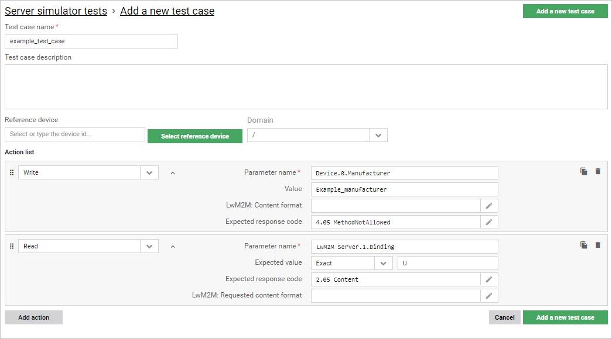
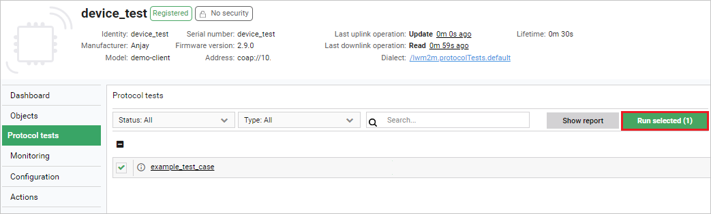
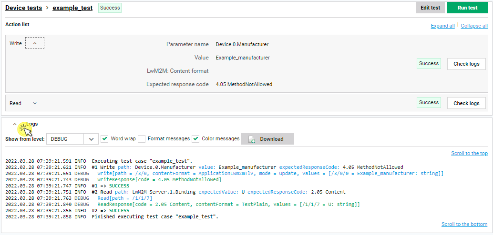

# Getting started

Start using the **Interoperability tests** feature right away. This short instruction will help you create your first test case, run it on a device and see the execution logs.

## Prerequisites

- A device that is added and registered in the platform.

## Create your first test case

1. From the navigation menu on the left, select **Protocol tests configuration**.

2. Click the **Add a new test case** button in the top-right corner.

   Configure your test case:
    - Provide a name for your test case.
    - Under the **Action list**, click the **Add action** button and select **Write** from the drop down list and provide data for the following fields:
         - **Parameter name**: `Device.0.Manufacturer`,
         - **Expected value**: `Example_manufacturer`,
         - **Expected response code**: `4.05 MethodNotAllowed`.
    - Under the **Action list**, select **Read** from the drop down list and provide data for the following fields:
         - **Parameter name**: `LwM2M Server.1.Binding`,
         - **Expected value**: `U`,
         - **Expected response code**: `2.05 Content`.
    - Select the **Add a new test case** button.

## Run the test case on device

1. In the **Device inventory**, select a currently registered device and enter its **Device Management Center**.
2. In **Device Management Center**, select the **Protocol tests** tab.

    !!! note
        If the **Protocol tests** tab is not visible in the menu, use the settings button under the menu to add it: drag it from **Available tabs** and drop it in **Selected tabs** and click **Confirm**.

3. Tick the test case you have just created and click **Run selected (1)**.

4. After a few moments, the execution should end and test case status changes from `In progress` to `Success`.  

!!! tip
    The `Success` status of a test case is a measure of the correctness of the device response against the expected test case parameters. Depending on the device and tester's needs, there may be test cases that are `successful` when the device responds with a *Failure* message (similarly to the example presented in this section).
## Check test execution details

To see test execution logs for your test case:

1. While in the **Protocol tests** panel, find your test case and click on its name.
2. Expand the **Logs** section using the **^** arrow icon to see execution details.

3. Use the **Check logs** button for each action inside the test case to see the highlighted results for this action.   
