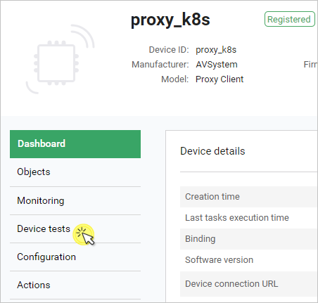
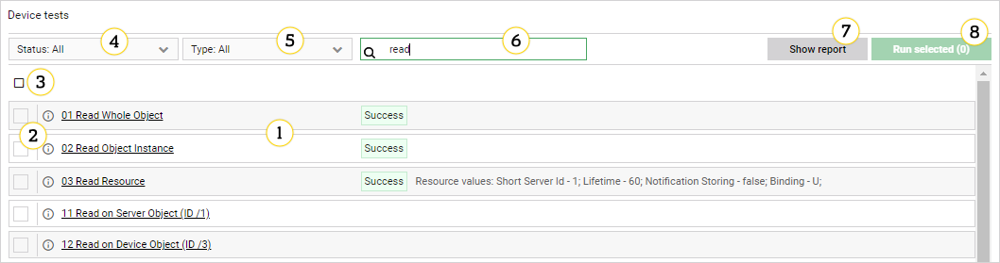

# Run tests

If you have tests configured in the platform, you can run them on your device using the **Device tests** panel. Read this chapter to learn how to display test descriptions, start and stop test execution and view test results and logs.

## Device tests panel description

The Device tests panel is available in the **Device Management Center** individually for each device. To access it, select a device in **Device Inventory** to enter its **Device Management Center** and select **Device tests** from the menu on the left.

!!! tip
    If the **Device tests** tab is not visible in the menu, use the **Configure visible tabs** button under the menu to add it: drag the tab from **Available tabs**, drop it in **Selected tabs** and click **Confirm**.

Read this section to learn about the main components that it comprises.

1.	**Test list** – views all the tests available for a given device. It is searchable and can be filtered.
2.	**Info icon** – hover over this icon to see test description.
3.	**'Select all' checkbox** – use this checkbox to select all items visible in the list. Note that if you filter or search the list, the previously made selection you will be kept nonetheless. In such a case, the number of selected tests visible in the Run selected button will be their total count, which may not correspond to the number of selections in your filtered list view.
4.	**Status** – use this field to filter your list view by test execution status.
5. **Type** - use this field to filter your list view by test type (*Automated* or *Semi-manual*).
6.	**Search** – use this field to search among the listed tests by their name. Start typing to get matching results.
7. **Show report** - use this button to view a summary of tests commissioned for your devices along with test success rate. To get the report in the CSV format, select the **Download summary file** button.
8.	**'Run selected (_)' button** – use it to start the execution of previously selected tests. The number of tests to be run is shown in brackets.

##	Displaying test description

Read this section to learn how to display details of tests.

1.	In **Device Inventory**, find your device in the list and click on its name.
2.	In **Device Management Center**, select the **Device tests** tab.
3.	Select a test and click on its name to enter the detailed view.

##	Starting tests

Read this section to learn how to start the execution of tests on a device.

1.	In **Device Inventory**, find your device in the list and click on its name.
2.	In **Device Management Center**, select the **Device tests** tab.
3.	Select the tests you want to run and click **Run selected (_)**.

!!! note
    Even if you leave the **Device tests** panel, tests once run will continue until all are finished or stopped.

##	Stopping tests

Read this section to learn how to stop the execution of tests on a device.

1.	With the tests running, go to **Device Inventory**.
2.	Find your device in the list and click on its name.
3.	In **Device Management Center**, select the **Device tests** tab.
4.	Click the **Cancel all tests** button located inside the footer bar.
5.	Test execution will be stopped.

!!! note
    Tests completed before you hit the **Cancel all tests** button will display their execution status.

##	Test statuses and logs

###	Test statuses

Test statuses are labels attached to tests that help to identify their state in each stage of their execution. There are eight available test statuses:

-	**New** – a test that has been recently added and has not been scheduled nor executed.
-	**NotScheduled** – a test that has never been picked for execution.
-	**NotTested** – a test that has been picked for execution, but its execution has not started due to some error or test execution interruption.
-	**Pending** – a test whose execution is pending.
-	**In progress** – a test whose execution is under way.
-	**Halted** – a test whose execution is temporarily stopped.
-	**Warning** – a test that has finished with error(s).
-	**Success** – a test that has finished with success.

!!! tip
    Statuses are available both for tests after execution as well as for individual actions inside a test. To view test results for individual actions, enter the finished test and see the action list.

###	Test logs

Logs store detailed information on the test execution and can be displayed after its completion. To display the logs for an individual test, enter the test and click **Check logs** or expand the **Logs** list.

-	If there are many logs from a selected period of time, use **Scroll to the bottom** and **Scroll to the top** links to navigate.
-	If a log entry is long, not all lines are displayed at once. To see more lines, click the **Show … lines/characters more** link.
-	To display only particular logs and logs of a higher level, use **Show from level list**.
-	To wrap words of logs, select the **Word wrap** checkbox.
-	To format messages in a more readable way, select the **Format messages** checkbox.
-	To see which messages were received (green color) and which were sent (blue color), select the **Color messages** checkbox.
-	To download logs from a particular period of time matching with used filters, click the **Download** button.
