# Test case actions

## Introduction

Based on the LwM2M 1.0 standard protocol operations, **Actions** are steps that can be defined within a test case. While some are used for the communication between the Server and the LwM2M test device, others help to define the test case logic. Read this chapter to learn how to use Actions in the configuration of customizable interoperability test cases.

## Action attributes

All the available Actions are defined using a set of configurable attributes that you can specify while adding or editing a test case. The attributes available under each action are determined by the type of given Action.
However, to set up a test case, not all attributes are mandatory. The general rule is that if you leave an optional attribute’s field blank, the final test case result won’t be affected in any way.

!!! tip
    if you would like to make the test device ignore a particular attribute so that it doesn’t answer to the server request, type ``None`` in the optional attribute’s field.

## Description of Actions

Within the Server simulator test cases, the following Actions are available (with mandatory attributes written in bold):

1.	READ
2.	WRITE
3.	EXECUTE
4.	DISCOVER
5.	DELETE
6.	CREATE
7.	WRITE ATTRIBUTES
8.	CLEAR ATTRIBUTES
9.	OBSERVE
10.	CANCEL OBSERVE
11.	Firmware Update
12.	Wait
13.	Pause response
14.	Wait for uplink request
15.	Send paused response
16.	Start Notification recording
17.	Expect Notification
18.	Loop start

### READ

READ is used to access the value of an object, object instances, a resource and single resource instances. You can define it using four attributes:

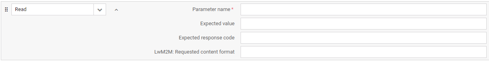

 - Parameter name – the name of the data model parameter you want to read. Note that it can be specified either using the full name in the string (e.g. ‘Device.0.Manufacturer) or the numerical (e.g. 3.0.1) value of the parameter.
 - Expected value – if the value you enter here equals the value read from the device, the test will be passed. If left blank, the value will only show up in the test case log and it will have no impact on the test case result. Note that this READ attribute works only for Resources and Resource Instances.
 - Expected response code – if the response code you enter here equals the response code returned by the device, the test will be passed. If left blank, the server will expect the default response code defined by the LwM2M standard.
 - LwM2M: Requested content format – the content format of the device answer that you request for your read operation. If the device doesn’t support the requested format, the test will fail. If left blank, the device can decide what content format to use; any format will be accepted.

### WRITE

WRITE is used to change the value of a Resource. You can define it using four attributes:

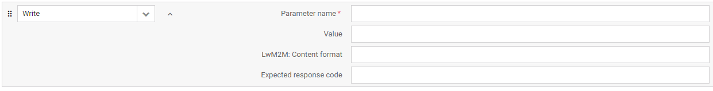

 - Parameter name – the name of the data model parameter for which you want to set a new value or overwrite the existing one. Note that it can be specified either using the full name in the string (e.g. ‘Device.0.Manufacturer) or the numerical (e.g. 3.0.1) value of the parameter.
 - Value – the value you enter here sets a new value or overwrites the existing one. If left blank, the existing value will be kept and the test will be passed.
 - LwM2M: Content format – the content format in which you send the write request to the device. If the device doesn’t support the specified format, the test will fail.
 - Expected response code – if the response code you enter here equals the response code returned by the device, the test will be passed. If left blank, the server will expect the default response code defined by the LwM2M standard.

### EXECUTE

EXECUTE is used to initiate some action and can only be performed on individual Resources. If the device receives an EXECUTE for an Object Instance(s) or Resource Instance(s), it will return an error. You can define it using two attributes:

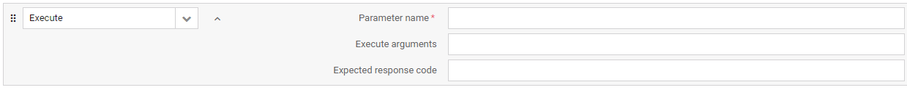

 - Parameter name – the name of the data model parameter for which you will issue an execute. Note that it can be specified either using the full name in the string (e.g. ‘Device.0.Manufacturer) or the numerical (e.g. 3.0.1) value of the parameter.
 - Execute arguments – the execution arguments passed to the device expressed in Plain Text format.
 - Expected response code – if the response code you enter here equals the response code returned by the device, the test will be passed. If left blank, the server will expect the default response code defined by the LwM2M standard.

### DISCOVER

DISCOVER is used to discover LwM2M Attributes attached to an Object, Object Instances, and Resources. You can define it using two attributes:

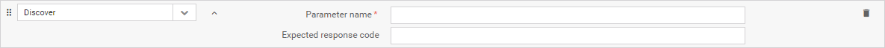

 - Parameter name – the name of the data model parameter whose attributes you want to discover. Note that it can be specified either using the full name in the string (e.g. ‘Device.0.Manufacturer) or the numerical (e.g. 3.0.1) value of the parameter.
 - Expected response code – if the response code you enter here equals the response code returned by the device, the test will be passed. If left blank, the server will expect the default response code defined by the LwM2M standard.

### DELETE

DELETE is used for the server to delete an Object Instance within the LwM2M Client. Note that an Object Instance to be deleted must be an Object Instance that is announced by the Client to the Server using the Register and Update operations of the Client Registration Interface.

 - Object instance – the object instance that you want to delete. Note that it can be specified either using the full name in the string (e.g. ‘Device.0) or the numerical (e.g. 3.0) value of the parameter.
 - Expected response code – if the response code you enter here equals the response code returned by the device, the test will be passed. If left blank, the server will expect the default response code defined by the LwM2M standard.

### CREATE

CREATE is used by the Server simulator to create Object Instance(s) within the LwM2M Client. You can define the action using three parameters and a set of Object Instance-dependent values:

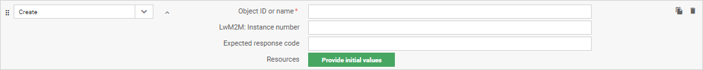

 - Object ID or name – the Object that you want to create an Instance for. Note that it can be specified either using the full name in the string (e.g. ‘Portfolio’) or the numerical (e.g. ‘16’) value of the parameter.
 - LwM2M: Instance number – the number assigned to the Object Instance to be created. If left blank, the number will be chosen by the device.
 - Expected response code – if the response code you enter here equals the response code returned by the device, the test will be passed. If left blank, the server will expect the default response code defined by the LwM2M standard.
 - Resources – click the Provide initial values button to view and specify the possible Resources and Resource Instances of the Object Instance to be created. Note that if the values marked as required are left blank, the action will fail for devices that correctly implement LwM2M.

### WRITE ATTRIBUTES

WRITE ATTRIBUTES is used to attach metadata containing parameters for Notifications to an Object, an Object Instance or a Resource. You can define it using seven attributes:

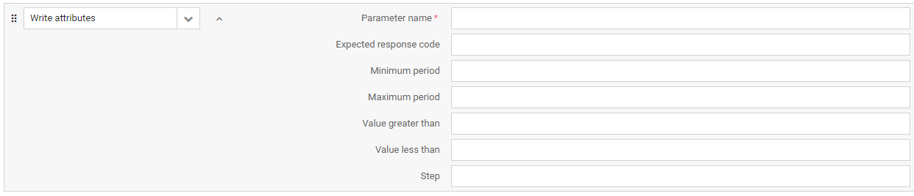

 - Parameter name – the name of the data model parameter for which you will write attributes. Note that it can be specified either using the full name in the string (e.g. ‘Device.0.Manufacturer) or the numerical (e.g. 3.0.1) value of the parameter.
 - Expected response code – if the response code you enter here equals the response code returned by the device, the test will be passed. If left blank, the server will expect the default response code defined by the LwM2M standard.
 - Minimum period – the minimum time in seconds that the device waits between two notifications.
 - Maximum period – the minimum time in seconds that the device waits between two notifications.
 - Value greater than – notifications will be sent only when the monitored value crosses the threshold you set here. However, please note that the interpretation of this parameter may differ depending on the specific LwM2M Client implementation.
 - Value less than – notifications will be sent only when the monitored value crosses the threshold you set here. However, please note that the interpretation of this parameter may differ depending on the specific LwM2M Client implementation.
 - Step – the minimum change value between two notifications.

### CLEAR ATTRIBUTES

CLEAR ATTRIBUTES is used to clear the metadata attached to an Object, an Object Instance or a Resource which contain parameters for Notifications. You can define it using seven attributes:

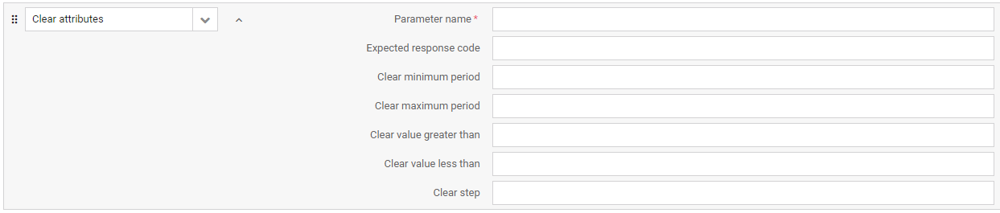

 - Parameter name – the name of the data model parameter for which you will clear attributes. Note that it can be specified either using the full name in the string (e.g. ‘Device.0.Manufacturer) or the numerical (e.g. 3.0.1) value of the parameter.
 - Expected response code – if the response code you enter here equals the response code returned by the device, the test will be passed. If left blank, the server will expect the default response code defined by the LwM2M standard.
 - Clear minimum period – if set to true, it clears the minimum time in seconds between two notifications. If set to false, the value is kept.
 - Clear maximum period – if set to true, it clears the maximum time set between two notifications. If set to false, the value is kept.
 - Clear value greater than – if set to true, it clears the threshold set for the monitored value. If set to false, the value is kept.
 - Clear value less than – if set to true, it clears the threshold set for the monitored value. If set to false, the value is kept.
 - Clear step – if set to true, it clears the minimum change value between two notifications. If set to false, the value is kept.

### OBSERVE

OBSERVE is used to initiate an observation request for changes of a specific Resource, Resources within an Object Instance or for all the Object Instances of an Object. You can define it using four attributes:

 - Parameter name – the name of the data model parameter whose value(s) you will observe. Note that it can be specified either using the full name in the string (e.g. ‘Device.0.Manufacturer) or the numerical (e.g. 3.0.1) value of the parameter.
 - Expected response code – if the response code you enter here equals the response code returned by the device, the test will be passed. If left blank, the server will expect the default response code defined by the LwM2M standard.
 - Fail if already observed – if set to true, the test will fail in case there is an existing observation set on this parameter. In case there is no observation set, your observe request should be accepted and the test won’t fail. If set to false, any existing observations will be cancelled and requested again by this one and the test will be passed.
 - LwM2M: Content format – the content format in which you send the OBSERVE request to the device. If the device doesn’t support the specified format, the test will fail.

### CANCEL OBSERVE

CANCEL OBSERVE is used to cancel an observation. You can define it using three attributes:

 - Parameter name – the name of the data model parameter for which you will cancel an existing observation. Note that it can be specified either using the full name in the string (e.g. ‘Device.0.Manufacturer) or the numerical (e.g. 3.0.1) value of the parameter.
 - Cancel type – the mode in which the CANCEL OBSERVE will be sent to the device.
o	ACTIVE - CANCEL OBSERVE is sent to the device immediately.
o	PASSIVE - CoAP RESET is sent in response to the next notification message received from the device.
 - Expected response code – if the response code you enter here equals the response code returned by the device, the test will be passed. If left blank, the server will expect the default response code defined by the LwM2M standard.

### Firmware Update

Firmware Update is used to perform a firmware update operation on the test device. You can define it using five attributes:

 - Firmware – the ID of the resource used as the firmware source.
 - Update timeout – the time period in seconds within which the firmware update should be completed. In case the timeout is up and the update process has not finished, the action will fail.
 - Delivery method – The protocol and transfer method used to deliver the firmware file to the device.
 - Use notifications – if set to true, an OBSERVE will be issued automatically for the ‘State’ and ‘Update result’ parameters while upgrading the device. The notifications returned by the device will be visible in the test case logs.
 - Expected update result – if the update result you enter here equals the result returned by the device, the test will be passed. If left blank, the server will expect the default result defined by the LwM2M standard. You can choose among the ten update results defined as per the LwM2M protocol specification.

### WAIT

Wait is used to set the waiting time before executing the next action. You can define it using two attributes:

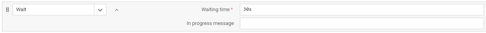

 - Waiting time – the interval set before the next action is executed.
 - In progress message – a custom text that will be displayed as the test case progress message while waiting for the execution of the next action.

### Pause response

Pause response is used to delay a response to be sent to the device. If set, the server will wait before sending the response until the Send paused response action is executed.

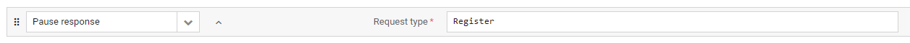

 - Request type – the kind of request for which you want to pause the response.

### Wait for uplink request

Wait for uplink request is used to prevent the server from executing any tasks or actions until an uplink request arrives from the device. You can define the action using three attributes:

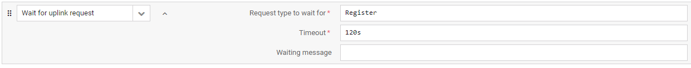

 - Request type to wait for – the kind of request you want to wait for.
 - Timeout – the time period in seconds within which the uplink request should arrive. In case the timeout is up with no request, the action will fail.
 - Waiting message – the message displayed during the test case execution while waiting for the arrival of the uplink request.

### Send paused response

Send paused response is used to send the previously paused response to the device.

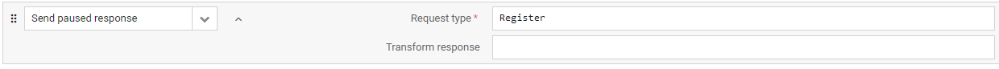

 - Request type – the kind of request for which you want to send the previously paused response.

### Start Notification recording

Start Notification recording is used to make the Server simulator save all notifications received from the device in its memory. The limit of recorded notifications can be configured using the ``ddscNotificationRecordingLimit`` setting value. Once the limit is reached, new notifications are not recorded. Execute the Start Notification recording action again in the same test to clear the recording state and to be able to match more notifications than the recording limit.

### Expect Notification

Expect Notification is used to check if recorded Notifications match the required criteria. You can define it using five attributes:

 - Expected path – only notifications that were received on this path will be validated. In case of a notification with multiple paths and values, each path and value are treated as separate notifications.
 - Expected value – use it to check if there is any notification that has a given value and matches all other criteria.
 - Expected arrival order – use it to limit the validation only to one notification on a given path that arrived in a given order since the last Start Notification recording action. Note that the counting starts from 0 and that the Observe response is also counted if it is executed after the recording action started.
 - Timeout – if the expected notification does not arrive within this time limit, the action will fail.
 - Waiting message – a custom text that will be displayed as the test case progress message while waiting for the action execution.

### Loop start

Loop start is used to repeat an action or a set of actions within a test case. Note that when configuring the first action inside the loop, the Loop end action is added automatically.

 - Repetitions – the number of iterations of action(s) inside the loop.
