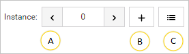

# Device data model and variables

##	Displaying device data model and running simple actions

Coiote DM gives you the possibility to view and perform actions on the data model of individual devices defined by the LwM2M protocol. This view is available under the **Objects** panel of your device. Read this chapter to learn how to use the panel.

1.	**Search** - use it to find a particular object. To find the object, type its name.
2.	If checked, the changes you make to device objects will be applied immediately. Otherwise, you will have to wait for the device to trigger action execution or use the **Execute tasks** button (for devices in non-queue mode).
      !!! note
          The **Apply immediately** option is only available for devices in non-queue mode.
3.	Use this button to add a new LwM2M object definition.
4.	Division into objects.
5.	The **info** icon - click it to see the object description.
6.	Managing instances:

   A. Use it to select another instance of an object if the object has instances.
   B. Use it to add a new instance if an object allows it.
   C. Use it to select another instance or remove it.
7.	Search - use it to find a particular resource. To find the resource, type its name.
8.	Use it to refresh data, track values (send an Observe task) and add additional attributes to a selected instance.
9.	Use it to refresh data, track values (send an Observe task) and add additional attributes to a selected object.
10.	The table with resources of an object instance.
     !!! note
         The icon displaying the status of execution is available after clicking one of the action buttons located in the **Actions** column. If you click it, you will see additional information on execution.
Figure 68. Execution status icon
11.	Use it to refresh the resource.
12.	Value tracking - use it to send an Observe task to the device and configure monitoring to collect data.
13.	Attributes - use it to edit resource attributes or add new ones.
14.	Use it to edit a value of a resource.
15.	Execute - use it to send an Execute task to the device. Click the icon next to the button to add additional parameters.

##	Managing device variables

Use the **Variables** panel to add custom variables onto your device for the purpose of protocol tests and view the existing variables that the device has inherited. To enter the **Variables** panel, go to **Device Management Center** by clicking on a selected device name and choose the **Variables** tab.

Figure 69. The variables panel
1.	The Custom device variables list shows the variables that belong to this particular device.
    - To add a variable, click on + Add variable, provide its name and value, and click Save.
Note that every custom variable that you add will have the VARIABLE_ prefix.
    - To delete a previously added variable, click the Trash bin icon and click Save.

2.	The Inherited variables list shows only the variables that the device inherits from the groups of devices that is belongs to. The list is view-only. To add a variable to this list, go to Device Groups and, in the Profiles panel, add an entry with the name beginning with `VARIABLE_`.
To use your device variables, enter the expression context by typing ${variable.<variableName>} while defining a test case action. Remember that each variable is treated as a string, therefore, to use it as a different data type, you will have to cast it to the appropriate type. 
