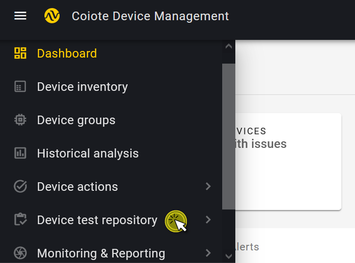
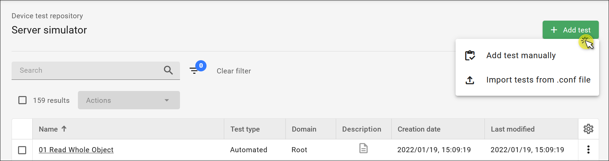
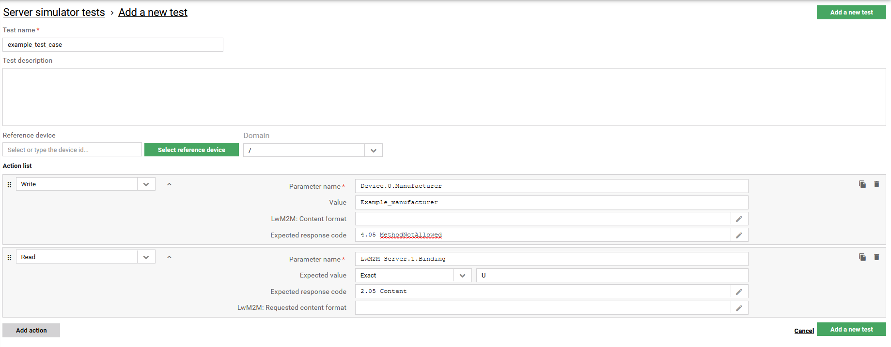
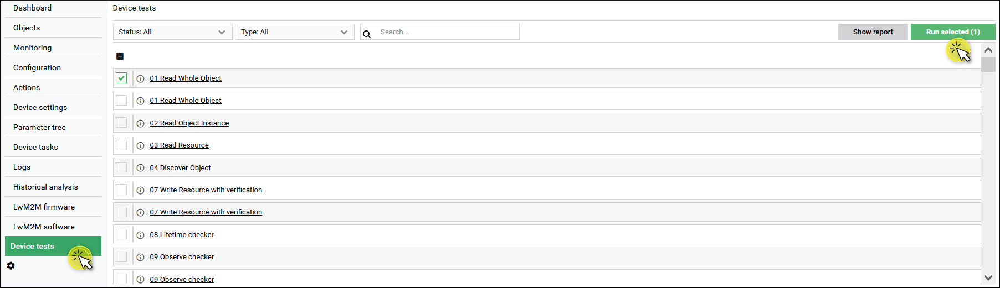
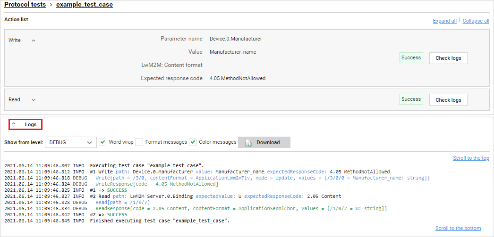

# Getting started

Start using the **Device tests** feature right away. This short instruction will help you create your first test, run it on a device and see the execution logs.

## Prerequisites

A device that is added and registered in the platform.

## Create your first test

1. From the navigation menu on the left, select **Device test repository** and then **Server simulator**.

2. Click **Add test** and select one of the two options: either **Add test manually** or **Import tests from .conf file**.

### Add test manually

If you've selected **Add test manually**, you need to configure your test:
    - Provide a name for your test.
    - Under the **Action list**, click**Add action** and select **Write** from the drop down list and provide data for the following fields:
         - **Parameter name**: `Device.0.Manufacturer`,
         - **Expected value**: `Example_manufacturer`,
         - **Expected response code**: `4.05 MethodNotAllowed`.
    - Under the **Action list**, select **Read** from the drop down list and provide data for the following fields:
         - **Parameter name**: `LwM2M Server.1.Binding`,
         - **Expected value**: `U`,
         - **Expected response code**: `2.05 Content`.
    - Click **Add a new test**.

  

### Import tests from .conf file

If you've selected **Import tests from .conf file**, a dialogue box prompting you to import a .conf file appears. Add the file and click **Import**.

## Run the test on device

1. In the **Device inventory**, select a currently registered device and enter its **Device Management Center**.
2. In **Device Management Center**, select the **Device tests** tab.

    !!! note
        If the **Device tests** tab is not visible in the menu, use the settings button under the menu to add it: drag it from **Available tabs** and drop it in **Selected tabs** and click **Confirm**.

3. Tick the test you have just created and click **Run selected (1)**.

4. After a few moments, the execution should end and test status changes from `In progress` to `Success`.  

!!! tip
    The `Success` status of a test is a measure of the correctness of the device response against the expected test parameters. Depending on the device and tester's needs, there may be tests that are `successful` when the device responds with a *Failure* message (similarly to the example presented in this section).

## Check test execution details

To see execution logs for your tests:

1. While in the **Device tests** panel, find your test and click on its name.
2. Expand the **Logs** section using the **^** arrow icon to see execution details.

3. Use the **Check logs** button for each action inside the test to see the highlighted results for this action.   
