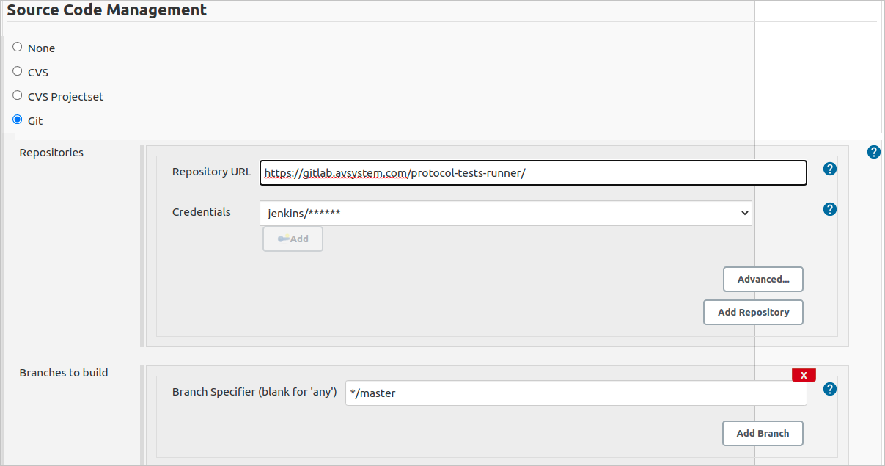
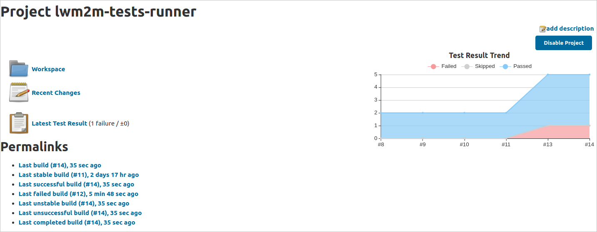
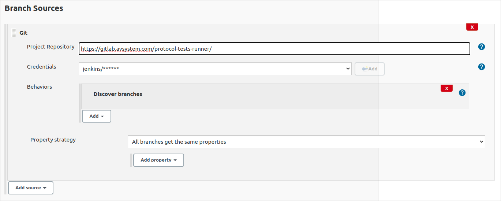
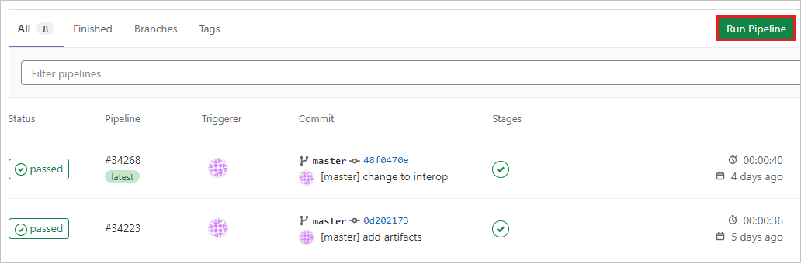
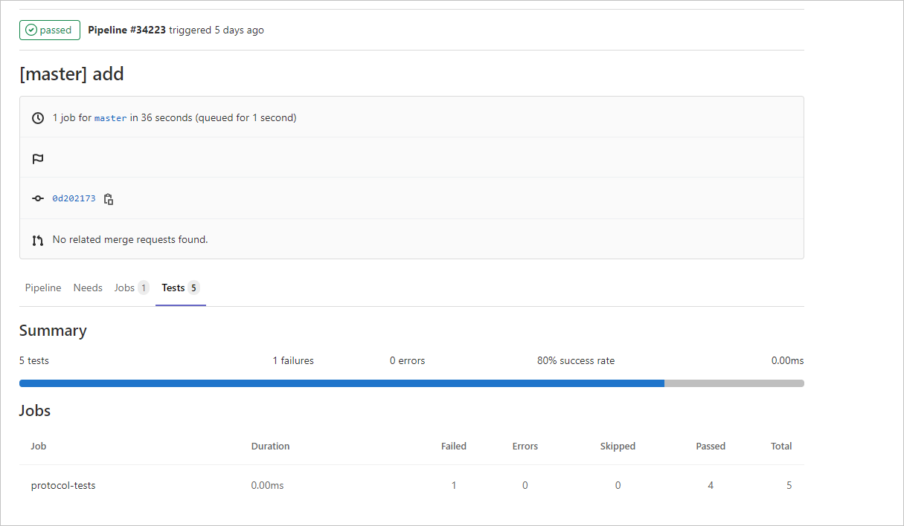
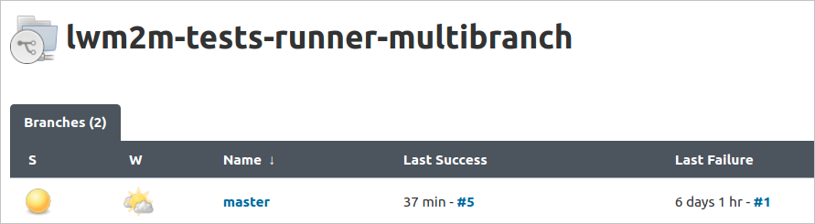
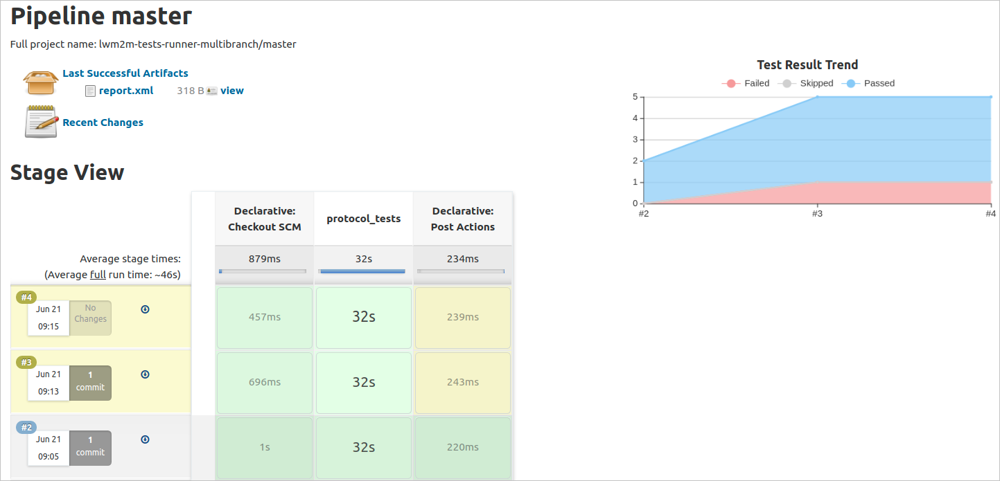

# Jenkins/GitLab integration with interop tests API

If you would like to automate your interoperability tests, you can use the Coiote DM API and integrate it with a CI/CD environment like Jenkins or GitLab.
Follow the guide below to learn how to configure the integration, run tests and summarize your test execution using these tools.

!!! note
    The following instruction is based on integration with Jenkins. To integrate with GitLab, you can follow the same steps, but with slight adjustments - for details, please see subsection on [GitLab](#gitlab-configure-and-run-pipeline).    

## Prerequisites

- An active Jenkins and GitLab account.
- A GitLab project repository.
- A working Coiote DM installation and a port for communication with the installation API.
- A device registered in the platform (if the tests require the device to be registered).
- A Coiote DM user with access to the device and the following permissions:
    - `rest.base.paths.devices.POST`
    - `rest.base.paths.devices.DELETE_id`
    - `rest.base.paths.devices.GET`
    - `rest.base.paths.devices.GET_id`
    - `rest.base.paths.devices.PUT_id`
    - `rest.base.paths.devices.find.details.GET`
    - `rest.base.paths.protocolTests.schedule.device.POST_device`
    - `rest.base.paths.protocolTests.schedule.group.POST_group`
    - `rest.base.paths.protocolTests.report.device.POST_deviceId`
    - `rest.base.paths.protocolTests.report.group.POST_groupId`

## Setting up a Jenkins standard pipeline

1. Upload a file with python script used to run test cases to your GitLab project repository:
    - Edit the following python script where required to adjust it to your environment:
       ```
       #!/usr/bin/python
       import requests
       import json
       import time
       import xml.etree.cElementTree as ET

       # ___Edit below___ #
       DEVICE_NAME = "test-device"
       INSTALLATION_URL = "https://lwm2m-test.avsystem.io"
       INSTALLATION_API_PORT = "8087"
       CREDENTIALS=('user_login', 'password')
       TEST_NAMES = {
               "testCases":[
                       "protocol_test_1",
                       "protocol_test_2",
                       "protocol_test_3",
                       "protocol_test_4",
                       "protocol_test_5",
               ]
       }
       # ___Edit above___ #

       SCHEDULE_URL = INSTALLATION_URL + ":" + INSTALLATION_API_PORT + "/api/coiotedm/v3/protocolTests/schedule/device/" + DEVICE_NAME
       REPORT_URL = INSTALLATION_URL + ":" + INSTALLATION_API_PORT + "/api/coiotedm/v3/protocolTests/report/device/" + DEVICE_NAME
       PARAMS = {
               'accept' : 'application/json',
               'Content-Type': 'application/json'
       }

       root = ET.Element("testsuite")

       result = requests.post(url=SCHEDULE_URL, json=TEST_NAMES, auth=CREDENTIALS, params=PARAMS)
       if result.status_code != 201:
              print('Could not schedule the tests.')
              print('Server returned: ' + str(result.status_code))
              print('Error message: ' + str(result.json()['error']))
              exit(1)

       tests_running = True
       while tests_running:
               result = requests.post(url=REPORT_URL, json=TEST_NAMES, auth=CREDENTIALS, params=PARAMS)
               if result.status_code != 200:
                       print('Could not read the tests status.')
                       print('Server returned: ' + str(result.status_code))
                       print('Error message: ' + str(result.json()['error']))
                       exit(1)
               tests_running = result.json()["waitingForExecution"]
               time.sleep(15)

       for test in result.json()['failed']:
           a = ET.SubElement(root, "testcase", classname="interop", name=test)
           ET.SubElement(a, "failure", type="failure")

       for test in result.json()['passedWithWarning']:
           b = ET.SubElement(root, "testcase", classname="interop", name=test)
           ET.SubElement(b, "failure", type="warning")

       for test in result.json()['passedSuccessfully']:
           ET.SubElement(root, "testcase", classname="interop", name=test)

       tree = ET.ElementTree(root)
       tree.write("report.xml")
       ```

          - `DEVICE_NAME` - type the endpoint name of your device.
          - `INSTALLATION_URL` - provide the URL of your Coiote DM installation.
          - `INSTALLATION_API_PORT` - provide the port for communication with the API. The default value is `8087`.
          - `CREDENTIALS` - provide user name and password of the user used for logging in to the platform.
          - `TEST_NAMES` - type the names of the test cases that you want to execute on the device.
    - Save the script as a .py file and upload it to your GitLab project repository.

2. Create a pipeline for your project:
    - Go to your Jenkins account and in the **Dashboard** view, select **New Item** from the menu on the left.
    - Enter a name for your pipeline, select **Pipeline**, and confirm by clicking **OK**.

3. Configure your pipeline:
    - Go to your newly created pipeline and select **Configure** from the menu on the left.
    - In the **Source Code Management** section, select the **Git** option and provide the following:
        - **Repository URL** - enter the URL address of your GitLab repository that hosts the python script file from step 1.  

        - **Credentials** - add the user name and password of your GitLab account.
        - **Branch Specifier** - choose the GitLab branch you want to use in the pipeline.
    - In the **Build** section, select the **Execute Shell** option from the drop-down list and provide the command to run the python script file from step 1:
        ```
        python3 example_filename.py
        ```

    - Additionally, in the **Post-build Actions** section, select the **Publish Junit test result report** to set up test result report generation:
        - Depending on your preferences, check or uncheck the **Allow empty results** option.
    - Click **Save**.

## Running the Jenkins standard pipeline

1. Enter pipeline and select **Build Now**.

!!! note
    Remember to check if the device you run the tests for is connected and registered in Coiote DM.
2. Once the tests are performed, you will see your build status along with a graph reporting the execution status for each test case.


## Setting up a Jenkins multibranch/GitLab pipeline

Alternatively to the standard pipeline, you may configure a multibranch pipeline to run your test cases.

### Jenkins - configure multibranch pipeline

1. Upload the `Jenkinsfile` that will define your multibranch pipeline to your GitLab project repository:
    - Edit the script where required to adjust it to your environment:

        !!! note
            Remember to change the name `example_filename.py` to your custom name that you will choose in step 2.

      ```
      pipeline {
          options { disableConcurrentBuilds() }
          agent any
          stages {
              stage('protocol_tests') {
                  steps {
                      sh 'python3 example_filename.py'
                  }
              }
          }
          post {
               always {
                        junit "report.xml"
                        archiveArtifacts artifacts: 'report.xml'
               }
               cleanup {
                       script { clean() }
               }
          }
      }
      ```

    - Save the file as `Jenkinsfile` and upload it to the chosen branch of your GitLab project repository.

2. Upload a file with python script used to run test cases to your GitLab project repository:
    - Edit the following python script where required to adjust it to your environment:
       ```
       #!/usr/bin/python
       import requests
       import json
       import time
       import xml.etree.cElementTree as ET

       # ___Edit below___ #
       DEVICE_NAME = "test-device"
       INSTALLATION_URL = "https://lwm2m-test.avsystem.io"
       INSTALLATION_API_PORT = "8087"
       CREDENTIALS=('user_login', 'password')
       TEST_NAMES = {
               "testCases":[
                       "protocol_test_1",
                       "protocol_test_2",
                       "protocol_test_3",
                       "protocol_test_4",
                       "protocol_test_5",
               ]
       }
       # ___Edit above___ #

       SCHEDULE_URL = INSTALLATION_URL + ":" + INSTALLATION_API_PORT + "/api/coiotedm/v3/protocolTests/schedule/device/" + DEVICE_NAME
       REPORT_URL = INSTALLATION_URL + ":" + INSTALLATION_API_PORT + "/api/coiotedm/v3/protocolTests/report/device/" + DEVICE_NAME
       PARAMS = {
               'accept' : 'application/json',
               'Content-Type': 'application/json'
       }

       root = ET.Element("testsuite")

       result = requests.post(url=SCHEDULE_URL, json=TEST_NAMES, auth=CREDENTIALS, params=PARAMS)
       if result.status_code != 201:
              print('Could not schedule the tests.')
              print('Server returned: ' + str(result.status_code))
              print('Error message: ' + str(result.json()['error']))
              exit(1)

       tests_running = True
       while tests_running:
               result = requests.post(url=REPORT_URL, json=TEST_NAMES, auth=CREDENTIALS, params=PARAMS)
               if result.status_code != 200:
                       print('Could not read the tests status.')
                       print('Server returned: ' + str(result.status_code))
                       print('Error message: ' + str(result.json()['error']))
                       exit(1)
               tests_running = result.json()["waitingForExecution"]
               time.sleep(15)

       for test in result.json()['failed']:
           a = ET.SubElement(root, "testcase", classname="interop", name=test)
           ET.SubElement(a, "failure", type="failure")

       for test in result.json()['passedWithWarning']:
           b = ET.SubElement(root, "testcase", classname="interop", name=test)
           ET.SubElement(b, "failure", type="warning")

       for test in result.json()['passedSuccessfully']:
           ET.SubElement(root, "testcase", classname="interop", name=test)

       tree = ET.ElementTree(root)
       tree.write("report.xml")
       ```

          - `DEVICE_NAME` - type the endpoint name of your device.
          - `INSTALLATION_URL` - provide the URL of your Coiote DM installation.
          - `INSTALLATION_API_PORT` - provide the port for communication with the API. The default value is `8087`.
          - `CREDENTIALS` - provide user name and password of the user used for logging in to the platform.
          - `TEST_NAMES` - type the names of the test cases that you want to execute on the device.
    - Save the script as a `.py` file (using the filename specified in the Jenkinsfile in the previous step) and upload it to your GitLab project repository.

2. Create a pipeline for your project:
    - Go to your Jenkins account and in the **Dashboard** view, select **New Item** from the menu on the left.
    - Enter a name for your pipeline, select **Multibranch Pipeline** and confirm by clicking **OK**.

3. Configure your pipeline:
    - Go to your newly created pipeline and select **Configure** from the menu on the left.
    - In the **Branch Sources** section, select the **Git** option and provide the following:
        - **Project Repository** - enter the URL address of your GitLab repository that hosts the `Jenkinsfile` and the python script file from step 2.  

        - **Credentials** - add the user name and password of your GitLab account.
    - In the **Build Configuration** section, select the **by Jenkinsfile** mode from the drop-down list and provide the GitLab path to the `Jenkinsfile` from step 1 (if the file is located in the GitLab root folder, it is enough to type `Jenkinsfile`)

    - Click **Save**.

### GitLab - configure and run pipeline

1. Upload the `gitlab-ci.yml` file that will define your GitLab pipeline to your GitLab project repository:
    - Edit the script where required to adjust it to your environment:

        !!! note
            Remember to change the name `example_filename.py` to your custom name that you will choose in the next step. Also, keep in mind that running a pipeline in GitLab requires a docker image of a Linux distribution.

      ```
      image:
        name: example.repository.com/docker-local/linux_image

      protocol-tests:
        stage: test
        script:
          - python3 example_filename.py
        artifacts:
          when: always
          paths:
            - report.xml
          reports:
            junit: report.xml
      ```

    - Save the file as `gitlab-ci.yml` and upload it to the chosen branch of your GitLab project repository.

2. Follow step 2 from [Creating a Jenkins multibranch pipeline](#jenkins-configure-multibranch-pipeline) (uploading a file with python script to your GitLab repository).

3. Run a created pipeline for your project:
    - Go to your GitLab project and in the **Dashboard** view, select **CI/CD** from the menu on the left and click **Pipelines**.

        !!! attention
            Note that to be able to run a pipeline, you will need to have the GitLab CI/CD toolset configured. For details, please check https://docs.gitlab.com/ee/ci/introduction/index.html.

    - You should be able to see the branch with the uploaded `gitlab-ci.yml` file.

    - Select the **Run pipeline** button, then confirm again by clicking **Run pipeline**.
    - Once the pipeline execution is finished, you should be able to see the results in the **Tests** tab of your pipeline.

        !!! note
            Viewing graphs with test results is not supported in GitLab by default as it requires additional plugins.



## Running the Jenkins multibranch pipeline

1. Before running the tests for a chosen branch, you have to perform a scan to detect available branches (those with a `Jenkinsfile`):
    - Go to your multibranch pipeline and select **Scan Multibranch Pipeline Now** option from the menu on the left.
    - Once the scan is completed, you will see a list of available branches.

2. Enter a chosen branch by clicking on its name and select **Build Now**.

!!! note
    Remember to check if the device you run the tests for is connected and registered in Coiote DM.
3. Once the tests are performed, you will see your build status along with a graph reporting the execution status for each test case.

