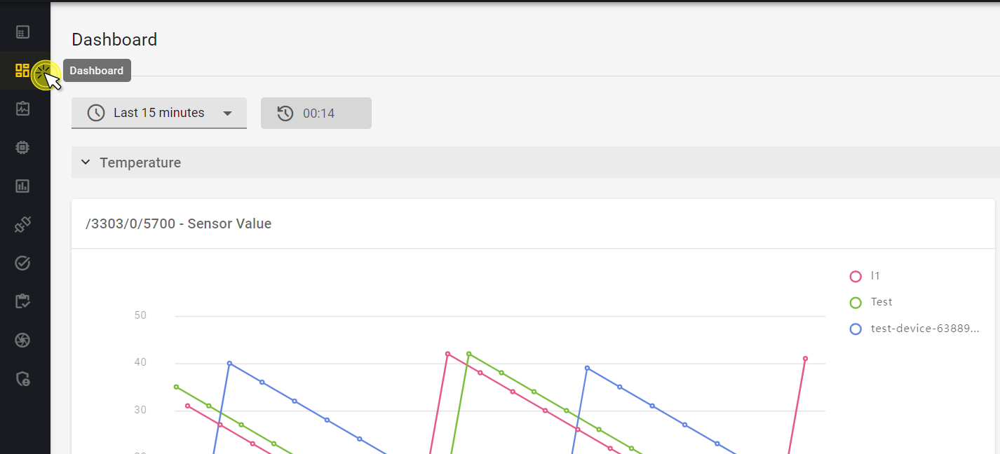
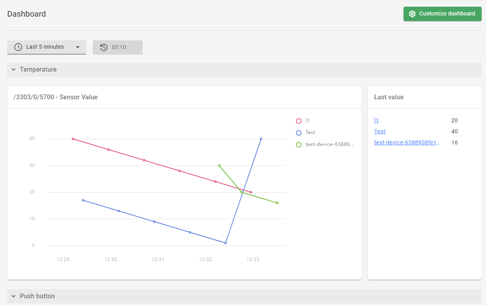
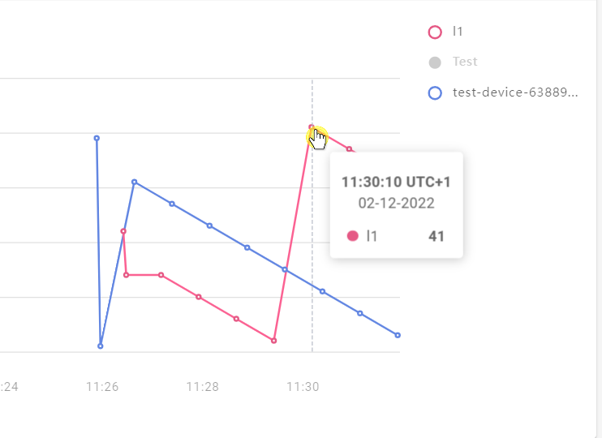
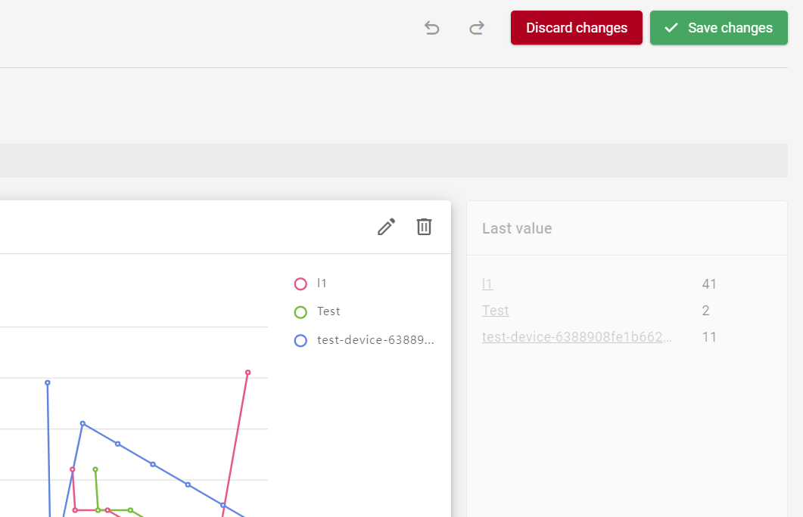

# Dashboard

The **Dashboard** displays widgets with visualized device data for your domain. Widgets are set and configured in the **Data model** tab of the **Device Center**, along with their corresponding **Observations** to enable collection of the reported device data. The **Dashboard** widgets are displayed per domain and feature different kinds of charts depending on the type of data collected.

!!! important
    The **Dashboard** and widgets are domain-wide, so they only apply to devices belonging to your domain. You can add up to 10 devices to a single widget, and they are added chronologically based on their **Creation time**. So if there are, for example, 15 devices in your domain, the 10 oldest of them will only be presented on a widget.

{:style="float: left;margin-right: 817px;margin-top: 17px;margin-bottom: 17px;border: 1px solid lightgray"}

## Dashboard overview

The **Dashboard** consists of widgets which are based on observations set on a device's data model. If you can't see any widgets in your domain dashboard, follow the [Visualize device data](Visualize_device_data.md) quick start to set them up smoothly.   

  {:style="float: left;margin-right: 817px;margin-top: 17px;margin-bottom: 17px;border: 1px solid lightgray;"}

### Widgets

A widget consists of its main component, which is a chart representing the collected device data, and the **Last value** component, which lists the last value that each device in the widget reported to Coiote DM. 

- To adjust the displayed timespan for the widget data, select the desired period in the **timespan** expandable list. By default, there are predefined timespans available ranging from 5 minutes up to 12 hours. 
- To view individual data readings in a chart, hover over a data point to see the reading value and its exact date.  
  {:style="float: left;margin-right: 817px;margin-top: 17px;margin-bottom: 17px;border: 1px solid lightgray;width: 60%"}  
- To exclude a device from the chart, simply click on its name located next to the chart. 

!!! tip
    The widget data is refreshed automatically and periodically every 15 seconds.

### Customize dashboard

A dashboard can be customized. Click **Customize dashboard** to switch to edition mode.

- To change widget name, expand a widget and click the **pencil** icon. Type the new name and click **Save**. 
- To delete a widget, expand a widget and click the **thrash bin** icon.
{:style="float: left;margin-right: 817px;margin-top: 17px;margin-bottom: 17px;border: 1px solid lightgray;width: 80%"}  
- To undo or redo your edits, click the **undo** or **redo** arrows.
- To exit edition mode without saving changes, click **Discard changes** and **Discard** in the dialog window.
- To exit edition mode and save changes, click **Save changes**.