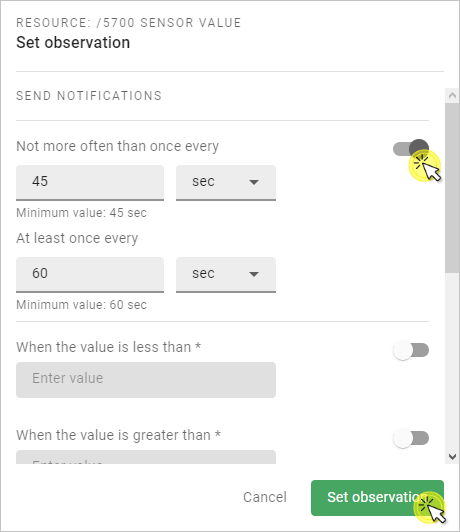

# Visualize device data

Learn how to visualize collected device data in your domain by setting an observation, adding a widget and diplaying it on the **Dashboard**.   

## Prerequisites

- An active Coiote DM user account with appropriate role assigned.
- A connected LwM2M device supporting the `/3303/` **Temperature object** (or a [simulated test device](#add-a-device-using-the-anjay-lwm2m-client)).

## Set observation and add widget

To start collecting data to be displayed for a widget on your Dashboard, you need to set an observation on a resource. In this tutorial, we'll be visualizing temperature records of the **Sensor value** `/5700/` resource belonging to the `/3303/` **Temperature** object.

!!! note
    Data model objects that support adding widgets range from `/502/` to `/65534/`.       

0. Go to the **Device Center** of a connected device in your domain and click the **Data model** tab.
0. In the list of objects, expand the **Temperature** `/3303/` object and click the **eye** icon in the **Operations** column.
    {:style="float: left;margin-right: 817px;margin-top: 17px;margin-bottom: 17px;border: 1px solid lightgray"}
0. In the side navigation menu, enable the **Not more often than once every** and **At least once every** attributes with default values and click **Save**.
  {:style="float: left;margin-right: 817px;margin-top: 17px;margin-bottom: 17px;border: 1px solid lightgray"}

    !!! info
        * **Not more often than once every** - the minimum time in seconds between two notifications.
        * **At least once every** - the maximum time in seconds between two notifications. The notification is sent even if the value hasn't changed.

0. In the expanded **Temperature** object card, click the **Add widget** icon in the **Widget** column and click **Save**.
   {:style="float: left;margin-right: 817px;margin-top: 17px;margin-bottom: 17px;border: 1px solid lightgray;width: 70%"}

    !!! important
        The action of adding a widget applies for all the devices in your domain, but the widget will only display data from the 10 oldest devices (based on their **Creation time**).

0. Repeat all the steps for any other connected devices in your domain which you want to include in the **Temperature** widget. You can add up to 10 devices to one widget.  

## View widget on the **Dashboard**

To see the device data visualized on the widget, you need to enter your domain **Dashboard** for your domain. 

0. From the left-side menu, select **Dashboard**.
0. Expand the **Temperature** widget. You should see a view similar to this:
    {:style="float: left;margin-right: 817px;margin-top: 17px;margin-bottom: 17px;border: 1px solid lightgray"}
0. Adjust the timespan for the collected data by selecting the desired period in the **timespan** expandable list.

    !!! tip
        The data is refreshed automatically and periodically every 15 seconds, so there's no need to refresh the page manually.