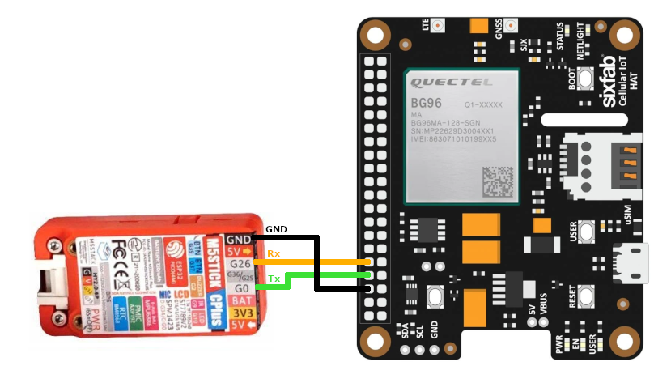

# M5StickC with BG96

Integrate your ESP32-based device with Quectel BG96 module to manage it via Coiote DM.

## Prerequisites
- An M5StickC device.
- A BG96 module with internet connection (it is strongly recommended to have a BG96 with firmware version BG96MAR03A06M1G).
- Installed ESP-IDF and dependencies (installation steps 1-4 from [ESP32 official documentation](https://docs.espressif.com/projects/esp-idf/en/v4.4/esp32/get-started/index.html)). Supported ESP-IDF version is v4.4.
- A user with access to the [Coiote IoT Device Management platform](https://eu.iot.avsystem.cloud).

## Step 1: Prepare project
0. Create a project directory for the integration.
0. Open a command line interface and run `git clone https://github.com/AVSystem/Anjay-esp32-client --recursive`.
0. Run `. $HOME/esp/esp-idf/export.sh` and `idf.py set-target esp32`.
0. Open the **menuconfig** with the `idf.py menuconfig` command, navigate to **Component config -> anjay-esp32-client**.
    - In **Choose targeted development board**, select ``M5StickC`` from the list of supported boards.
    - In **Choose an interface**, select `External BG96 module`.
    - In **BG96 module configuration**, specify the UART port, Tx pin and Rx pin for the BG96 module. Example port and pin numbers are provided in the screenshot below.
      
    - In **Client options**, provide device credentials and Server URI:
        - **Endpoint name** - your device endpoint name
        - **Server URI** - the address and port of your Coiote DM installation, e.g. ``coaps://eu.iot.avsystem.cloud:5684``
        - **Security mode** - the PSK security mode
        - **PSK configuration** - the PSK identity and PSK key
    - In the `Connection configuration`, set **APN name** to `internet` for the sake of this tutorial. However, **APN name** depends on your SIM card operator.
    - Press `s` on the keyboard to Save the configuration.

## Step 2: Connect BG96 module to a M5StickC

Connect the Tx, Rx and GND pins, respectively, to the M5StickC pins selected in the previous step on the basis of the following example connection:

  

- M5Stick GND > BG96 6 GND
- M5Stick G26 > BG96 10 UART Rx
- M5Stick G0 > BG96 8 UART Tx

## Step 3: Add device to Coiote DM
To connect your M5StickC to the Coiote IoT Device Management LwM2M Server, use your access to a Coiote DM installation, or register at https://eu.iot.avsystem.cloud/ to get access.

To connect the board:

0. Log in to Coiote DM and from the left side menu, select **Device Inventory**.
0. In **Device Inventory**, click **Add device**.
0. Select the **Connect your LwM2M device directly via the Management server** tile.

0. In the **Device credentials** step:
    - In the **Device ID** field, type the endpoint name provided in the IDF menuconfig **Client options**, e.g. `ESP32BG96`.
    - In the **Security mode** section, select the **PSK** mode.
    - In the **Key identity** field, type the identity provided in the IDF menuconfig **Client options**, e.g. `ESP32BG96`.
    - In the **Key** field, type the `psk` key provided in the IDF menuconfig **Client options**.
    
0. Click the **Add device** button and **Confirm** in the confirmation pop-up.
0. In the **Connect your device** step, the server is waiting for the board to connect. You can now start connecting the device.

## Step 4: Flash M5StickC
0. Open the command line interface, go to your project directory, and run `idf.py -b 750000 flash monitor`.
