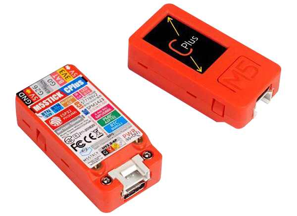

# Getting started

Start developing LwM2M applications on your boards and IoT devices in just a few clicks using our Anjay LwM2M Client.

## Espressif ESP32
### M5StickC

{ width=50% }

[Start integration](./ESP32/M5Stick.md){: .md-button .md-button--big }

### M5StickC/BG96

{ width=50% }

[Start integration](./ESP32/M5StickBG96.md){: .md-button .md-button--big }

### ESP32-DevKitC/BG96

[Start integration](./ESP32/ESP32-DevKitCBG96.md){: .md-button .md-button--big }

## STMicroelectronics

Build a LwM2M application for your ST board using I-Cube Anjay from scratch by following our [I-CUBE-Anjay guide](./STMicroelectronics/Building_LwM2M_applications/Building_LwM2M_applications_with_I-CUBE-Anjay.md).

### STM32L496G-DISCO/BG96

Integrate your P-L496G-CELL02 Discovery kit board along with the default-provided Quectel BG96 modem using our Anjay LwM2M Client based on freeRTOS.

[Start integration](./STMicroelectronics/STM32L496G-DISCOBG96.md){: .md-button .md-button--big }

### B-L462E-CELL1/TYPE1SC

Integrate your B-L462E-CELL1 Discovery kit board along with the TYPE 1SE module with built-in eSIM (ST4SIM-200M) using our Anjay LwM2M Client based on freeRTOS.

[Start integration](./STMicroelectronics/B-L462E-CELL1-TYPE1SC.md){: .md-button .md-button--big }

###  B-L475E-IOT01A

Integrate your B-L475E-IOT01A Discovery kit board using our Anjay LwM2M Client based on Zephyr OS.

{ width=60% }

[Start integration](./STMicroelectronics/B-L475E-IOT01A.md){: .md-button .md-button--big }

###  B-U585I-IOT02A/BG96

Integrate your B-U585I-IOT02A/BG96 Discovery kit board using our Anjay LwM2M Client based on Zephyr OS.

{ width=60% }

[Start integration](./STMicroelectronics/B-U585I-IOT02A-BG96.md){: .md-button .md-button--big }

## Nordic Semiconductor

### Thingy:91

Integrate your Thingy:91 board using our Anjay LwM2M Client based on Zephyr OS.

{ width=50% }

[Start integration](./Nordic/Thingy91.md){: .md-button .md-button--big }

### nRF9151 DK

Integrate your nRF9151 DK board using our Anjay LwM2M Client based on Zephyr OS.

{ width=70% }

[Start integration](./Nordic/nRF9151DK.md){: .md-button .md-button--big }

### nRF9160 DK

Integrate your nRF9160 DK board using our Anjay LwM2M Client based on Zephyr OS.

{ width=70% }

[Start integration](./Nordic/nRF9160DK.md){: .md-button .md-button--big }

### nRF7002 DK

Integrate your nRF7002 DK board using our Anjay LwM2M Client based on Zephyr OS and connect to Coiote through Wi-Fi network.

{ width=70% }

[Start integration](./Nordic/nRF7002DK.md){: .md-button .md-button--big }

## OpenThread

### Connect nRF52840 DK

Integrate your nRF52840 DK board using our Anjay LwM2M Client based on Zephyr OS and OpenThread.

{ width=70% }

[Start integration](./OpenThread/Adding_device.md){: .md-button .md-button--big }

### Manage your OpenThread Border Router

Integrate your Linux-based device using our Svetovid LwM2M Client to manage OpenThread Border Router.

{ width=70% }

[Start integration](./OpenThread/OTBR_with_svetovid.md){: .md-button .md-button--big }
