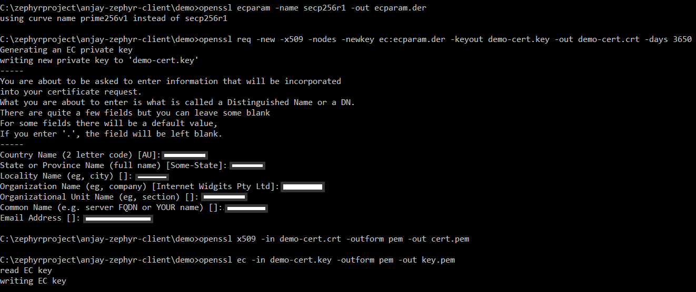
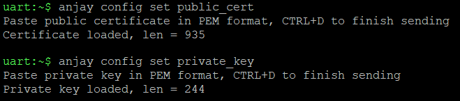
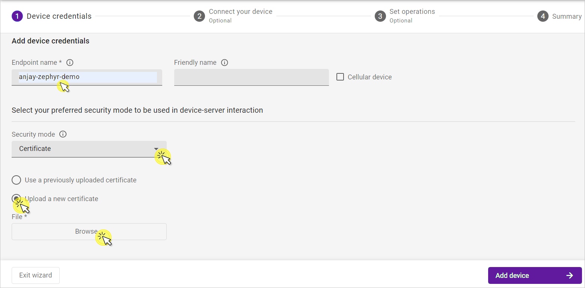
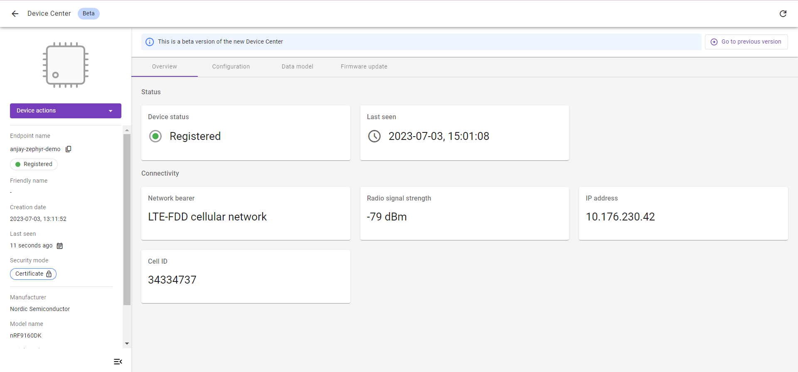

# Runtime Certificate and Private Key Configuration

## Introduction
Anjay library supports secure connection between device and server. Encryption can be achieved with the use of Pre-Shared Key as it was described in [nRF9160](nRF9160.md) and [Thingy:91](Thingy91.md) pages or with certificate-based cryptography.

In **Certificate Mode** an asymmetrical algorithm is used to authenticate the connection endpoints and initialize payload encryption. Appropriate certificates need to be generated for both the LwM2M Client and the LwM2M Server. Public certificates of both parties are mutually available, and each party also has access to its corresponding private key.

You can read more about secure communication on [Anjay's documentation](https://avsystem.github.io/Anjay-doc/BasicClient/BC-Security.html) page.

## Prerequisites
* The nRF9160DK board with a USB cable.
* Cloned [Anjay-zephyr-client](https://github.com/AVSystem/Anjay-zephyr-client#getting-started) repository
* Installed **nrfjprog** from [Nordic Semiconductor page](https://www.nordicsemi.com/Products/Development-tools/nrf-command-line-tools/download)
* Installed [OpenSSL](https://www.openssl.org/source/)
* Installed **minicom** (for Linux), **RealTerm**, **PuTTy** (for Windows), or another serial communication program.
* An active [Coiote IoT DM](https://eu.iot.avsystem.cloud/) user account.

!!! Note
    In this tutorial we will use the nRF9160DK board as an example.

## Build and flash the device
0. Connect the nRF9160DK board to a USB port of your machine.
0. Go to your local **Anjay-zephyr-client/demo** directory
0. Set manifest file to `west-nrf.yml`, and do `west update`:

    ```
    west config manifest.path Anjay-zephyr-client/demo
    west config manifest.file west-nrf.yml
    west update
    ```

0. Build a project with a runtime certificate and private key.

    ```
    west build -b <BOARD> -p -- -DCONFIG_ANJAY_ZEPHYR_RUNTIME_CERT_CONFIG=y
    ```

    where <BOARD\> should be replaced by the selected board from `boards/` directory.

    !!! Note

        The runtime certificate and private key configuration do not work with Thingy:91. Other boards should work with this command.

    This feature works with nRF9160DK starting from revision v0.14.0. For this board use configuration that utilizes an external flash chip and software-based cryptography:

    ```
    west build -b nrf9160dk_nrf9160_ns@0.14.0 -p -- -DCONF_FILE=prj_extflash.conf -DOVERLAY_CONFIG="overlay_nrf_mbedtls.conf"
    ```

0. Flash the board with `west flash` command.

## Generate certificate
The certificate and private key based on the SECP256R1 curve can be provided through the shell interface in `.pem` format. To generate them open terminal in the **Anjay-zephyr-client/demo** directory and use the following commands.

```
openssl ecparam -name secp256r1 -out ecparam.der
openssl req -new -x509 -nodes -newkey ec:ecparam.der -keyout demo-cert.key -out demo-cert.crt -days 3650
openssl x509 -in demo-cert.crt -outform pem -out cert.pem
openssl ec -in demo-cert.key -outform pem -out key.pem
```



!!! Important

    To use the certificate and private key with Coiote IoT DM you must specify a common name that is the same as the client endpoint name.

You will see created `cert.pem` and `key.pem` files in the `Anjay-zephyr-client/demo` directory.

## Configure the Client
0. Provide the generated certificate and private key through the shell in the serial communication program.

    !!! Note

        Before setting configurations in Anjay you need to stop running Anjay by `anjay stop` command.

    ```
    anjay config set public_cert
    anjay config set private_key
    ```

    

0. Save changes, start Anjay using `anjay start` command and go to the next step to add a device to Coiote.

## Add device to Coiote IoT DM

0. Upon logging in to Coiote IoT DM for the first time, you will see the **Add your LwM2M device** panel.

    !!! note
        If you had previously added a device, in **Device inventory**, click the **Add device** button.

0. Select the **Connect your LwM2M device directly via the Management server** tile.
   
0. In the **Device credentials** step:
     - In the **Endpoint name** enter your LwM2M device endpoint name, e.g. `anjay-zephyr-demo`.
     - In the **Security mode** section, select **Certificate** mode.
        
     - Click **Upload a new certificate** and **Browse**.
     - In the pop-up, go to the directory where your certificate has been generated, select the `demo-cert.crt` file and click **Open**.
     - Click **Add device**.

!!! Note
    The **Endpoint name** which you enter to the Coiote IoT DM should be the same as it is in the Client configuration.

0. Click **Next**, **Go to Summary** to skip the third step, and **Finish** to see your Device Center.
    

