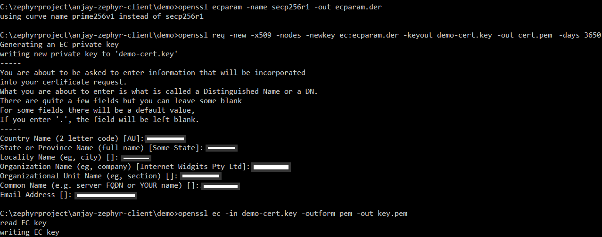
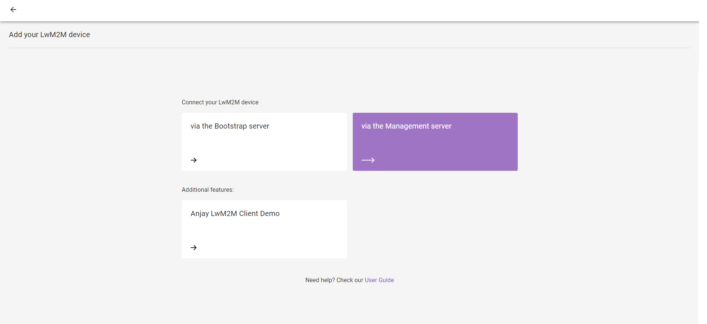

# Runtime certificate and private key configuration
Build a project with a runtime certificate and private key.

## Prerequisites
* The nRF9160 board with a USB cable.
- Installed **nrfjprog** from [Nordic Semiconductor page](https://www.nordicsemi.com/Products/Development-tools/nrf-command-line-tools/download)
* Installed **minicom** (for Linux), **RealTerm**, **PuTTy** (for Windows), or another serial communication program.
* An active [Coiote IoT DM](https://eu.iot.avsystem.cloud/) user account.

## Build and flash the device
0. Connect the nRF9160 board to a USB port of your machine.
0. Go to your local **Anjay-zephyr-client** directory
0. Set West manifest path to `Anjay-zephyr-client/demo`, manifest file to `west-nrf.yml`, and do `west update`:

    ```
    west config manifest.path Anjay-zephyr-client/demo
    west config manifest.file west-nrf.yml
    west update
    ```

0. Go to the **Anjay-zephyr-client/demo** folder and build a project with a runtime certificate and private key.

    ```
    west build -b <BOARD> -p -- -DCONFIG_ANJAY_ZEPHYR_RUNTIME_CERT_CONFIG=y
    ```

    where <BOARD\> should be replaced by the selected board from boards/ directory.

    !!! Note

        The runtime certificate and private key do not work with Thingy:91. Other boards should work with this command.

    This feature works with nrf9160dk starting from revision v0.14.0. For this board use configuration that utilizes an external flash chip and software-based cryptography:

    ```
    west build -b nrf9160dk_nrf9160_ns@0.14.0 -p -- -DCONF_FILE=prj_extflash.conf -DOVERLAY_CONFIG="overlay_nrf_mbedtls.conf"
    ```

0. Find the merged.hex file under the **build/zephyr** directory in the project folder.

0. Use the nRF Connect Programmer with the downloaded `.hex` file and execute steps from the [Updating the application firmware](https://developer.nordicsemi.com/nRF_Connect_SDK/doc/latest/nrf/ug_nrf9160_gs.html#updating-the-application-firmware) section.

## Generate certificate
The certificate and private key based on the SECP256R1 curve can be provided through the shell interface in PEM format. To generate them open terminal and use the following commands.

!!! Important

    To use the certificate and private key with Coiote IoT DM you must specify a common name that is the same as the client endpoint name.

```
openssl ecparam -name secp256r1 -out ecparam.der
openssl req -new -x509 -nodes -newkey ec:ecparam.der -keyout demo-cert.key -out demo-cert.crt -days 3650
openssl x509 -in demo-cert.crt -outform pem -out cert.pem
openssl ec -in demo-cert.key -outform pem -out key.pem
```



You will see created `demo-cert.pem` and `demo-cert.key.pem` files in the **Anjay-zephyr-client/demo** directory.

## Configuring the Client
0. Provide the generated certificate and private key through the shell in the serial communication program.

    !!! Note

        Before setting configurations in Anjay you need to stop running Anjay by `anjay stop` command.

    ```
    anjay config set public_cert
    anjay config set private_key
    ```

    

0. Save created changes, start Anjay and go to the next step to add a device to Coiote.

## Add device to Coiote IoT DM and connect

0. Upon logging in to Coiote IoT DM for the first time, you will see the **Add your LwM2M device** panel.

    !!! note
        If you had previously added a device, in **Device inventory**, click the **Add device** button.

0. Select the **Connect your LwM2M device directly via the Management server** tile.
   
0. In the **Device credentials** step:
     - In the **Endpoint name** enter your LwM2M device endpoint name, e.g. `anjay-zephyr-demo`.
     - In the **Security mode** section, select **Certificate** mode.
        
     - Click **Upload a new certificate** and **Browse**.
     - In the pop-up, go to the directory where your certificate has been generated, select the `demo-cert.crt` file and click **Open**.
     - Click **Add device**.

0. Click **Next**, **Go to Summary** to skip the third step, and **Finish** to see your Device Center.
    

