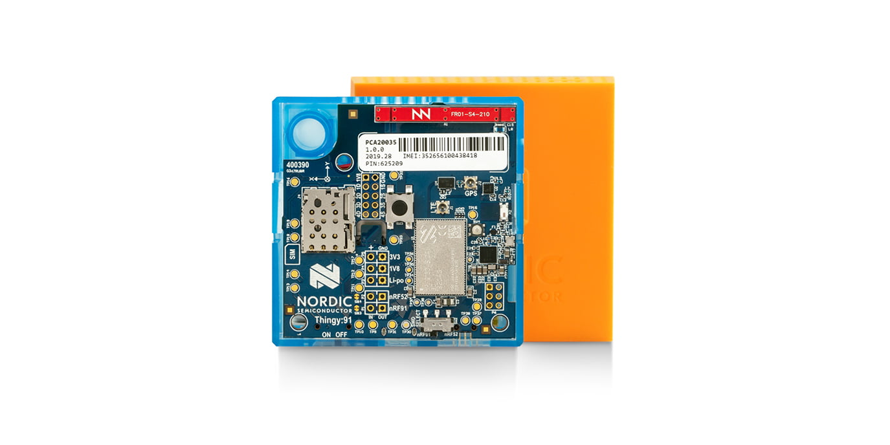
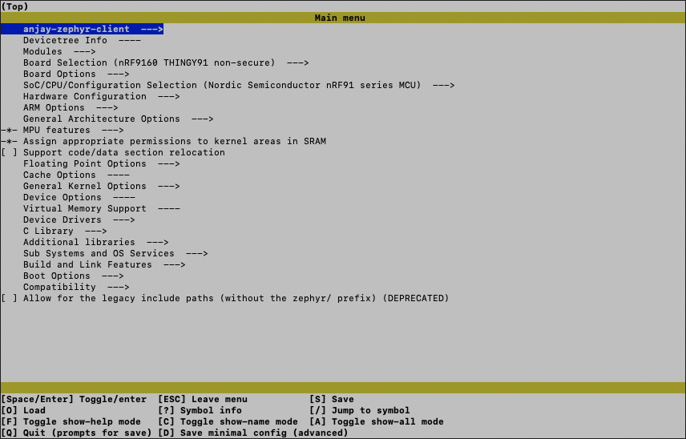
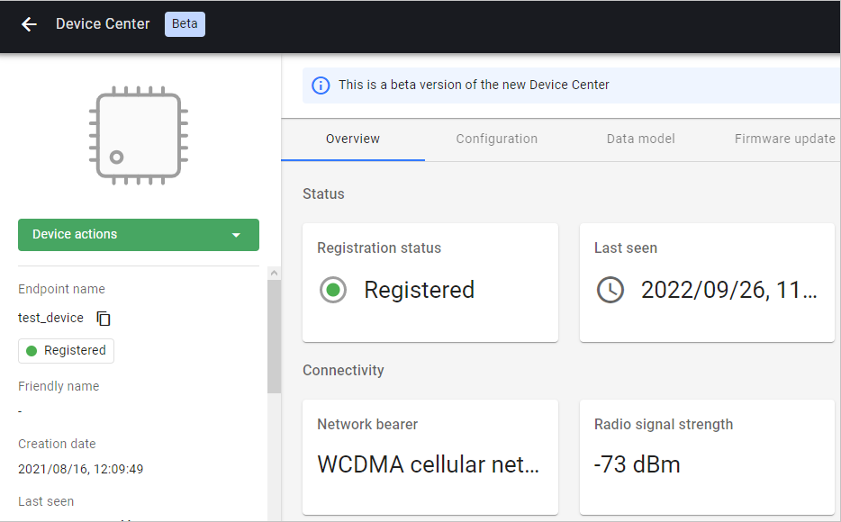

# Thingy:91

Integrate your Nordic **Thingy:91** board with **{{ short_name }}** using the [**Anjay LwM2M client**](https://avsystem.github.io/Anjay-doc/index.html).



## Prerequisites

- The **Thingy:91** board with a USB cable and SIM card.
- Installed **minicom** or **RealTerm** (for Linux or Mac) or **PuTTy** (for Windows) or other serial communication program.
- A user with access to the {{ site_name }}.

## Prepare binaries
### Use an already built binary

To get the latest binary file and flash the board:

{{ zephyr_files }}
{{ thingy91_binary }}
0. Jump to the [flashing part](#flash-the-binaries) of the tutorial.

### Start development using samples
!!! Note
    If you've gone through the [Use an already built binary](#use-an-already-built-binary) step, you can jump to [Connecting to the LwM2M Server](#connecting-to-the-lwm2m-server).

#### Part 1: Get Zephyr and Python dependencies

To get the Zephyr SDK and dependencies follow the first 4 steps of the instruction provided by [the Zephyr Project](https://docs.zephyrproject.org/latest/getting_started/index.html).

0. [Select and Update OS](https://docs.zephyrproject.org/latest/develop/getting_started/index.html#select-and-update-os)
0. [Install dependencies](https://docs.zephyrproject.org/latest/develop/getting_started/index.html#install-dependencies)
0. [Get Zephyr and install Python dependencies](https://docs.zephyrproject.org/latest/develop/getting_started/index.html#get-zephyr-and-install-python-dependencies)
0. [Install Zephyr SDK](https://docs.zephyrproject.org/latest/develop/getting_started/index.html#install-zephyr-sdk)


#### Part 2: Clone the Anjay Zephyr repository

Open the command line interface on your machine, then paste and run the following command:

   ```
   git clone https://github.com/AVSystem/Anjay-zephyr-client
   ```

#### Part 3: Compile the demo project

0. Connect the Thingy:91 board to a USB port of your machine.
0. Set West manifest path to `Anjay-zephyr-client/demo`, manifest file to `west-nrf.yml`, and run `west update`:

    ```
    west config manifest.path Anjay-zephyr-client/demo
    west config manifest.file west-nrf.yml
    west update
    ```

0. Go to the directory `Anjay-zephyr-client/demo`.

0. Compile the project for **Thingy:91** using the command:

    ```
    west build -b thingy91_nrf9160ns
    ```

    !!! Note
        [Optional] Configuration of the Anjay client can be done using **menuconfig**. This allows you, among others, to enable the **GPS** and **cell-based location services**. To open the configuration menu, run the command:

        ```
        west build -b thingy91_nrf9160ns -p -t menuconfig
        ```

        A config screen will open:

        

        After making the configuration changes, close the config menu by pressing `Q` and save it by pressing the key `Y`.

        To build the project using the new configuration, run:
        ```
        west build
        ```

0. Find the `app_signed.hex` file under the `build/zephyr` directory in the project folder.

## Flash the binaries
To program the board, go through the process of **flashing Thingy:91**. Use the nRF Connect Programmer with the downloaded `.hex` file and follow the [program the nRF9160 SiP application](https://developer.nordicsemi.com/nRF_Connect_SDK/doc/latest/nrf/ug_thingy91_gsg.html#program-the-nrf9160-sip-application) section.

After successful flashing, reboot the board and go to the next step.

## Connect to the LwM2M Server

To connect to {{ site_name }}, please register at [{{ site_link }}]({{ site_link }}/).

To connect the board:

0. Log in to {{ short_name }} and from the left side menu, select **Device Inventory**.
0. In **Device Inventory**, click **Add device**.
0. Select the **Connect your LwM2M device directly via the Management server** tile.
    
0. In the **Device credentials** step:
     - In the **Endpoint name** field, enter your board endpoint name e.g. `test_device` (remember to set the same name in the [next section](#configure-the-client)).
         
     - In the **Security mode** section, select the **Pre-Shared Key** mode:
         - In the **Key identity** field, type the same name as in the `Endpoint name` field.
         - In the **Key** field, type a shared secret used for the device-server authentication.

            !!! Note
                This is your password which you create yourself, you will need it in the next steps.

0. Click the **Add device** button and **Confirm** in the confirmation pop-up.
0. While in the **Connect your device** step, follow the [next section](#configure-the-client) to run the client and connect it to the server.

## Configure the Client

0. With the board still connected to a serial port interface, open a serial communication program.

0. Use the `anjay` command to list possible options:

    {{ console("Anjay commands",
'''uart:~$ anjay
anjay - Anjay commands
Subcommands:
start   :Save config and start Anjay
stop    :Stop Anjay
config  :Configure Anjay params
''') }}

    !!! tip
        To show available subcommands, use the **Tab** key.

0. Check your default credentials by following the instructions in the program:

    ```
    anjay config show
    ```

    {{ console("Anjay Configuration",
'''uart:~$ anjay config show

Current Anjay config:

 LwM2M Server URI: ''' + coaps + '''
 Device lifetime: 50
 Endpoint name: test_device
 PSK: psk
 Bootstrap: n
''')}}

1. Update your device credentials:
    * To make any changes to the configuration, stop the client:

        ```
        anjay stop
        ```

    * To update the **endpoint name** run the command:

        ```
        anjay config set endpoint <endpoint name>
        ```

    * To update the **Pre-Shared Key**, run the command

         ```
         anjay config set psk <key>
         ```

2. Start the client using the new configurations:

    ```
    anjay start
    ```

3. Go to the Coiote DM to check if your device is connected.
    

!!! note
    When Anjay has no connection with the server or network for a long time, warning
    `at_monitor: No heap space for incoming notification: <notification>` may appear.
    It does not affect the operation of the application and will no longer appear after reconnection.

## Next Steps
After configuring the Anjay Client, you can use the **nRF Cloud Location Service** to enable cell-based location services, or assisted GPS. [**Learn how to do it here.**](/Cloud_integrations/nRF_Cloud_Location_services/Configure_nRF_Cloud_integration/)

!!! note
    **Thingy:91** uses the same radio for GPS and LTE connectivity. GPS signal is
    caught between LTE transmissions and in case GPS "cold" fix acquisition takes
    too much time, Anjay turns off LTE transmissions for the time of fix acquisition.
    It can be seen by the following warning: `gps_nrf: GPS was interrupted multiple
    times by the LTE modem when producing a fix`. Anjay is notified by it, enters
    offline mode and reconnects when the first fix is acquired and LTE is enabled back.
