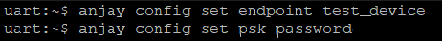
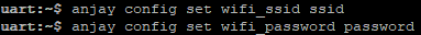

# nRF7002 DK

Integrate your Nordic nRF7002 DK board.

## Prerequisites

- The nRF7002 DK board with a USB cable.
- Installed **minicom** (for Linux) or RealTerm or PuTTy (for Windows) or other serial communication program.
- Installed **nrfjprog** from [Nordic Semiconductor page](https://www.nordicsemi.com/Products/Development-tools/nrf-command-line-tools/download).
- A user with access to the {{ coiote_long_name }}.


## Prepare binaries
### Use an already built binary

To get the latest binary file and flash the board:

{{ zephyr_repository_step }}
{{ nRF7002DK_binary_step }}
{{ nRF7002DK_flash_downloaded_binary_step }}

Go to the [Connecting to the LwM2M Server](#connecting-to-the-lwm2m-server).

### Start development using samples
!!! Note
    This step is optional. If you've gone through the [Use an already built binary](#use-an-already-built-binary) step, you can jump to [Connecting to the LwM2M Server](#connecting-to-the-lwm2m-server).


#### Part 1: Getting Zephyr and Python dependencies

To get the Zephyr SDK and dependencies follow the first 4 steps of the instruction provided by [the Zephyr Project](https://docs.zephyrproject.org/latest/getting_started/index.html) (from the set up the OS to installing the Zephyr SDK).

#### Part 2: Cloning the Anjay zephyr repository

Enter the command line interface on your machine and change the directory to the one where you set up the Zephyr project (usually, it's `~/zephyrproject`), then paste and run the following command:

   ```
   git clone https://github.com/AVSystem/Anjay-zephyr-client
   ```

#### Part 3: Compiling the example

0. Connect the nRF7002 DK board to a USB port of your machine.
0. Set West manifest path to `Anjay-zephyr-client/demo`, manifest file to `west-nrf.yml`, and do `west update`:
    ```
    west config manifest.path Anjay-zephyr-client/demo
    west config manifest.file west-nrf.yml
    west update
    ```
0. Compile and flash the project for **nRF7002 DK**:
    ```
    cd Anjay-zephyr-client/demo
    west build -b nrf7002dk_nrf5340_cpuapp
    west flash
    ```

## Connecting to the LwM2M Server

To connect to {{ coiote_long_name }}, please register at [{{ coiote_site_link }}]({{ coiote_site_link }}).

To connect the board:

1. Log in to {{ coiote_short_name }} and from the left side menu, select **Device Inventory**.
2. In **Device Inventory**, click **Add device**.
3. Select the **Connect your LwM2M device directly via the Management server** tile.
       
    3. In the **Device credentials** step:
         - In the **Device ID** enter your board endpoint name, e.g. `test_device`.
             
         - In the **Security mode** section, select the **PSK (Pre-Shared Key)** mode:
              - In the **Key identity** field, type the same name as in the `Endpoint name` field
              - In the **Key** field, type the shared secret used in the device-server authentication.
    4. Click the **Add device** button and **Confirm** in the confirmation pop-up.
    5. In the **Connect your device** step, follow the [next section](#configuring-the-client) to run the client and connect it to the server.

## Configuring the Client

0. With the board still connected to a serial port interface, open a serial communication program.
0. Use the `anjay` command to list possible options:

    ```
    uart:~$ anjay
    anjay - Anjay commands
    Subcommands:
    start   :Save config and start Anjay
    stop    :Stop Anjay
    config  :Configure Anjay params
    ```

    !!! tip
        To show available subcommands, use the **Tab** key.

0. Check your default credentials by following the instructions in the program:
    {:style="float: left;margin-right: 1177px; margin-top: 7px; margin-bottom: 17px;"}

    !!! note
        Use the `anjay stop` command to stop LwM2M Client if you are going to change credentials.

    If your default credentials are different from device credentials provided in {{ coiote_short_name }}, change them using the `anjay config set <possible_option> <value>` command.
    <br/>
    {:style="float: left;margin-right: 1177px;margin-top: 7px; margin-bottom: 17px;"}


0. The **nRF7002 DK** connects to the Internet via a Wi-Fi network. Remember to set the credentials of your network using `anjay config set wifi_ssid <value>` and `anjay config set wifi_password <value>`.
        {:style="float: left;margin-right: 1177px;margin-top: 7px; margin-bottom: 17px;"}

0. Use the `anjay start` command to run the Client.
0. Go to {{ coiote_short_name }} to check if your device is connected. Click **Next**, then **Go to Summary**, then **Finish**. You should see your device registered.
