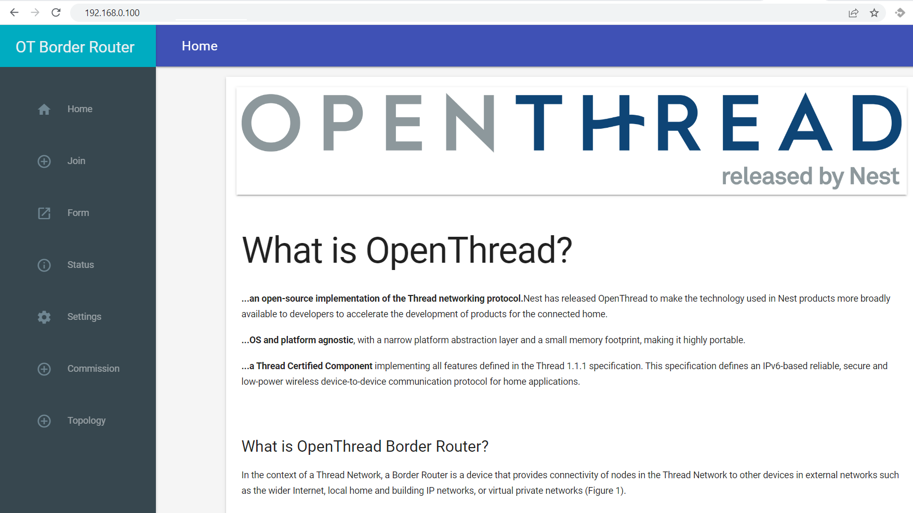
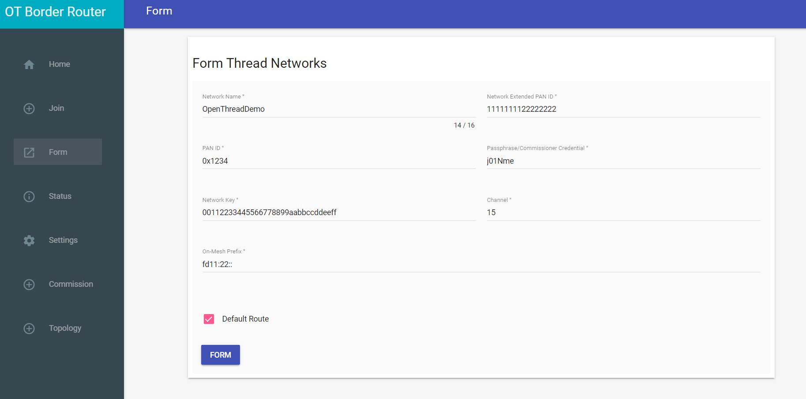
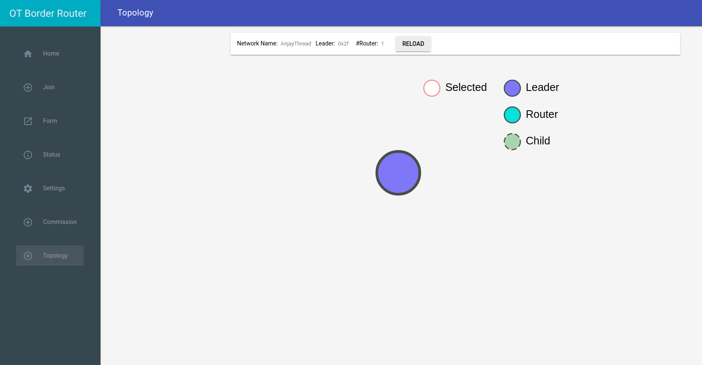
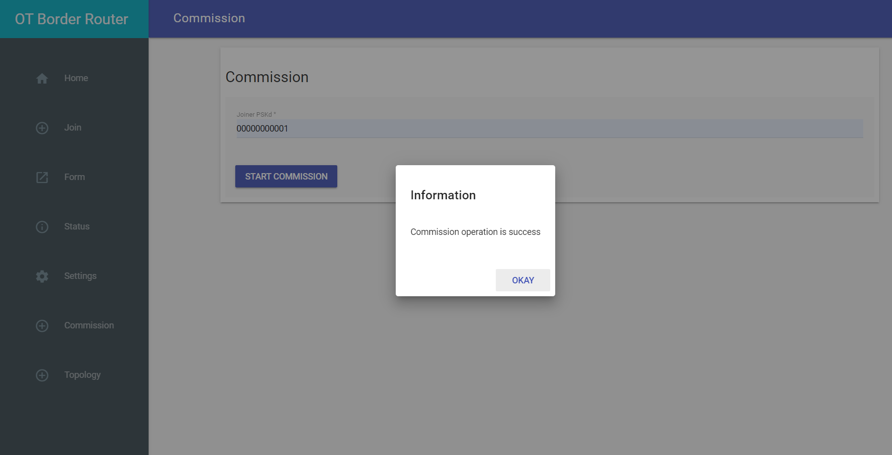
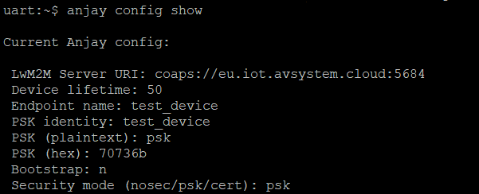
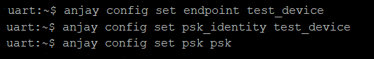
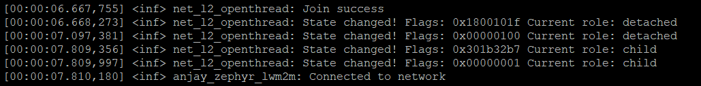
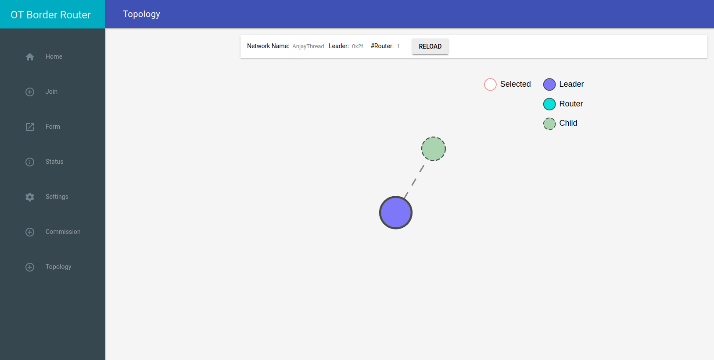
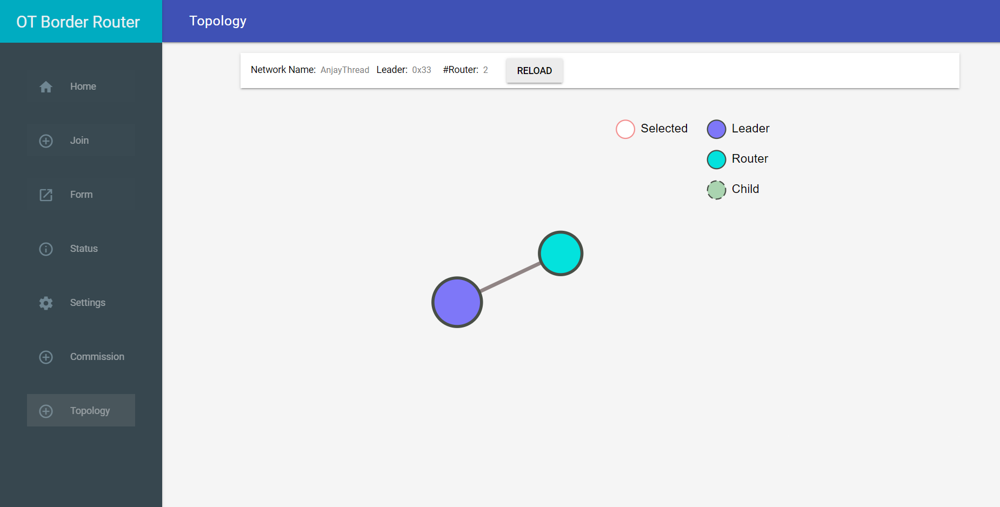

# Adding nRF board to OpenThread

Integrate your Nordic nRF52840 DK board to an active OpenThread Border Router.

## Prerequisites

- An active **OpenThread Border Router**.
- The **nRF52840 DK** board with a USB cable.
- Installed **minicom** or **RealTerm** (for Linux or Mac) or **PuTTy** (for Windows) or other serial communication program.
- Installed **nrfjprog** from [Nordic Semiconductor page](https://www.nordicsemi.com/Products/Development-tools/nrf-command-line-tools/download).
- A user with access to the [**{{ coiote_long_name }}**]({{ coiote_site_link }}/ui/device/inventory) platform and appropriate permissions.

## Connecting to the OpenThread

!!!Note

    Check your active Border Router IP address on which your Border Router works (e.g. `192.168.10.3`) and save it - use your address instead of **<OTBR_IP_address\>** in the next steps.

### Connecting to the WebUI

You should be in the same network as your OpenThread Border Router. To configure the Border Router open any web browser and connect to the WebUI by typing **<OTBR_IP_address\>:80**.

When you are connected you should see the OpenThread main page:



### Creating an OpenThread network

On the left side, select the ***Form*** option, and a new page will be displayed for the network creation. After providing required credentials, click the **FORM** button and a message should pop up to let you know about the operation's success. {:style="float: left;margin-right: 1177px;margin-top: 17px; margin-bottom: 17px;"}

On the left-side menu, click ***Topology*** to see the role of Border Router. {:style="float: left;margin-right: 1177px;margin-top: 17px; margin-bottom: 17px;"}

### Commissioning process

To start the commissioning process click ***Commission*** on the left-side menu and write down **Joiner PSKd password**.

!!! Important
    The PSKd needs following:

    - length: 6-32 characters,

    - encoding: base32-thread (0-9, A-Y excluding I, O, Q, and Z for readability).


    Remember the **Joiner PSKd password**, you will use it in the next step to configure your device.
    <br />
    For more information check [here](https://openthread.io/guides/border-router/external-commissioning/prepare?hl=en#prepare_the_joiner_device).

Click **START COMMISSION** button, and a message should pop up to inform you about the operation's success. {:style="float: left;margin-right: 1177px;margin-top: 17px; margin-bottom: 17px;"}

### Device configuration

0. Get Zephyr, SDK and other dependencies, as described in Zephyr's [Getting Started Guide](https://docs.zephyrproject.org/latest/develop/getting_started/index.html) (first 4 steps).

0. After navigating to Zephyr workspace (**~/zephyrproject** is default after following Getting Started Guide), clone Anjay Zephyr client repository.

    ```
        git clone https://github.com/AVSystem/Anjay-zephyr-client
    ```

0. Connect the nRF52840 board to the USB port of your machine.

0. Because NCS uses a *west-nrf.yml* file, it is necessary to change our Zephyr workspace, it is handled by using a different manifest file.
Set West manifest path to *Anjay-zephyr-client/demo*, and manifest file to *west-nrf.yml* and do *west update*.

    ```
        west config manifest.path Anjay-zephyr-client/demo
        west config manifest.file west-nrf.yml
        west update
    ```

0. Go to *Anjay-zephyr-client/demo/boards* directory and find the `nrf52840dk_nrf52840.conf` file. In this file, you will need to change the joiner PSKd password (the `CONFIG_OPENTHREAD_JOINER_PSKD` option):

    ```
        # OpenThread
        CONFIG_OPENTHREAD_JOINER=y
        CONFIG_OPENTHREAD_JOINER_AUTOSTART=y
        CONFIG_OPENTHREAD_MANUAL_START=y
        CONFIG_OPENTHREAD_SLAAC=y
        CONFIG_OPENTHREAD_JOINER_PSKD="00000000001"
        CONFIG_OPENTHREAD_FTD=y
    ```

    !!! Note
        The last config option in the `nrf52840dk_nrf52840.conf` file (`CONFIG_OPENTHREAD_FTD`) tells about a Full Thread Device (FTD) which always has its radio on and maintains IPv6 address mappings. This option can be changed to `CONFIG_OPENTHREAD_MTD`, a Minimal Thread Device (MTD) that forwards all messages to its Parent.

0. Now in Anjay-zephyr-client/demo directory you can compile the project.

    ```
        west build -b nrf52840dk_nrf52840
    ```

0. After successful build you can flash the target.

    ```
        west flash
    ```

## Connecting to the LwM2M Server

To connect to {{ coiote_long_name }}, please register at [{{ coiote_site_link }}]({{ coiote_site_link }}).

To connect the board:

1. Log in to {{ coiote_short_name }} and from the left side menu, select **Device Inventory**.
2. In **Device Inventory**, click **Add device**.
3. Select the **Connect your LwM2M device directly via the Management server** tile.
       
    3. In the **Device credentials** step:
         - In the **Device ID** enter your board endpoint name, e.g. `test_device`.
             
         - In the **Security mode** section, select the **PSK (Pre-Shared Key)** mode:
              - In the **Key identity** field, type the same name as in the `Endpoint name` field.
              - In the **Key** field, type the shared secret used in the device-server authentication.
    4. Click the **Add device** button and **Confirm** in the confirmation pop-up.
    5. In the **Connect your device** step, follow the [next section](#configuring-the-client) to run the client and connect it to the server.


## Configuring the Client

0. With the board still connected to a serial port interface, open a serial communication program.
0. Use the `anjay` command to list possible options:

    ```
    uart:~$ anjay
    anjay - Anjay commands
    Subcommands:
    start   :Save config and start Anjay
    stop    :Stop Anjay
    config  :Configure Anjay params
    ```

    !!! tip
        To show available subcommands, use the **Tab** key.

0. Use the `anjay stop` command to stop LwM2M Client and change credentials.

0. Check your default credentials by following the instructions in the program:
    {:style="float: left;margin-right: 1177px; margin-top: 7px; margin-bottom: 17px;"}


    !!! note
        If your default credentials are different from device credentials provided in {{ coiote_short_name }}, change them using the `anjay config set <possible_option> <value>` command.
        <br/>
        {:style="float: left;margin-right: 1177px;margin-top: 7px; margin-bottom: 17px;"}


0. Use the `anjay start` command to run the Client.

0. In logs, you can find information about status of the device. There will be information about success or failure in joining the connection and the current role of your device in the OpenThread network.

    {:style="float: left;margin-right: 1177px;margin-top: 7px; margin-bottom: 17px;"}

0. Go to OpenThread main web page, on the left-side menu click ***Topology*** to see connected device.

    {:style="float: left;margin-right: 1177px;margin-top: 7px; margin-bottom: 17px;"}

    !!! Note
        The node should join the OTBR Thread network automatically. Within two minutes its state should change to `router`.

        {:style="float: left;margin-right: 1177px;margin-top: 7px; margin-bottom: 17px;"}

0. Go to {{ coiote_short_name }} to check if your device is connected. Click **Next**, then **Go to Summary**, then **Finish**. You will see your Device Center view:
    {:style="float: left;margin-right: 1177px;margin-top: 7px; margin-bottom: 17px;"}

!!! note
    When Anjay has no connection with the server or network for a long time, warning
    `at_monitor: No heap space for incoming notification: <notification>` may appear.
    It does not affect the operation of the application and will no longer appear after reconnection.
