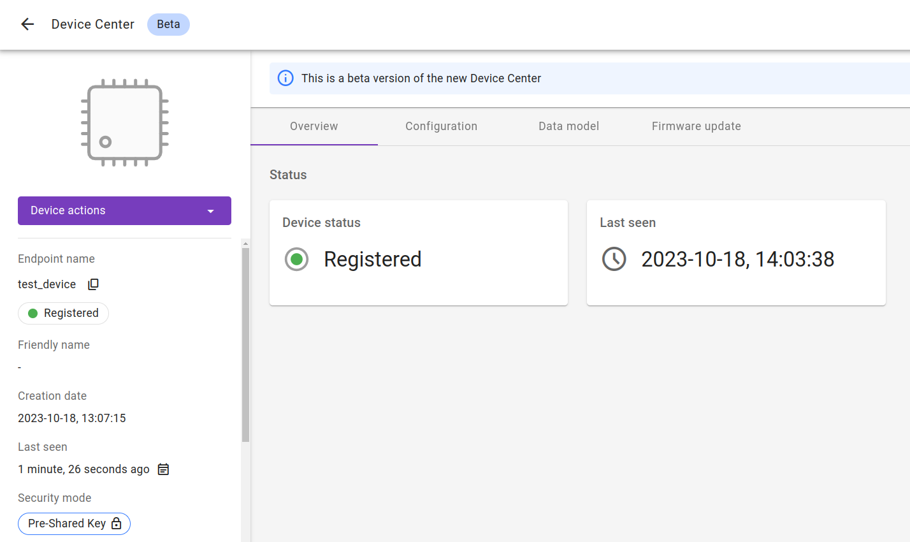

# Adding nRF dongle to OpenThread

Integrate your Nordic nRF52840-DK board to an active OpenThread Border Router.

## Prerequisites

- An active OpenThread Border Router
- The **nRF52840-DK** board with a USB cable.
- Installed **minicom** (for Linux) or RealTerm or PuTTy (for Windows) or other serial communication program.
- Installed **nrfjprog** from [Nordic Semiconductor page](https://www.nordicsemi.com/Products/Development-tools/nrf-command-line-tools/download)
- A user with access to the Coiote IoT Device Management platform and appropriate permissions.

## Connecting to the OpenThread

When you have an active Border Router you should have a posibility to check its hostname, domain, IP address and port on which your Border Router works.

!!! Note
    In commands **OTBR_hostname.OTBR_domain** can be replaced with **OTBR_IP_address**.

### Connection through Wi-Fi

In this method you have to be connected to the same Wifi network as is your OpenThread Border Router. To connect your device to Border Router through Wifi you should go to ` http://localhost:OTBR_port/ `.

### Connection through SSH

In this method you will need hostname and domain for your OTBR
`ssh -L OTBR_port:OTBR_hostname.OTBR_domain:80 -L 8081:OTBR_hostname.OTBR_domain:8081`
Then go to: `http://localhost:OTBR_port/`. The additional forwarding for port 8081 is necessary for the Topology view to work.


When you are connected you should see the OpenThread main page:


## Creating an OpenThread network

On the left side, select the option Form, and a new page will be displayed for the network creation. Click form and a message should pop up to let you know about the operation success. {:style="float: left;margin-right: 1177px;margin-top: 17px; margin-bottom: 17px;"}


On the left-side menu, click Topology to see the role of Border Router {:style="float: left;margin-right: 1177px;margin-top: 17px; margin-bottom: 17px;"}

## Connecting to the LwM2M Server

To connect to Coiote IoT Device Management LwM2M Server, please register at [https://eu.iot.avsystem.cloud](https://eu.iot.avsystem.cloud).

To connect the board:

1. Log in to Coiote DM and from the left side menu, select **Device Inventory**.
2. In **Device Inventory**, click **Add device**.
3. Select the **Connect your LwM2M device directly via the Management server** tile.
       
    3. In the **Device credentials** step:
         - In the **Device ID** enter your board endpoint name, e.g. `test_device`.
             
         - In the **Security mode** section, select the **PSK (Pre-Shared Key)** mode:
              - In the **Key identity** field, type the same name as in the `Endpoint name` field
              - In the **Key** field, type the shared secret used in the device-server authentication.
    4. Click the **Add device** button and **Confirm** in the confirmation pop-up.
    5. In the **Connect your device** step, follow the [next section](#configuring-the-client) to run the client and connect it to the server.


## Configuring the Client

0. With the board still connected to a serial port interface, open a serial communication program.
0. Use the `anjay` command to list possible options:

    ```
    uart:~$ anjay
    anjay - Anjay commands
    Subcommands:
    start   :Save config and start Anjay
    stop    :Stop Anjay
    config  :Configure Anjay params
    ```

    !!! tip
        To show available subcommands, use the **Tab** key.

0. Check your default credentials by following the instructions in the program:
    {:style="float: left;margin-right: 1177px; margin-top: 7px; margin-bottom: 17px;"}


    !!! note
        If your default credentials are different from device credentials provided in Coiote DM, change them using the `anjay config set <possible_option> <value>` command.
        <br/>
        {:style="float: left;margin-right: 1177px;margin-top: 7px; margin-bottom: 17px;"}


0. Use the `anjay start` command to run the Client.
0. Go to Coiote DM to check if your device connected. Click **Next**, then **Go to Summary**, then **Finish**. You will see your Device Center view:
    

!!! note
    When Anjay has no connection with the server or network for a long time, warning
    `at_monitor: No heap space for incoming notification: <notification>` may appear.
    It does not affect the operation of the application and will no longer appear after reconnection.